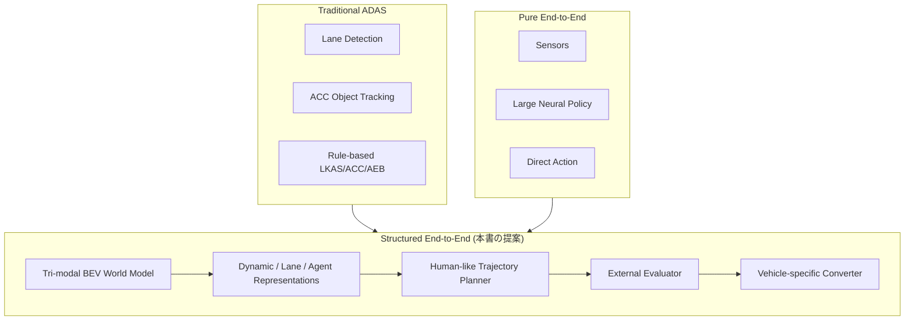
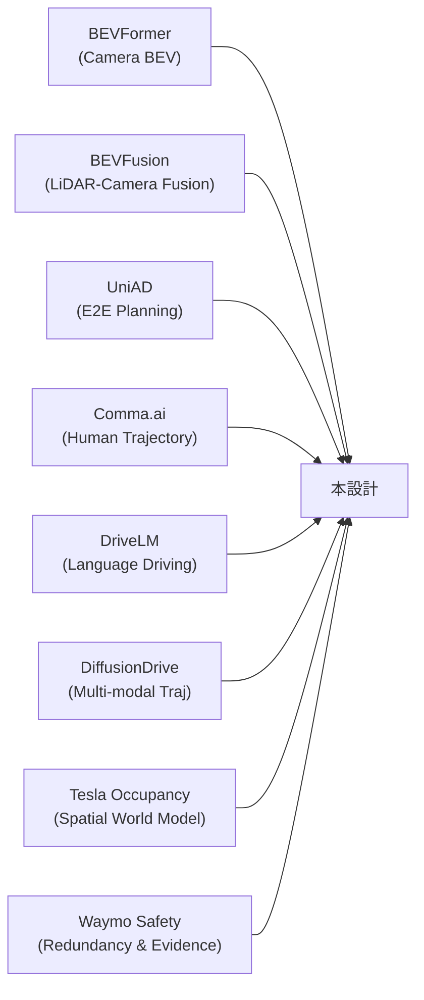

# 第1章 自動運転アーキテクチャの設計思想

---

### Architecture View: ADASとE2Eの間に置くStructured E2E



---

## 1.1 共通空間表現としてのBEV

自動運転では、センサの観測はそれぞれ異なる座標系・投影系にある。

- Camera は perspective image
- LiDAR は 3D point cloud
- Radar は sparse points または range-azimuth measurements
- Route は地図や車体座標
- Planner は通常 ego-centric な 2D/3D 空間で判断したい

これらを直接融合すると、各モダリティの対応が曖昧になる。  
そこで **BEV を共通の空間表現** として使う。

### BEVの利点

1. **Planner が扱いやすい**
   - 目標軌跡は通常 ego 座標の XY 平面で表す
   - BEV はそのまま軌跡と重ねられる

2. **外部評価器に渡しやすい**
   - ルール評価は、占有・走行可能領域・車線・動体位置を BEV で見られると書きやすい

3. **センサ追加に強い**
   - 新しいセンサも BEV に射影できれば同じ Fusion に追加できる

4. **時系列統合がしやすい**
   - BEV は ego motion warp が比較的単純

### BEVの座標系について

BEVの座標系は、本書全体で次のように統一する。

```text
ego coordinate:
- x: forward (車両前方)
- y: left (車両左方向)
- z: up
- yaw: counter-clockwise positive
- unit: meter, radian
```

この定義を全モジュールで共有することが実装上の前提になる。

---

## 1.2 Vision・LiDAR・Radarを統合する理由

Vision, LiDAR, Radar はそれぞれ得意・不得意が違う。

| センサ | 強い情報 | 弱点 |
|---|---|---|
| Camera | 車線、信号、標識、色、テクスチャ、意味 | 深度不確実、悪天候、夜間 |
| LiDAR | 形状、距離、障害物境界、3D幾何 | 遠距離疎、雨霧、コスト |
| Radar | 速度、Doppler、悪天候耐性、動体検出 | 形状が粗い、ghost、多重反射 |

このため、**一つのセンサに依存しない BEV fusion** が安全側の設計になる。

### 典型的なセンサ配置

実車でのセンサ配置は、車両サイズ・クラス・コストによって異なるが、典型的な構成は次のようになる。

```text
前方カメラ:
- 1〜3台
- 遠距離（望遠）、中距離、広角をカバー
- 信号、標識、歩行者、レーン

側方・後方カメラ:
- 4〜8台
- 全周囲をカバー
- 車線変更、後退、死角

フロントLiDAR:
- 1台（主）
- 200mカバー
- 障害物形状、先行車、歩行者

コーナーレーダー:
- 4台（四隅）
- 合流、死角、後退
- 速度情報

フロントレーダー:
- 1台
- ACC、遠方速度
- 悪天候耐性
```

本設計では、最低限「前方カメラ×複数 + LiDAR × 1 + Radar × 複数」を前提とする。  
センサ配置の多様性に対応するため、モジュールはセンサ種別ごとに分離する。

---

## 1.3 Plannerに意図と制約を渡すLanguage Conditioning

外部言語指示は、通常の perception だけでは得られない「意図」や「制約」を表す。

例：

```text
Turn right at the next intersection.
Do not change lanes.
Follow the left lane after the bridge.
Drive cautiously because there is construction ahead.
Prioritize the passenger's comfort.
```

これらは画像やLiDARからは直接読み取れない。

一方で、Planner が外部言語だけを見ると危険である。  
実際のシーンに応じた注意（「右折したいが歩行者がいる」）は BEV / vision 由来でなければ分からない。

そこで本設計では、言語を2種類に分ける。

```text
External language:
- User or navigation command
- Explicit instruction
- High level constraint

Internal scene language:
- Generated from BEV or vision
- Latent scene summary
- Risk and intent cues
```

そして、両方を CondFormer で統合し、Planner に渡す。

### 言語による行動条件付けの注意点

言語指示は「会話させる」ためではなく、「行動分布を条件付ける」ためのものである。

```text
Language conditioning:
- not for explanation
- not for conversation
- for action conditioning
```

製品では、自然文をそのまま安全制約として扱うのは危険である。  
自然文から構造化コマンドへの変換を挟む設計が望ましい（詳細は第5章）。

---

## 1.4 従来ADASの成立条件と限界

従来のADASは、機能ごとに分かれた構造で発展してきた。

```text
ACC:
- 前走車との距離を保つ

LKAS:
- レーン中央付近を保つ

AEB:
- 衝突しそうな対象があればブレーキ

BSM:
- 死角の車両を警告

TSR:
- 標識を認識する

HBA:
- 自動ハイビームコントロール
```

この構造は、製品として非常に扱いやすい。  
機能ごとに入力・出力・安全要件・試験条件を定義しやすいからである。

しかし、実際の運転はこのように分解しきれない。  
駐車車両を避けるためにレーン内で少し右へ寄る判断は、レーンキープなのか、障害物回避なのか、快適性制御なのか、周辺車両との相互作用なのか。  
交差点で右折するとき、対向車の速度を見て待つ判断は、物体認識なのか、予測なのか、ルール判断なのか、Plannerなのか。

従来ADASは、こうした相互作用が強い場面になるほど、モジュール間の境界が難しくなる。

### ADASの現実的な動作領域

| 機能 | 動作しやすいODD | 弱い場面 |
|---|---|---|
| LKAS | 高速道路、明瞭白線 | 交差点、消えた白線、工事 |
| ACC | 単一前走車、高速道路 | 割り込み、静止物体、交差点 |
| AEB | 正面衝突 | 横切り車両、歩行者（低速） |
| BSM | 直線路、隣接車線 | 合流、カーブ |

これらの機能は個別には有効だが、都市部や複雑交差点での統合行動には設計の隙間が生まれやすい。

---

## 1.5 純粋End-to-Endの魅力と製品化上の難しさ

End-to-Endは魅力的である。大量のセンサログと人間の運転結果から、複雑な判断を直接学習できる。Comma.aiのE2E lateral planningのように、人間が実際に走った未来軌跡を学習する方向は、レーンセンター追従では表現できない自然な運転を獲得できる可能性がある。

しかし、純粋なE2Eには製品上の難しさがある。

```text
Pure E2E の製品上の課題:
- なぜその出力になったか説明しにくい
- 安全監視器が何を検査すればよいか分かりにくい
- 法規や地域差を後から追加しにくい
- ODD外やセンサ異常への対応を別途作りにくい
- 不具合時に認識ミスか計画ミスか切り分けにくい
- 安全規格（ISO 26262, SOTIF）への対応で証拠を出しにくい
- 車両変更時のポータビリティが低い
```

製品として自動運転を出す場合、単に「ニューラルネットがそう出した」では足りない。  
失敗時のログ、事故解析、安全ケース、監査、OTA更新、リグレッション試験、法規変更対応が必要になる。

---

## 1.6 Structured End-to-Endという設計方針

本設計は、従来ADASと純粋E2Eの中間を狙う。

```text
従来ADAS:
- 分かりやすい
- 検証しやすい
- しかし相互作用に弱い
- ODD拡張が難しい

純粋E2E:
- 複雑な判断を学習しやすい
- 人間軌跡を直接学べる
- しかし製品検証が難しい
- ODD外の対応が不透明

Structured E2E（本設計）:
- 人間軌跡を学ぶ
- BEVや動的世界などの中間表現を持つ
- 外部評価器に渡せる情報を出す
- 実車制御は決定論的な変換器に分離する
- 製品として必要な中間観測点を設計に含める
```

### Structured E2Eの責任境界

Structured E2Eの本質的な問いは「ニューラルネットワークに何を任せ、何を任せないか」である。

従来のモジュラーADASは、ほぼすべての判断をルールで記述しようとした。これは透明性が高い反面、「世界のすべての状況をルールで書き切る」という本質的な困難を抱えていた。一方、純粋なEnd-to-Endは「センサから舵角まで」をニューラルネットに丸投げするが、その内部で何が起きているか追いにくく、安全証拠の構築が難しい。

Structured E2Eの責任境界は次のように引く:

**ニューラルネットワークが担う領域**: 世界の認識と計画候補の生成。これは組み合わせ爆発が起きる複雑な判断であり、データからの学習が不可欠な部分である。BEVを共通空間として認識し、動体の未来を予測し、K本の候補軌跡を生成する。

**外部モジュールが担う領域**: 生成された候補を審査し、実際に車両を動かす最終段階。ルールで明示的に記述でき、ISO 26262等の安全規格上も「説明可能」であることが求められる部分である。不安全な候補を拒否し、ODD外を検出し、軌跡を物理的に正しいステアリング角に変換し、万一の全候補Fail時にはFallbackを発動する。

この境界を引くことで:
- ニューラルネット側の失敗（誤認識・誤計画）を外部モジュールが補足できる
- 外部モジュールは軽量なルールで実装でき、ASIL-B/D認証が現実的になる
- ログに残るべき情報が自然に設計される（何を選んだか、なぜ選んだか）


この境界により、ニューラルネットが学ぶ部分と、ルールベースで明示的に制御する部分が分かれる。

---

## 1.7 Safety Case型システムから学ぶ冗長性と証拠構造

Waymoのようなロボタクシー型システムは、センサ冗長性と安全ケースを重視する。LiDAR、Camera、Radarを組み合わせ、地図、シミュレーション、実走行、事故率比較、安全ケースを積み上げる。

この方向から学ぶべきことは、単に「高価なセンサを積めばよい」という話ではない。  
重要なのは、製品として人を乗せて走るには、**安全を主張するための証拠の構造**が必要という点である。

本設計でBEV情報Head、候補軌跡、外部評価器、Dynamic Risk Map、ログを持たせているのは、このためである。  
モデルが直接舵角を出すだけでは、安全ケースに必要な証拠を作りにくい。

### 安全ケースに必要な要素

```text
Claim: このシステムは定義されたODD内で安全に動作する

Argument:
- センサ冗長性により単一センサ故障時も継続可能
- 中間表現（BEV）によりPerceptionの妥当性を検証できる
- K候補と外部評価器により不安全な軌跡を除外できる
- ODD監視により動作範囲外を検出し、fallbackへ移行できる
- ログにより失敗事例を解析できる

Evidence:
- センサ別BEV出力のラベル精度評価
- 外部評価器の拒否率・拒否理由分析
- Shadow Modeでの候補軌跡と人間軌跡の比較
- ODD外検出率のシナリオテスト
```

---

## 1.8 OccupancyとFleet Learningから学ぶ空間表現

Tesla系の公開情報から学べる大きなポイントは、物体boxだけではなく、周辺空間のoccupancyやoccupancy flowを重視している点である。  
現実世界には、boxとしてきれいに検出しにくいものが多い。工事の柵、落下物、縁石、変な形の障害物、車両の一部、ゲートのような構造物などである。

box detectionだけに頼ると、「分類できないもの」を見落としやすい。  
occupancyは、分類名よりも先に「そこは物理的に占有されているか」を見る。これは安全に近い表現である。

本設計では、この考えを拡張し、次を持たせる。

```text
- static occupancy（静的占有）
- dynamic occupancy（動的占有）
- occupancy flow（占有の動き）
- future dynamic occupancy（将来の動的占有）
- dynamic risk map（動的リスクマップ）
```

これは、「物体が何であるか」だけでなく、「どこを占有し、どう動き、いつ自車軌跡と交差するか」をPlannerに渡すためである。

### Fleet Learningの重要性

大規模フリート（多数の車両からのデータ収集）は、テールケース（稀な場面）の学習に不可欠である。

```text
Fleet Learningの価値:
- 100万km走行で1回しか現れない稀な場面も蓄積できる
- 地域ごとの道路構造・交通文化の差を学べる
- センサ配置・車両種別ごとの差異を学べる
- 強化学習のリワードシグナルをオフラインで設計できる
```

本設計でログ設計と中間表現の明示化を重視するのは、フリート学習パイプラインを将来設計しやすくするためでもある。

---

## 1.9 人間軌跡を教師にするEnd-to-End Lateral Planning

Comma.ai/openpilotのE2E lateral planningから学ぶべき最も重要な点は、レーン中心ではなく、人間が実際に走った未来軌跡を教師として使うという発想である。

この考えは非常に強い。  
なぜなら、レーンセンターは道路幾何の人工的な中心線であって、人間の運転判断そのものではないからである。

人間は、路肩の駐車車両、自転車、歩行者、隣の大型車、道路端、工事、路面状態、カーブの快適性などを見て、自然に車線内の位置を変える。  
その結果としての軌跡を学ぶ方が、レーン中心を学ぶよりも運転行動に近い。

本設計が「毎サイクル自車基準の目標軌跡を出す」構造にしているのは、この思想と整合する。

---

## 1.10 縦方向制御（速度計画）の位置づけ

本書では横方向制御（操舵）を中心に記述しているが、縦方向制御（速度計画・加減速）も同様に重要である。

```text
横方向 (Lateral):
- どのレーンを、どの横位置で走るか
- 候補軌跡のx,y成分
- 舵角指令

縦方向 (Longitudinal):
- どの速度で走るか
- 加速・減速のタイミング
- 前走車追従、信号対応、カーブ速度
```

候補軌跡には速度プロファイル（v）を含めることで、横方向と縦方向を統合的に扱える。

```text
trajectory point:
- t: timestamp
- x: forward position
- y: lateral position
- yaw: heading angle
- v: target speed at this point
- a: target acceleration (optional)
```

速度計画の独立した問題として扱うべき場面：

```text
- 信号対応（赤で止まる、青で発進）
- 停止線での一時停止
- 交差点進入速度
- カーブでの快適速度
- スクールゾーンや工事区間での減速
- 前走車追従
```

これらは、External Evaluatorの速度・快適性チェック、またはPlanner出力の速度プロファイルとして扱う。

---

## 1.11 設計の進化と本書の位置づけ

本書が提案するアーキテクチャは、単一の論文を翻訳したものではない。  
BEVFormer、BEVFusion、UniAD、DiffusionDrive、DriveLM、Comma.ai E2E、Tesla Occupancy、Waymo Safety Caseなど、複数の方向からの知見を「実車で動かせる一つのシステム」として統合したものである。



第2章以降で、このアーキテクチャの具体的な構造を順に説明する。

---

### Coffee Break: 「設計思想」がなぜ第1章なのか

研究論文では、関連研究を先に書き、手法を後から提案するのが一般的である。しかし実際の製品開発では、「何のためにこの設計にするのか」が最初に共有されていないと、実装の細部で判断が食い違う。本書が第1章に設計思想を置くのは、チームメンバーが「なぜこの構造なのか」を理解した上で実装に進むためである。
