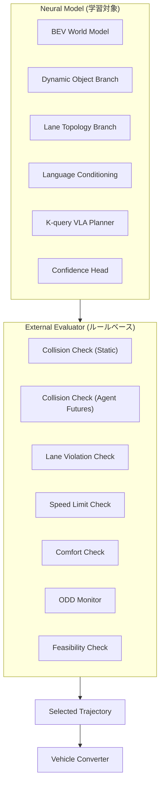
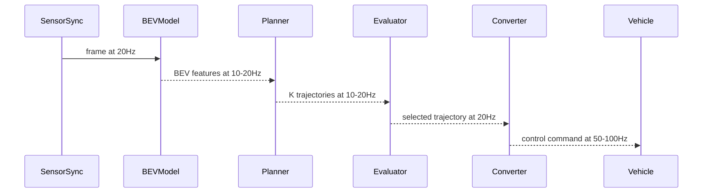

# 第2章 システム要件と全体アーキテクチャ

---

## 2.1 設計原則

本システムの設計原則は次のとおりである。

```text
1. センサ統合はBEV共通空間で行う
2. 世界表現は静的・動的・レーン・エージェントに分離する
3. Plannerは複数候補を出し、外部評価器が選ぶ
4. 制御への接続は決定論的変換器に分離する
5. 全中間表現をログ可能にする
6. センサ故障、ODD外、リスク超過時のフォールバックを設計段階から持つ
```

---

## 2.2 入力インターフェース

### センサ入力

```text
images:
  shape: [B, N_cam, C, H, W]
  type: float32
  unit: normalized [0, 1]
  note: undistorted, synchronized

lidar_points:
  shape: [B, N_sweeps, N_points, D]  (D = x, y, z, intensity, ring, ...)
  type: float32
  unit: meter
  note: ego frame, N_sweeps = 1 or stacked

radar_points:
  shape: [B, N_radar_sweeps, N_rpoints, D_r]  (D_r = x, y, vr, rcs, ...)
  type: float32
  unit: meter, m/s
  note: corrected to ego velocity, ego frame
```

### 自車状態

```text
ego_state:
  speed:      float32, m/s
  yaw_rate:   float32, rad/s
  accel_x:    float32, m/s^2
  accel_y:    float32, m/s^2
  steer_angle: float32, rad
  timestamp:  int64, ns
```

### ルート・言語指示

```text
route_info:
  type: structured or lane sequence
  example: [lane_id_1, lane_id_2, lane_id_3]
  note: 次の300m〜500mのルート情報

language_command:
  type: str (UTF-8)
  example: "次の交差点を右折してください"
  note: navigationまたはユーザー指示
```

### キャリブレーション

```text
calibration:
  camera_intrinsics: [N_cam, 3, 3]
  camera_extrinsics: [N_cam, 4, 4] (ego <- camera)
  lidar_to_ego:      [4, 4]
  radar_to_ego:      [N_radar, 4, 4]
```

---

## 2.3 出力インターフェース

### プランナー出力

```text
trajectories:     [B, K, T, D]   K候補軌跡
confidence:       [B, K]          候補ごとの信頼度スコア
selected_traj:    [B, T, D]       外部評価器が選択した軌跡（optional）
```

### 世界モデル出力

```text
bev_drivable:     [B, H, W]       走行可能領域（3クラス: 0=NOT_DRIVABLE, 1=DRIVABLE, 2=MARGINAL）
bev_occupancy:    [B, H, W]       静的占有
bev_lane:         [B, H, W, C]    車線情報
bev_agent_occ:    [B, H, W]       動的物体占有
bev_agent_vel:    [B, H, W, 2]    動的物体速度場
bev_uncertainty:  [B, H, W]       不確実性マップ
dynamic_risk_map: [B, T_fut, H, W] 未来リスクマップ
lane_topology:    dict            レーングラフ（LaneNodeのリスト）
agent_futures:    [B, N_ag, M, T_fut, D_a] エージェント未来軌跡
```

### 制御出力

```text
control_command:
  target_curvature:  float32, 1/m
  target_speed:      float32, m/s
  limit_steer:       bool
  limit_accel:       bool
  feasibility_ok:    bool
  fallback_active:   bool
  timestamp:         int64, ns
```

### デバッグ出力

```text
debug:
  T_scene_text:      str  (内部シーントークンのデバッグデコード)
  selected_reason:   str  (選択理由)
  ood_flags:         dict (ODD外フラグ)
  sensor_health:     dict (センサ毎の健全性)
  processing_ms:     float (処理時間ms)
```

---

## 2.4 ニューラルモデルと外部評価器の責任分担



**ニューラルモデルが扱う部分:**  
- センサから中間表現への変換
- 世界状態の推定と予測
- K候補軌跡の生成と信頼度推定

**外部評価器が扱う部分:**  
- K候補に対するルール適合性チェック
- 不適な候補の除外
- ODD超過の検出
- フォールバック発動の判定

この分離により、安全な動作の根拠を外部評価器のルールとして明示でき、監査・試験が行いやすくなる。

---

## 2.5 統一アーキテクチャ全体像（10ステップ）

```mermaid
flowchart LR
  S1["1. SensorPacket\n(images, lidar, radar,\nego_state, calib)"]
  S2["2. Sensor Sync\n& Calib"]
  S3["3. Tri-modal BEV Encoder\n(Camera/LiDAR/Radar)"]
  S4["4. BEV Fusion &\nTemporal Memory"]
  S5["5. BEV Information Heads\n(Static/Lane/Dynamic/Risk)"]
  S6["6. Language & Scene\nConditioning"]
  S7["7. VLA Planner\n(K Candidate Trajectories)"]
  S8["8. External Evaluator\n(Rule-based Safety Check)"]
  S9["9. Trajectory-to-Steering\nConverter"]
  S10["10. ControlCommand\n(curvature, speed)"]

  S1 --> S2 --> S3 --> S4 --> S5 --> S6 --> S7 --> S8 --> S9 --> S10
```



---

## 2.6 既存研究との対応関係

| 本設計モジュール | 対応する代表OSSまたは設計 |
|---|---|
| Camera BEV Encoder | BEVFormer (multi-view camera BEV) |
| Tri-modal BEV Fusion | BEVFusion (MIT Han Lab) |
| LiDAR BEV Encoder | PointPillars + MMDetection3D |
| Temporal BEV Memory | BEVFormer temporal attention |
| BEV Information Heads | UniAD, FusionOcc, SurroundOcc |
| Lane Topology Branch | MapTR, TopoNet, LaneSegNet |
| Dynamic Object Branch | UniAD (motion prediction) |
| Agent Future Predictor | UniAD, Wayformer, MotionDiffuser |
| VLA Planner | UniAD planner, DiffusionDrive |
| Language Conditioning | DriveLM, VLM-AD, CLIP, LLaVA |
| External Evaluator | PDM-Closed (nuPlan) style |
| Trajectory Converter | openpilot/sunnypilot純追従制御参考 |

---

## 2.7 ランタイムパイプライン（10ステップの詳細）

| ステップ | 処理 | 入力 | 出力 |
|---|---|---|---|
| 1 | SensorPacket受信 | raw sensor + ego | SensorPacket |
| 2 | 同期・キャリブレーション | SensorPacket | synchronized frames |
| 3 | Camera BEV Encoder | images, calib | camera BEV features |
| 4 | LiDAR BEV Encoder | lidar_points | lidar BEV features |
| 5 | Radar BEV Encoder | radar_points | radar BEV features |
| 6 | Tri-modal Fusion + Temporal | modality BEVs, history | fused BEV |
| 7 | BEV Information Heads | fused BEV | world outputs |
| 8 | Language + Scene Conditioning | language, BEV | T_inst + T_scene |
| 9 | VLA Planner | BEV + conditioning | K trajectories + conf |
| 10 | External Evaluator | K trajs, world, ODD | selected trajectory |
| 11 | Vehicle Converter | selected trajectory | control command |

---

## 2.8 マルチレート処理設計

自動運転のように物理的な時定数が重要なシステムでは、全処理を同じレートで動かすことは現実的ではない。

```text
Fast Layer (20-100 Hz):
  - Vehicle Converter (Trajectory-to-Steering)
  - Fallback condition monitor
  - Sensor health check
  - EPS/throttle command output

Medium Layer (10-20 Hz):
  - VLA Planner
  - External Evaluator
  - Language instruction decode
  - BEV feature update (Dynamic priority)

Slow Layer (1-5 Hz):
  - Static World Cache update
  - Lane Topology update
  - Map-assisted lane topology alignment
  - ODD status update
  - Scene Tokenizer (T_scene) update
```

この設計により、計算コストを抑えながら、制御遅れを最小化できる。



---

## 2.9 21モジュールの一覧

本設計の主要モジュールは以下の21個である。

| # | モジュール名 | 役割 |
|---|---|---|
| 1 | SensorSyncCalib | センサ同期・キャリブレーション |
| 2 | CameraBEVEncoder | カメラ→BEV変換 |
| 3 | LiDARBEVEncoder | LiDAR→BEV変換 |
| 4 | RadarBEVEncoder | Radar→BEV変換 |
| 5 | ModalityGateFuser | モダリティゲートBEV融合 |
| 6 | TemporalBEVMemory | BEV時系列統合 |
| 7 | PlannerfacingBEVBuilder | Planner用BEVトークン構築 |
| 8 | StaticWorldHead | 走行可能・占有・不確実性 |
| 9 | LaneTopologyHead | レーングラフ推定 |
| 10 | DynamicObjectHead | 動的物体占有・速度場 |
| 11 | OccupancyFlowHead | 占有フロー |
| 12 | FutureDynamicOccHead | 未来動的占有 |
| 13 | AgentFuturePredictor | エージェント未来軌跡 |
| 14 | MotionSalienceGate | エージェント重要度 |
| 15 | DynamicRiskMap | 動的リスクマップ |
| 16 | ExternalLanguageEncoder | 外部言語エンコーダ |
| 17 | InternalSceneTokenizer | 内部シーントークナイザー |
| 18 | CondFormer | 条件付けAttention統合 |
| 19 | VLAPlanner | K候補軌跡生成 |
| 20 | ExternalEvaluator | ルールベース安全選択 |
| 21 | TrajectoryToSteeringConverter | 軌跡→舵角変換 |

---

## 2.10 モジュール間データコントラクト

```text
SensorPacket
  → SensorSyncCalib
    → [Camera|LiDAR|Radar]BEVEncoder (並列)
      → ModalityGateFuser + TemporalBEVMemory
        → PlannerfacingBEVBuilder
          → [StaticWorldHead, LaneTopologyHead, Dynamic系Heads] (並列)
        → CondFormer ← ExternalLanguageEncoder ← language_command
                     ← InternalSceneTokenizer ← BEV features
          → VLAPlanner → [K trajectories, confidence]
            → ExternalEvaluator ← [world outputs, ODD status]
              → selected trajectory
                → TrajectoryToSteeringConverter
                  → ControlCommand
```

---

## 2.11 主要テンソル形状

| テンソル | 形状 | 説明 |
|---|---|---|
| camera images | [B, N_cam, 3, H_img, W_img] | 例: [1, 6, 3, 900, 1600] |
| BEV feature | [B, C, H, W] | 例: [1, 256, 200, 200] |
| BEV tokens | [B, H×W, C] | 例: [1, 40000, 256] |
| trajectory candidates | [B, K, T, D] | 例: [1, 16, 10, 4] (x,y,yaw,v) |
| confidence | [B, K] | 例: [1, 16] |
| agent futures | [B, N, M, T_f, D_a] | 例: [1, 32, 6, 12, 5] |
| dynamic risk map | [B, T_f, H, W] | 例: [1, 8, 200, 200] |

---

## 2.12 センサ冗長性の設計

本設計では、単一センサ障害時の挙動を設計段階で考慮する。

```text
カメラ障害 (1台):
  - 他カメラでカバー可能なビューなら継続
  - BEV不確実性が上昇する領域を外部評価器に通知
  - 速度制限を下げる

LiDAR障害:
  - Camera-only BEVにdegradeする
  - LiDAR依存のモダリティゲートを自動閉じ
  - 遠距離・形状精度が落ちることをログ
  - ODD限定（高速道路LiDAR必須 → 止まる）

Radar障害:
  - Camera+LiDARのみで継続
  - 動体速度推定の不確実性が増す
  - 前走車速度の信頼度が下がる

GPS/測位障害:
  - 相対位置から動く（dead reckoning）
  - ルート情報の信頼度が下がる
  - ODD外として扱い速度を下げる
```

---

## 2.13 フォールバック階層

```text
Level 0 (Normal): 通常動作
Level 1 (Degraded): センサ一部障害、速度制限、ODD限定
Level 2 (Caution): 外部評価器が全K候補を不合格、最小リスク軌跡（MRM）を選択
Level 3 (Safe Stop): Plannerが軌跡を出せない、あるいは制御不能 → 安全停車
Level 4 (Emergency): システム故障 → ドライバー介入要求、エマージェンシーブレーキ
```

このフォールバック階層は、ISO 26262 / UNECE R157 の Minimum Risk Maneuver 要件と対応する（詳細は第9章）。

---

## 2.14 測位と地図管理の役割

本設計で外部から取り込む情報の一つに、地図情報と測位情報がある。
ただし、本設計は「高精度な絶対測位で事前HD Mapを切り出し、そのままBEV世界モデルの前提にする」方式を必須とはしない。
地図は主にLane Topology Branchへの補助入力であり、推論時にセンサから観測されたレーン構造と地図由来のレーン候補を照合しながら、車両近傍の局所レーントポロジーをオンライン生成する。

```text
地図情報が提供する情報:
  - 車線候補または道路中心線候補
  - レーン接続グラフ候補（successor, predecessor）
  - 交差点・分岐・合流の構造候補
  - 規制速度
  - 停止線・横断歩道・信号機などの静的要素候補
  - ルートに関係する道路セグメント候補

測位が提供する情報:
  - 地図検索のための粗い絶対位置（latitude, longitude, heading）
  - 時系列整合のための相対移動量（ego motion）
  - 局所レーントポロジー座標系に対する自車姿勢
```

### 測位精度と地図整合性の要件

本設計では、HD MapまたはSD Mapのいずれかを必須入力とはしない。
利用可能な場合、地図情報はレーン推定のPriorではなく、候補生成と曖昧性解消のための補助情報として扱う。
そのため、外部測位に要求される精度は「地図から適切な周辺候補を取得できること」が中心であり、RTK-GNSS級の絶対位置精度を常時要求しない。

一方で、オンライン生成された局所レーントポロジーに対する自車位置・姿勢の精度は高くなければならない。
Plannerと外部評価器が参照するのは、グローバル座標上のHD Mapではなく、現在観測と整合した局所レーングラフ上での自車位置、走行レーン、横方向オフセット、方位差だからである。

```text
外部測位の最低要件:
  - 周辺地図候補を検索できる粗い絶対位置精度
  - ルートセグメントを大きく取り違えない方位・道路リンク推定
  - GNSS不安定時も短時間のego motionを継続できるIMU/車輪速連携

局所レーントポロジーに対する要件:
  - 自車が属するレーンIDまたはレーン候補集合を高信頼に推定する
  - レーン中心線に対する横方向オフセットを制御に十分な精度で推定する
  - レーン接線方向に対する自車ヨー角差を制御に十分な精度で推定する
  - 生成したレーングラフとBEV占有・動的物体・信号/標識認識の整合性を検査する
```

この分離により、地図と絶対測位の誤差をそのままPlannerへ流し込まず、現在見えている道路構造に整合した局所マップを主表現として扱える。

### 測位が信頼できない場合の対処

```text
GNSS信頼度が低い場合（トンネル、ビル影）:
  - IMUによる短期Dead Reckoning
  - 視覚オドメトリ（Visual Odometry）
  - BEV特徴量と地図候補のマッチング
  - オンライン生成済みの局所レーントポロジー上で自車姿勢を追跡

地図情報と実際の道路が異なる場合:
  - Lane Topology Headのオンライン推定を優先
  - 地図不整合フラグを立て、不確実性を上昇させる
  - マップレス動作モードへdegradeする
```

### マップレス（Map-less）動作モード

地図情報が使えない、または信頼できない場合、オンラインのLane Topology推定だけで動く。

```text
Map-less degradation:
  - Lane Topology Headのオンライン推定が主
  - Route情報はGPS + 道路番号のみ
  - 速度制限や停止線はカメラ認識のみ
  - 動作範囲: ODDを限定し、低速走行のみ
```

---

## 2.15 クロック・タイムスタンプ設計

タイムスタンプの設計は、マルチセンサ融合の精度に直結する。

```text
センサ別クロック:
  - Cameraは通常10Hz, 30Hzの固定フレームレート
  - LiDARは10Hz, 20Hzの回転スキャン
  - Radarは10Hz〜20Hz
  - IMU/EgoStateは100Hzが一般的

要件:
  - 全センサをGPS時刻またはPTP (IEEE 1588) で同期する
  - タイムスタンプ精度: 1ms以下が目標
  - 処理遅れ（latency）: 各フレームの処理時刻を記録し、制御への遅れを補正する
```

### 遅れの補正

```text
Ego state のtimestamp を使い、制御コマンド生成時点での自車位置・姿勢を補正する。
BEV memory の ego motion warp にも遅れ補正を適用する。
```
