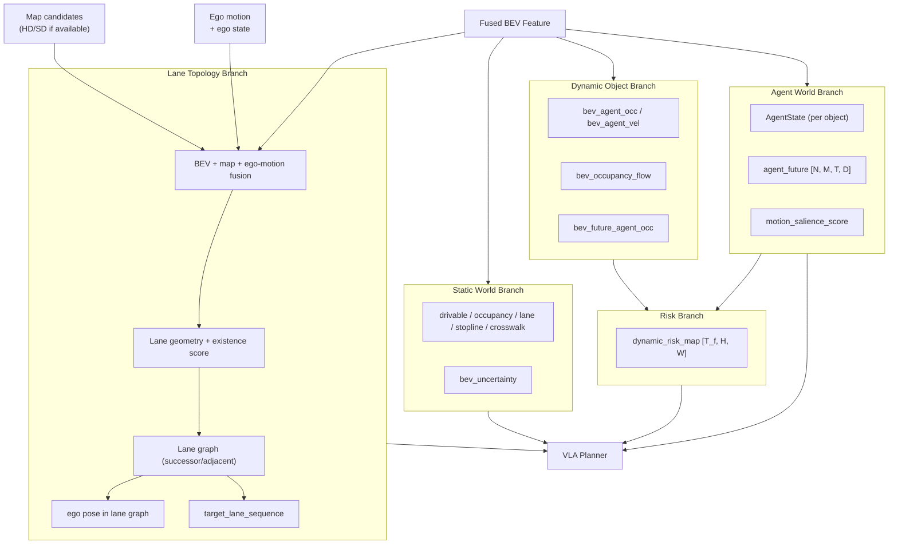

# 第4章 Dynamic Object World Model と未来リスク推定

---

## 4.1 なぜ静的Occupancyだけでは不十分か

BEVの静的占有（bev_occupancy）は、「現在どこが物理的に占有されているか」を表す。  
これだけでは以下の判断ができない。

```text
不足する判断:
  - 前方の車両は走行中か、駐車中か
  - 横から来る車両はどの速度でいつ交差点に入るか
  - 歩行者は道路を横断しようとしているか
  - 前走車が急ブレーキをかける可能性があるか
  - 停車中の車両がこれから発進するか
```

Plannerが安全かつ自然な走行を計画するには、「動的物体がどう動くか」の予測が必要である。

---

## 4.2 Occupancy FlowとDynamic Space表現

### Occupancy Flow

Occupancy Flowは、各BEVセルの占有がどの方向にどのくらい移動するかを表す。

```text
bev_occupancy_flow: [B, H, W, 2]
  - channel 0: flow_x (前後方向の変位)
  - channel 1: flow_y (左右方向の変位)
  - 意味: この時点から次の時点で、占有がどこへ移動するか
  - 単位: メートル/フレーム or メートル/秒
```

光学フローと同様だが、BEV上で動的物体の動きを表す。

### 静的ワールドと動的ワールドの分離

```text
Static World Branch:
  - 道路構造（走行可能、車線、ストップライン、横断歩道）
  - 静止した障害物（建物、壁、工事柵）
  - 更新頻度: 低（1-5Hz、キャッシュ可能）

Dynamic Object Branch:
  - 移動車両、歩行者、自転車
  - 動的な状態（速度、加速度、意図）
  - 更新頻度: 高（10-20Hz）
```

この分離により、静的情報はキャッシュして計算コストを下げ、動的情報だけを高頻度で更新できる。

---

## 4.3 Dynamic Object Detection & State Head

BEV特徴量から各動的物体を検出し、状態を推定するヘッドである。  
この節では「現時刻の検出・状態推定」までを扱い、複数秒先の多モード未来軌跡は4.6節に集約する。  
検出結果は Agent Token と AgentState として後段の Future Predictor と Planner に渡される。

### インターフェース

```text
入力:
  bev_temporal:  (B, T_in, C_bev, H, W)   ← 時系列BEV特徴量（複数フレーム分）

出力:
  agent_tokens:  (N_agent, C_agent)        ← 検出エージェントの埋め込みベクトル
  agent_states:  List[AgentState]          ← 解釈可能な状態（Plannerのルールにも使用）
    - bbox_bev:          (cx, cy, w, l, yaw)    BEV上のバウンディングボックス
    - velocity:          (vx, vy) m/s
    - heading:           float, rad
    - category:          "vehicle" / "pedestrian" / "cyclist" / "animal" / "unknown"
    - vehicle_subtype:   "car" / "truck" / "bus" / "motorcycle" / "special"  (category=vehicle時のみ、表示用)
    - motion_state:      "parked" / "stationary" / "moving" / "accelerating" / "decelerating" / "turning"
    - existence_score:   float [0, 1]
    - track_id:          str   ← 同一エージェントをフレーム間で継続識別するID
    - occlusion_level:   "none" / "partial" / "full"
    - unknown_dynamic:   bool  ← bev_agent_occ diff + vel threshold で動体として検出されたが分類不能な場合
```

### モデルアーキテクチャ

```text
BEV Detection Head（CenterPoint / DETR-BEV 系）:

Step 1: 特徴抽出
  - bev_temporal (T_in フレーム) をChannelで結合し、2D CNN / Transformer で処理
  - 出力: spatial_features (B, C_spatial, H, W)

Step 2: 物体クエリ生成（DETR方式）
  - N_query 個の学習済みクエリを初期化
  - spatial_features に対して cross-attention → query_features (N_query, C_agent)
  - 存在確率が閾値を超えたクエリのみを agent_tokens として後段に渡す

Step 3: 各属性のデコード（マルチタスクヘッド）
  - bbox_bev:      (cx, cy, w, l, sin(yaw), cos(yaw)) を MLP で回帰
  - velocity:      (vx, vy) を MLP で回帰
  - category:      5クラス Softmax（vehicle/pedestrian/cyclist/animal/unknown）
  - vehicle_subtype: 5クラス Softmax（category=vehicleのみ有効、CE loss）
  - existence_score: Sigmoid
  - occlusion_level: 3クラス分類

損失:
  - bbox 回帰: Smooth L1 loss（CenterPoint 方式: ヒートマップ + オフセット回帰）
  - velocity:  L1 loss
  - category:  CE loss（5クラス）
  - subtype:   CE loss（5クラス、vehicle サンプルのみ）
  - existence: BCE loss

```

### 運動状態分類

```text
parked:       速度 < 0.5 m/s かつ 長時間位置変化なし（路肩・駐車枠・ハザード等の文脈を併用）
stationary:   速度 < 0.5 m/s かつ 短時間停止（信号待ち・渋滞・一時停止等、発進可能状態）
moving:       速度 >= 0.5 m/s かつ 等速に近い（yaw_rate 小）
accelerating: 速度が増加中（前フレームとの速度差 > 閾値）
decelerating: 速度が減少中
turning:      yaw_rate > 閾値（例: 0.1 rad/s）

→ この分類はルールベースで agent_states に付与する（学習ターゲットではない）
→ Planner のルールベース安全チェックや Dynamic Risk Map の重み付けに使用
```

### 駐車車両と一時停止車両の識別

Plannerにとって重要な区別である。未来予測の不確実性が大きく異なる。

```text
駐車車両（parked）:
  - 近い未来では動かない確率が高い → agent_future の主モードが静止に近い
  - ドアオープンリスクは別途ルールで付加
  - 識別根拠: 停止継続時間、路肩/駐車枠との整合、周辺交通流との不整合

一時停止車両（stationary）:
  - 信号変化・前詰まり解消後に発進する可能性がある
  - agent_future に「発進・加速」モードが高確率で現れる
  - 識別根拠: 周辺の信号状態、横断歩道の有無、前方の渋滞状況

→ 識別失敗（parked を stationary と誤認）した場合のリスク:
     不要な待機・過剰な追従期待により走行が不自然になる
→ 識別失敗（stationary を parked と誤認）した場合のリスク:
     発進した車両への衝突リスクを過小評価
→ 対処: 停止継続フレーム数でヒステリシスを設けて誤分類を抑制
```

### unknown_dynamic フラグの付与

分類不能だが動いている物体（落下物が転がるケース、特殊車両、動物等）を安全に扱うための仕組み。

```text
条件:
  - bev_agent_occ の差分（diff_occ）でセルが新たに占有された
  - かつ bev_agent_vel でそのセルに有意な速度ベクトルが存在する
  - かつ category = unknown（既知カテゴリに分類できなかった）

処理:
  - unknown_dynamic = true としてフラグを立てる
  - Agent Future Predictor は「停止」「低速直進」「現在速度維持」を保守的な候補として出力
  - Dynamic Risk Map でのリスク下限を通常エージェントより高めに設定
```

---

## 4.4 Occupancy FlowとVelocity Field

BEV上でセルレベルの動き場を推定する。Agent Detection Head とは独立して動作し、  
検出できなかった小物体・遠方物体・密集領域の動きも捉える補完的な表現である。

### 出力テンソル

```text
入力:
  bev_temporal: (B, T_in, C_bev, H, W)   ← 時系列BEV特徴量

出力:
  bev_agent_occ:      (B, H, W)         動的物体が現在占有するセル（確率 [0,1]）
  bev_agent_vel:      (B, H, W, 2)      各セルの速度場 (vx, vy) [m/s]
  bev_occupancy_flow: (B, H, W, 2)      次フレームへの変位場 (Δx, Δy) [m]
  bev_motion_prob:    (B, H, W)         動体である確率（静止物と動的物体の区別）
```

### モデルアーキテクチャ

```text
Occupancy Flow Head（軽量 CNN デコーダ）:

Step 1: BEV特徴からの Shared Encoder
  - bev_temporal の T_in フレームを時間方向に畳み込み（Temporal Conv / attention）
  - 出力: flow_features (B, C_flow, H, W)

Step 2: 各出力のデコード（マルチタスク、共有エンコーダから分岐）
  - bev_agent_occ:      Conv → Sigmoid
  - bev_agent_vel:      Conv → 速度ベクトル（無制限 float）
  - bev_occupancy_flow: Conv → 変位ベクトル（PixelFlow と同方式）
  - bev_motion_prob:    Conv → Sigmoid

損失:
  - bev_agent_occ:      BCE loss（動体セルは Focal Weight を適用）
  - bev_agent_vel:      L1 loss（bev_agent_occ > 0.5 のセルのみ）
  - bev_occupancy_flow: Charbonnier loss + flow consistency loss
      flow consistency: bev_agent_occ_t+1 ≈ warp(bev_agent_occ_t, flow_t)
  - bev_motion_prob:    BCE loss

Imbalance 対処:
  - 動体セルは全セルの約 5〜10% → Focal Loss + positive-weight sampling
  - bev_agent_vel は動体セルのみで損失を取る

```

### なぜ Agent Detection と両方必要か

```text
Agent Detection Head:
  - 個別物体に track_id を付与して「誰が」動いているか追跡できる
  - 未来予測・衝突判定に高精度なbbox情報が得られる
  - 密集・遮蔽時に検出漏れが生じやすい

Occupancy Flow Head:
  - セルレベルなので検出が難しい小物体・密集領域も捉えられる
  - 連続した速度場として Planner がリスク計算に直接使える
  - ただし「誰が」動いているかは分からない（ID なし）

→ 両方を組み合わせることで、検出漏れを occupancy flow で補完しながら、
  主要エージェントは ID 付きで追跡・予測できる。
```

---

## 4.5 Future Dynamic Occupancy Head

現在の状態から、未来の各時刻での動的占有分布を予測する。  
Agent Future Predictor（4.6節）が個別エージェントの軌跡を予測するのに対し、  
こちらはセルレベルで将来の動体分布全体を予測する粗粒度の表現である。

### インターフェース

```text
入力:
  bev_temporal:   (B, T_in, C_bev, H, W)   ← 時系列BEV特徴量
  bev_agent_occ:  (B, H, W)                ← 現在の動体占有（4.4節出力）
  bev_agent_vel:  (B, H, W, 2)             ← 現在の速度場（4.4節出力）

出力:
  bev_future_agent_occ: (B, T_future, H, W)
    - T_future = 4〜12 ステップ
    - 各ステップの占有確率 [0, 1]
    - 例: T_future=12, 0.5s間隔 → 6秒先まで
```

### モデルアーキテクチャ

```text
Convolutional Future Occupancy Predictor:

Step 1: 現在状態の特徴統合
  - bev_temporal（過去フレーム）+ bev_agent_occ + bev_agent_vel を concat
  - 2D CNN Encoder で空間特徴を圧縮 → context_features (B, C, H/4, W/4)

Step 2: 時間方向の展開（AutoRegressive または 並列デコード）
  並列デコード方式（推論速度重視）:
    - T_future 個のデコーダヘッドを並列に持つ
    - context_features から各時刻の occupancy を直接予測
    - 出力: (B, T_future, H, W)

  AutoRegressive 方式（精度重視）:
    - ConvLSTM / PredRNN で 1ステップずつ先の occupancy を予測
    - 前ステップの予測を次ステップの入力に使う
    - 出力精度は高いが推論遅延が増加

Step 3: Warp-based 一貫性強化
  - 予測した bev_future_agent_occ と bev_occupancy_flow から
    warp した予測を加重平均して最終出力とする
  - 物体が消えない・突然現れない物理的一貫性を補強

損失:
  - per-step BCE loss（各未来フレームでの教師信号との比較）
  - flow consistency loss: warp(occ_t, flow_t) ≈ occ_t+1
  - 教師信号: ログの未来フレームの bev_agent_occ
             または Agent Future Predictor の出力を soft target として使う

```

### Agent Detection との役割分担

```text
bev_future_agent_occ（本節）:
  - セルレベル、粗粒度
  - Dynamic Risk Map (4.8節) の計算基盤
  - 検出できなかった物体も含む「全体的リスク」の把握

agent_futures（4.6節、per-agent）:
  - エージェントごとの精密な多モード軌跡
  - Planner の cross-attention 入力
  - 「誰がどのモードで動くか」を Planner が判断するために必要

→ 両者は並列に計算し、それぞれ異なる用途で使われる。
```

---

## 4.6 Agent Future Trajectory Prediction

物体ごとの未来軌跡を、多モード（複数のシナリオ）で予測する。

```text
外部インターフェース（エージェント入力は現フレーム中心、履歴は内部状態とBEV時系列で扱う）:
  入力:
    agent_tokens:  (N_agent, C_agent)        ← 4.3節の現フレーム出力
    agent_states:  List[AgentState]          ← bbox・速度・heading・track_idを含む現在状態
    bev_temporal:  (B, T_in, C_bev, H, W)    ← 時系列BEV（交差点形状・信号等の文脈）
    lane_graph:    局所Lane Graph トークン   ← 走行方向の制約に使用

  出力:
    agent_futures: (N_agent, M_modes, T_future, D_agent)
    mode_scores:   (N_agent, M_modes)         ← 各モードの確率
      - N_agent: 最大エージェント数（例: 32）
      - M_modes: 軌跡モード数（例: 6）
      - T_future: 未来時刻ステップ（例: 12、0.5s間隔で 6秒先まで）
      - D_agent: 状態次元（x, y, vx, vy, heading）= 5

  内部状態（モジュールが保持・更新）:
    hidden_states: Dict[track_id → h (C_hidden,)]
      ← エージェントごとのGRU隠れ状態
      ← 検出されなかったエージェントの状態は一定フレーム保持後に削除
```

### なぜ過去履歴が必要か・なぜ内部状態で持つか

```text
現在の1フレームだけでは以下が判断できない:
  - 加速中か、減速中か（速度変化）
  - カーブに差し掛かっているか（yaw変化率）
  - 一時停止してから発進しようとしているか（停止→速度上昇）
  - 車線変更を始めているか（lateral drift）
  - 歩行者が立ち止まって向きを変えたか

→ 過去情報をバッファとして外部から毎回渡すと:
  - インターフェースが複雑になる
  - バッファの管理責任が呼び出し側に移る
  - フレーム欠損時（オクルージョン）の補完が難しい

→ モジュール内部でGRU隠れ状態として保持する設計が適切:
  - 外部から見ると「現フレームを渡すだけ」のシンプルなIF
  - オクルージョンや新規エージェントの扱いをモジュール内で完結
```

### モデルアーキテクチャ（Recurrent + Multi-mode Decoder）

```text
Recurrent Encoder（GRUベース、per-agent hidden state）:

Step 1: 現フレームの入力変換
  - agent_tokens と agent_states（位置・速度・heading・motion_state）を結合してGRU入力次元に線形変換
  - 各エージェントの track_id から対応する hidden_state h_prev を取得
    （新規エージェントは h_prev = zeros）

Step 2: GRU更新（時系列情報の蓄積）
  h_new = GRU(x_t=agent_input_projected, h=h_prev)
  - h_new: (N_agent, C_hidden)  ← 過去の軌跡パターンが圧縮されている
  - 各 track_id の hidden_states を h_new で更新（モジュール内部に保存）

Step 3: BEV cross-attention（シーン文脈の取り込み）
  - h_new が自分の位置周辺のBEVトークンをcross-attend
  - 交差点形状・信号位置・車線方向をエージェント特徴に統合
  - 出力: context_aware_features (N_agent, C_hidden)

Step 4: Agent 間 cross-attention（相互作用のモデリング）
  - 全エージェント間でself-attentionを実行
  - 近くのエージェント同士が互いの動きを考慮した予測が可能
  - 例: 前走車が減速中（hidden stateが減速パターンを蓄積）
        → 後続車のhiddenに反映 → 後続車の「停止モード」確率上昇

Step 5: Multi-mode デコーダ
  - M 個の学習済みモードクエリ（固定）を用いてDecoder
  - 各クエリが「直進」「右折」「停止」等の行動モードを表す潜在モードとして学習される
  - 出力: (N_agent, M_modes, T_future, D_agent) + mode_scores

オクルージョン対策:
  - 検出が途切れたエージェントの hidden_state は N フレーム保持（例: 10フレーム）
  - 再検出時: 保持していた hidden_state から継続してGRU更新
  - N フレーム超過で削除（その後再検出時は新規として扱う）

学習:
  - 学習時は T_hist 分のシーケンスをBPTT（Backpropagation Through Time）で学習
  - 推論時は1フレームずつ逐次的に hidden_state を更新
  - Winner-takes-all / best-of-M: 最も実際の軌跡に近いモードを主ターゲットにする
  - minADE/minFDE loss、mode_scores のNLL loss、速度・加速度の物理的一貫性ペナルティ

```

### 多モード予測の重要性

```text
同じ状態からでも複数の未来がありうる例:
  - 前方の車両: 直進 or 右折 or 急停車
  - 歩行者: 待機 or 横断開始
  - 横断歩道前の自転車: 止まる or 飛び出す

M=6モードを出すことで、Plannerはどのシナリオが起きても
安全側の軌跡を選びやすくなる。最終判断では mode_scores と Dynamic Risk Map を併用する。
```

### Interaction-aware予測

単独での予測ではなく、複数エージェント間の相互作用を考慮した予測が精度を上げる。

```text
Interaction-aware methods:
  - Transformer-based joint prediction (Wayformer, etc.)
  - Graph Neural Network over agent proximity
  - Social Force model inspired
  
本設計: Transformer-based multi-agent self-attention / cross-attention
  - 各エージェントが他エージェントの状態を参照してMHA
  - BEV特徴量も参照（交差点幾何等）
```

---

## 4.7 Motion Salience Gate

全エージェントが等しく重要ではない。Plannerへの計算負荷を抑えながら安全性を維持するため、  
重要度の高いエージェントに優先的に計算リソースを割り当てる仕組みである。

### インターフェース

```text
入力:
  agent_states:   List[AgentState]     ← 4.3節の Detection Head 出力
  agent_futures:  (N_agent, M, T, D)  ← 4.6節の Future Predictor 出力
  ego_state:      (x, y, vx, vy, heading, route)

出力:
  motion_salience_score: (N_agent,)   ← [0, 1]、高いほど自車 Planner への影響大
```

### スコア計算方法

```text
各エージェントに対して以下のスコアを計算し、加重和を取る:

1. 距離スコア (w=0.30):
   s_dist = exp(-d / σ_dist)
   - d: 自車とエージェントのユークリッド距離
   - σ_dist = 20m（距離 20m 以内を重視）

2. 速度スコア (w=0.20):
   s_vel = min(|v_agent| / v_max, 1.0)
   - v_max = 20 m/s を上限として正規化
   - 静止中のエージェントは低スコア

3. ルート交差スコア (w=0.25):
   s_route = max over modes and route_points(mode_score[m] * exp(-d_to_route[m] / σ_route))
   - d_to_route[m]: agent_future の各モード軌跡と自車ルートの最接近距離
   - σ_route = 5m

4. 相対角スコア (w=0.15):
   s_angle = |sin(θ_relative)|
   - θ_relative: 自車進行方向とエージェント進行方向の相対角
   - 交差・合流するエージェントほど高スコア

5. 脆弱性ボーナス (w=0.10):
   s_vuln = 1.0 if category in (pedestrian, cyclist) else 0.0

motion_salience_score[i] = Σ w_k * s_k[i]（正規化して [0, 1] に収める）
unknown_dynamic または pedestrian/cyclist には安全側の下限値を設定する
```

### Planner・Risk Map での使い方

```text
Planner Decoder:
  - motion_salience_score でソートし、上位 N_top エージェント（例: 16）のみを
    cross-attention の入力として使う
  - N_top 未満のエージェントは dynamic_risk_map を通じて間接的に影響

Dynamic Risk Map (4.8節):
  - 各エージェントの寄与を motion_salience_score で重み付け
  - スコアが低いエージェント（遠方の静止車両等）のリスク寄与を抑制
  - ただし近接障害物や unknown_dynamic は salience によってリスクをゼロ化しない

リアルタイム性への寄与:
  - 最大 32 エージェントを常に処理すると Planner の計算コストが増大
  - N_top = 16 に絞ることで cross-attention の計算量を半減（O(N²) の削減）
  - 交差点や合流点では高スコアのエージェントが自然に上位に来る
```

---

## 4.8 Dynamic Risk Map

動的物体の未来予測から、BEV上の時系列リスクマップを計算する。  
Planner の軌跡評価において、衝突リスクを空間・時間の両軸で定量化する。

### インターフェース

```text
入力:
  agent_futures:          (N_agent, M, T_future, D)   ← 4.6節
  mode_scores:            (N_agent, M)                ← 各モードの確率
  motion_salience_score:  (N_agent,)                  ← 4.7節
  bev_future_agent_occ:   (B, T_future, H, W)         ← 4.5節（補完用）

出力:
  dynamic_risk_map: (B, T_future, H, W)
    - 各未来時刻のBEVセルのリスク値
    - 値: [0, 1]（1が最高リスク）
```

### リスク計算方法

```text
Step 1: エージェントごとの占有確率マップ生成
  各エージェント i、モード m、時刻 t:
    - 軌跡点 (x_t, y_t) を中心に 2D Gaussian を BEV グリッドに投影
    - σ はエージェントの bbox サイズと mode_score の不確実性に比例
    occ_prob[i, m, t](x, y) = mode_scores[i, m] * Gaussian(x-x_t, y-y_t; σ_bbox)

Step 2: モード統合とサリエンス重み付け
  agent_risk[i, t](x, y) = 1 - Π_m(1 - occ_prob[i, m, t](x, y))
  risk_weight[i] = max(salience[i], category_floor[i])
  dynamic_risk_map[t](x, y) = max_i(agent_risk[i, t](x, y) * risk_weight[i])
  - category_floor は pedestrian/cyclist/unknown_dynamic で高めに設定し、低salienceでも消さない

Step 3: bev_future_agent_occ との融合（未検出物体の補完）
  final_risk[t](x, y) = max(dynamic_risk_map[t](x, y),
                             α * bev_future_agent_occ[t](x, y))
  α = 0.5〜1.0（検出済みエージェントの精密な予測を優先しつつ未検出物体を補完）

損失（学習時）:
  - agent_futures と bev_future_agent_occ から作った占有分布を教師にする supervised loss
  - 衝突・急制動ログでは、衝突地点周辺のリスクが低くならないよう calibration loss を追加
  - end-to-end ではなく、agent_futures の損失で間接的に改善する設計も可能
```

### Planner での使い方

```text
軌跡候補の評価（External Evaluator内）:
  - K 個の候補軌跡の各時刻・各点で dynamic_risk_map[t](x, y) を参照
  - candidate_risk[k] = Σ_t Σ_point dynamic_risk_map[t](ego_xy[k,t])
  - candidate_risk が閾値を超える候補を除外
  - 残る候補の中で comfort score が最高の軌跡を選択

Planner 損失への組み込み:
  - ログ軌跡が dynamic_risk_map の高リスク領域に入ったシーンでは
    safety loss を追加（回避行動の学習を促進）
```

---

## 4.9 Interaction-aware Planner 接続

Dynamic World の各モジュール出力を Planner Decoder に効率的に渡す設計を定義する。  
渡し方（concat / cross-attention / additive）と順序が、Planner の性能に直結する。

### 情報の渡し方

```text
Planner Decoder は Transformer Decoder 構造を持つ（5章で詳述）。
動的世界の情報は以下の方法で注入する:

1. agent_futures（per-agent cross-attention）:
   - Motion Salience 上位 N_top エージェントの future tokens をキーとして
   - Planner クエリが cross-attention で参照
   - 「誰がどこにいるか」を明示的に条件付け

2. dynamic_risk_map（Spatial attention bias）:
   - BEV グリッドと Planner クエリ間の attention logits に risk 由来の負バイアスを加算
   - 高リスクセルへのアテンションを抑制する Negative Attention Bias として機能

3. bev_future_agent_occ（オプション）:
   - dynamic_risk_map の補完として Planner に渡す場合もある
   - ただし冗長な場合は省略して計算コストを削減
```

### Planner Decoder の注意順序

```text
各 Decoder レイヤーでの情報参照順序:
  1. Static World（走行可能領域、現在の占有、停止線）
       → 「そもそもどこを走れるか」の硬い制約
  2. Lane Topology（目標車線、接続グラフ）
       → 「どのルートを通るか」の構造的制約
  3. Dynamic Agent Futures（上位エージェントの多モード軌跡）
       → 「周囲がどう動くか」を条件に軌跡形成
  4. Dynamic Risk Map（BEV レベルのリスク）
       → 「どこが危ないか」の連続的ペナルティ
  5. Language Conditioning（外部指示・シーン記述）
       → 「何をすべきか」の意味的条件付け
  6. Ego Route & Context（自車ルート、速度、残距離）
       → 「目的地に向かう」の目標条件

この順序は「安全制約 → 構造制約 → 動的制約 → 言語指示 → 目標」
という自律走行の意思決定の論理に対応している。

各エージェント情報の利用:
  - 上位 N_top エージェント: cross-attention でシナリオを明示的に考慮
  - 下位エージェント: dynamic_risk_map を通じて暗黙的に影響

設計上の注意:
  - agent_futures と dynamic_risk_map は情報が重複する部分もある
  - 実装上は dynamic_risk_map への attention を先に適用し、
    残差として agent_futures cross-attention を追加するとよい
  - 全情報を同時に入力するより、段階的に注入する方が学習が安定する
```

---

## 4.10 Extended BEV Output Package

```json
{
  "static_world": {
    "bev_drivable": "tensor [B, H, W]  (0=NOT_DRIVABLE, 1=DRIVABLE, 2=MARGINAL)",
    "bev_occupancy": "tensor [B, H, W]",
    "bev_lane": "tensor [B, H, W, C]",
    "bev_stopline": "tensor [B, H, W]",
    "bev_crosswalk": "tensor [B, H, W]",
    "bev_uncertainty": "tensor [B, H, W]"
  },
  "lane_topology": {
    "lane_nodes": "[LaneNode]",
    "lane_edges": "[LaneEdge]",
    "target_lane_sequence": "[lane_id]"
  },
  "dynamic_world": {
    "bev_agent_occ": "tensor [B, H, W]",
    "bev_agent_vel": "tensor [B, H, W, 2]",
    "bev_occupancy_flow": "tensor [B, H, W, 2]",
    "bev_motion_prob": "tensor [B, H, W]",
    "bev_future_agent_occ": "tensor [B, T_future, H, W]"
  },
  "agent_world": {
    "agent_states": "List[AgentState]",
    "agent_tokens": "tensor [N_agent, C_agent]",
    "agent_futures": "tensor [B, N, M, T, D]",
    "mode_scores": "tensor [B, N, M]",
    "motion_salience": "tensor [B, N]"
  },
  "risk_outputs": {
    "dynamic_risk_map": "tensor [B, T_future, H, W]"
  }
}
```

---

## 4.11 シナリオ別の処理例

### 駐車車両の脇をすり抜ける場合

```text
観測:
  - bev_agent_occ: 前方右側に占有
  - bev_motion_prob: 低 (0.1以下)
  - motion_state: "parked"
  - 時系列: 複数フレームで同じ位置に静止

Dynamic Risk Mapへの反映:
  - 現在占有と静的衝突チェックでは常に障害物として扱う
  - 動的未来リスクは低いが、駐車車両の footprint は未来時刻でも残す
  - ドアオープンや歩行者の飛び出しは別の近傍リスクとして加算する

Plannerへの影響:
  - 候補軌跡が駐車車両を回避する左オフセットを生成
  - 外部評価器が回避軌跡を選択
  - 横方向のマージンを計算して候補を評価
```

### 交差点で対向左折待ちの場合

```text
観測:
  - bev_agent_occ: 対向方向から来る車が減速しつつ交差点に接近
  - motion_state: "decelerating" → "stationary"
  - agent_future: Modeに「直進する」と「こちら側に左折する」がある

Dynamic Risk Mapへの反映:
  - 左折モードの軌跡がリスクマップに反映
  - 交差点中心付近のリスクが高い

Plannerへの影響:
  - 交差点内での候補軌跡のリスクが高くなる
  - 外部評価器: 対向車の左折完了後に進む軌跡を選択
  - 待機判断（stop then go）が候補軌跡に現れることが望ましい
```

### 横切り車両が飛び出してくる場合

```text
観測:
  - Radar: 側方から高速で接近するターゲット
  - Camera: 右側の細道から車が出てくる
  - bev_motion_prob: 急上昇
  - agent_future: 自車軌跡と交差する高確率モード

Dynamic Risk Mapへの反映:
  - 数秒後の自車軌跡上でリスクが急上昇

Plannerへの影響:
  - 高リスク軌跡を外部評価器が除外
  - 残る候補: 減速して待つ or 大きく回避
  - External Evaluator が最小リスク軌跡を選択
```

### 一時停止後に発進する前走車

```text
観測:
  - motion_state: "stationary" → "moving"
  - agent_future: 加速して直進するモードが高確率

Dynamic Risk Mapへの反映:
  - 前走車の現在位置付近のリスクは時間とともに前方へ移動する
  - 自車が追従すべき時空間ギャップを下回る候補は除外する

Plannerへの影響:
  - 前走車の発進を予測した追従軌跡が候補に現れる
  - 過剰なブレーキを避ける自然な加速が生成される
```

---

## 4.12 全体アーキテクチャ図（5ブランチ構造）



---

## 4.13 学習時の課題

### 教師信号の構築

```text
bev_agent_occ の教師:
  - LiDARからの3D bbox → BEV投影
  - または UniADのoccupancy head出力を蒸留

agent_futures の教師:
  - ログの実際の未来軌跡（nuScenesのannotation）
  - 予測誤差の最小化（minADE, minFDE, MR等）

dynamic_risk_map の教師:
  - agent futuresの確率分布から計算
  - または衝突が実際に発生したログからの逆算
```

### Imbalance問題

```text
問題: 動体が存在しないセルが圧倒的多数
対処:
  - Focal Loss
  - weighted sampling (動体周辺を高頻度でサンプリング)
  - presence-guided loss masking
```

---

## 4.14 章のまとめ

```text
本章で設計した要素:
  1. 動的世界が必要な理由（静的Occupancyの限界）
  2. 静的ワールドと動的ワールドの分離・設計思想
  3. Dynamic Object Detection & State Head
       - CenterPoint / DETR-BEV 系アーキテクチャ
       - 2階層分類（5クラス + vehicle subtype）
       - 運動状態分類（parked/stationary/moving 等）
       - 駐車車両と一時停止車両の識別
       - unknown_dynamic フラグの付与
  4. Occupancy Flow / Velocity Field
       - セルレベル速度場・変位場
       - Agent Detection との役割分担
  5. Future Dynamic Occupancy Head
       - 並列デコード / AutoRegressive 方式
       - flow consistency loss
       - Agent Future Predictor との粒度の違い
  6. Agent Future Trajectory Prediction（多モード）
       - GRU per-agent hidden state（履歴は内部状態として保持）
       - BEV cross-attention + agent間 cross-attention
       - Winner-takes-all 学習
  7. Motion Salience Gate
       - 距離・速度・ルート交差・相対角・脆弱性の加重スコア
       - Planner の計算コスト削減（N_top 絞り込み）
  8. Dynamic Risk Map
       - エージェントごとの Gaussian 投影 + モード統合 + salience/category floor 重み付け
       - bev_future_agent_occ との融合（補完）
       - Planner 軌跡評価への組み込み
  9. Interaction-aware Planner 接続
       - 情報の渡し方（per-agent cross-attn / risk spatial bias）
       - 注意順序の設計思想
 10. シナリオ別の動作例（4シナリオ）
```

次章では、Language Conditioning と VLA Planner の設計を詳述する。
