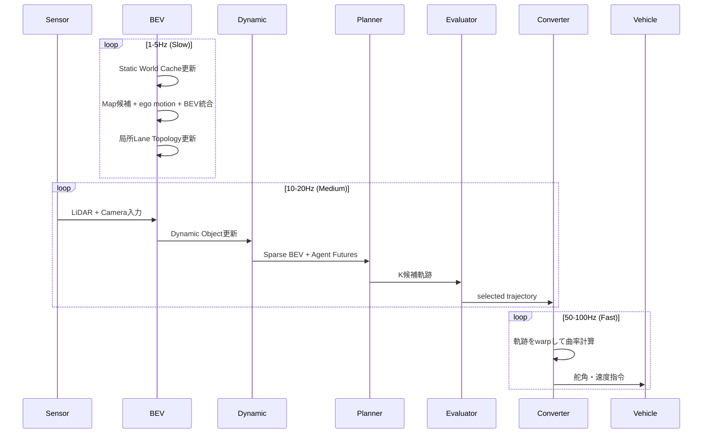

# 第8章 実車適用のための軽量化とリアルタイム設計

---

## 8.1 車載環境の制約

研究環境では、大型GPUサーバーでモデルを動かすことができる。  
しかし実車に搭載するには次の制約がある。

```text
電力制約:
  - 乗用車: 100〜200W の熱設計電力（TDP）
  - 自動車グレードSoC: DRIVE Orin / Thor (NVIDIA): 60W - 300W
  - 研究用GPU (A100等): 400W以上

メモリ帯域:
  - HBM2 (A100): 2TB/s
  - Orin AGX DRAM: 136GB/s (LPDDR5)
  - 大きな差がある → メモリ帯域がボトルネックになりやすい

ストレージ:
  - 推論モデルのロード速度
  - OTA更新のモデルサイズ上限

温度:
  - 夏の車内温度は 70〜80℃ に達することがある
  - 車載グレード（AEC-Q100等）の要件

振動・衝撃:
  - 車載環境は研究室と異なる振動特性
```

---

## 8.2 軽量化の基本方針

```text
原則1: Planner は軽量化しすぎない
  - 判断の精度がそのまま安全性に影響する
  - Plannerの精度を削って計算を減らすより、Percptionを軽量化する

原則2: 計算を「計画に関係する空間」に集中させる
  - Route Corridor周辺の高解像度処理
  - 遠距離・無関係な領域は粗いサンプリング

原則3: 静的情報はキャッシュする
  - 道路構造（走行可能域、車線）は毎フレーム更新不要
  - Dynamic ObjectとRisk Mapのみ高頻度更新

原則4: Dense BEV を Sparse BEV に変換する
  - 全BEVセルを処理するより、重要なトークンのみを処理する
```

---

## 8.3 Dense BEVからPlanner向けSparse BEVへ

```text
全BEVトークン（200x200=40,000）を Planner に渡すと重すぎる。

Sparse化の方針:
  1. Motion Salienceスコアでトークンを重要度付け
  2. ルートコリドー内のトークンを高密度に保持
  3. 重要度低のトークンをpoolingで削減
  4. Planner入力: 2,000〜4,000トークンを目標

SparseDriveの思想を参考に:
  - 全BEVではなく動体・ルート関連のSparse featureを使う
  - object-centric な表現
```

### Sparse BEV Token の選別

```python
# Sparse BEV Token選別（概略）
salience_scores = compute_salience(bev_features, route_tokens, agent_tokens)
# salience: motion prob + route proximity + bev_uncertainty

keep_mask = salience_scores > SALIENCE_THRESHOLD
# keep_mask: 上位2000〜4000トークンを保持
pooled_rest = mean_pool(bev_features[~keep_mask])  # 残りをpooling

sparse_bev = concat([bev_features[keep_mask], pooled_rest])
```

---

## 8.4 Range-Adaptive Perception（距離適応型解像度）

距離に応じてBEV解像度を変える。

```text
Zone 1 (0〜30m): 高解像度
  - BEV grid: 0.2m/pixel
  - Attention budget: 高
  - 近接障害物、歩行者、信号待ち

Zone 2 (30〜80m): 中解像度
  - BEV grid: 0.5m/pixel
  - Attention budget: 中
  - 前走車、割り込み車両

Zone 3 (80m〜200m): 低解像度
  - BEV grid: 1.0〜2.0m/pixel
  - Attention budget: 低
  - 遠方の参考情報のみ
```

実装：

```text
方法A: Multi-scale BEV Grid
  - 各zoneで別々のBEV gridを持つ
  - Planner入力時に統合

方法B: Rectilinear Projection
  - x軸方向に非線形な解像度
  - 近距離は高密度、遠距離は低密度

推奨: 方法Aの簡略版（2スケール: near/far）
```

---

## 8.5 Static World Cache（静的情報のキャッシュ）

```text
静的情報（走行可能域、車線、停止線、横断歩道）は、
道路構造が変わらない限り毎フレーム更新不要。

Cache設計:
  update_interval: 1-5 Hz (slow layer)
  cache_duration:  ~1秒分
  
  Ego motion warp:
    - キャッシュされたBEVを毎フレームEgo motionでwarpして使う
    - 局所Lane GraphもEgo motionで現在座標へ更新する
    - warp計算コスト: 全体のBEV推論コストより大幅に低い

キャッシュ無効化条件:
  - Map候補とBEV観測の不整合スコアが閾値超過
  - センサ品質の大幅低下
  - Ego速度が急変（急減速等）
  - ODD外検出
```

---

## 8.6 Dynamic-first Perception

静的情報より先に動的情報を処理する。

```text
Dynamic-first の理由:
  - 動的物体は毎フレーム変化する
  - 歩行者の動きは100msで大きく変わることがある
  - Static cacheで静的情報を補いながら、動的処理に予算を使う

実装:
  1. Radar Doppler + 時系列差分 → 動体領域の高速検出
  2. 動体周辺のBEV特徴量を優先的に更新
  3. 静的背景はcacheから補完

RadarのDopplerを使った早期動体検出:
  - Radarは低レイテンシ
  - Doppler速度から高速で動体の方向と速度を取得
  - これをBEV処理の「ヒント」として使う
```

---

## 8.7 Route Corridor Perception（2段階処理）

```text
Stage 1: Coarse Global BEV
  - 全範囲を低解像度で処理
  - ルート方向の確認
  - 大まかなリスク検出

Stage 2: High-Resolution Corridor BEV
  - ルート周辺（±5m程度）を高解像度で処理
  - 詳細な障害物検出
  - 車線精細化
  - 歩行者詳細

計算の集中:
  Stage 1: 全体の30%の計算コスト
  Stage 2: 全体の70%をルート周辺に集中
```

---

## 8.8 Token Compression と Query Pruning

```text
Keep tokens（高密度に保持）:
  - motion_prob > 0.3 のBEVセル（動体）
  - route_proximity < 3m のBEVセル（ルート近傍）
  - bev_uncertainty > 0.5 のBEVセル（不確実領域）
  - stopline, crosswalk が検出されたセル

Pool tokens（まとめる）:
  - 上記以外の遠距離・静的背景
  - 2x2 or 4x4 average pooling

Remove tokens（削除）:
  - bev_drivable = NOT_DRIVABLE(0) かつ Dynamic Risk = 0 のセル
    ※ MARGINAL(2) のセルは削除しない（緊急回避経路として保持）
  - 遠距離の明らかに無関係な領域
```

---

## 8.9 Cascaded Perception（段階的精緻化）

```text
Pass 1: Coarse（高速・低精度）
  - 軽量Backboneで全体を処理
  - 動体領域と重要領域をマスクとして取得
  - 10-20ms 目標

Pass 2: Refinement（重要領域のみ）
  - Pass 1が重要とした領域のみを高精度処理
  - 高精度Backboneを重要領域のROIに適用
  - 30-50ms 追加

合計: 50-70ms が目標（20Hz目標なら50ms以下）
```

---

## 8.10 マルチレートサイクル設計（詳細）



---

## 8.11 Anytime Planning（段階的フォールバック）

計算が間に合わない場合のための段階的対応。

```text
Level 0 (Normal): 完全推論
  - 全モジュール動作
  - K=16候補
  - T=10ステップ

Level 1 (Lite): 軽量推論
  - BEV解像度を128x128に下げる
  - K=8候補
  - T=8ステップ
  - トリガー: 推論が30ms超過

Level 2 (Minimal): 最小推論
  - Static cacheのみ更新
  - K=4候補
  - T=6ステップ
  - レーダー + 前回BEVのwarpのみ
  - トリガー: 推論が50ms超過

Level 3 (Emergency): 緊急モード
  - Plannerを停止
  - External EvaluatorのMRMを発動
  - 安全な速度での走行か停車
  - トリガー: 推論が100ms超過 or センサ障害

Level 4 (Safe Stop): 停車
  - 全システム停止、安全停車
  - トリガー: Level 3 が5秒以上継続
```

---

## 8.12 Knowledge Distillation（教師-生徒モデル）

大きなモデルの知識を小さなモデルに移す。

```text
Teacher: 大型モデル（オフライン学習環境）
  - ResNet101 + BEVFormer-Base
  - nuScenes full-resolution training
  - 高精度だが推論時間が長い

Student: 軽量モデル（実車搭載）
  - EfficientNet-B2 + 簡略BEV Encoder
  - 低解像度BEV
  - TensorRT INT8 量子化済み

蒸留損失:
  L_distill = MSE(student_bev, teacher_bev.detach())
             + KLDiv(student_conf, teacher_conf.detach())
```

---

## 8.13 重要度Supervision

軽量モデルが重要な場所に計算を集中できるよう、supervisedな重要度マップを学習させる。

```text
Importance Map 教師:
  - Dynamic Objects の occupancy
  - Route corridor
  - High uncertainty regions

Loss:
  L_importance = BCE(pred_importance_map, gt_importance_map)

これにより、軽量モデルが「どこを見るべきか」を学習する。
```

---

## 8.14 OSS参考: SparseDrive と Fast-BEV

```text
SparseDrive:
  https://github.com/swc-17/SparseDrive
  - Sparse representation for E2E autonomous driving
  - Object-centric, route-aware sparse BEV
  - 本設計の Sparse BEV 設計の参考

Fast-BEV:
  Paper: https://arxiv.org/abs/2301.12511
  - Fast BEV inference without deformable attention
  - Pre-computed camera frustum sampling
  - 実車向け高速BEV推論の参考
```

---

## 8.15 章のまとめ

```text
本章で設計した要素:
  1. 車載環境の制約（電力・帯域・温度）
  2. 軽量化の基本方針（4原則）
  3. Dense BEV → Sparse BEV 変換
  4. Range-Adaptive Perception（距離適応型解像度）
  5. Static World Cache（静的情報のキャッシュ）
  6. Dynamic-first Perception
  7. Route Corridor Perception（2段階処理）
  8. Token Compression と Query Pruning
  9. Cascaded Perception
  10. マルチレートサイクル設計
  11. Anytime Planning（4段階フォールバック）
  12. Knowledge Distillation
  13. SparseDrive / Fast-BEV の参考
```

次章では、製品化、安全性、法規、ODD、ログの設計を詳述する。
