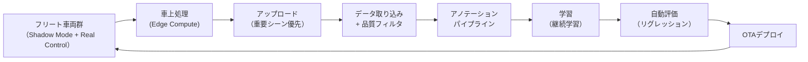

# 第12章 データ収集・フリート学習・アノテーションパイプライン

---

## 12.1 自動運転学習データの特殊性

自動運転の学習データは、通常の画像認識データとは根本的に異なる性格を持つ。

```text
通常の画像認識データ:
  - 静止画像 + ラベル
  - 独立したサンプル
  - 人手ラベリングが標準

自動運転学習データ:
  - 時系列センサデータ（Camera, LiDAR, Radar）の同期
  - 自車の状態（速度、操舵、加速度）
  - 精密なタイムスタンプ、ego motion、粗い測位情報
  - 他車両・歩行者の未来軌跡
  - 道路構造・信号・標識情報
  - これらが高度に結合した構造
```

---

## 12.2 データ収集の設計原則

```text
原則1: センサ同期の確保（収集時に確実に行う）
  - キャリブレーション・同期の不備は後から直せない
  - 毎走行前にキャリブレーション確認

原則2: Ego状態の記録
  - 速度・操舵・加速度を全フレーム記録
  - これが人間軌跡教師の基盤

原則3: Ego motionと粗い測位の記録
  - 純GPSだけでは時系列BEV統合には不十分
  - IMU + 車輪速 + 操舵角から高頻度ego motionを推定
  - GNSSは周辺Map候補検索とルート整合のために記録する

原則4: 生データを保存する
  - 加工済みデータではなく生データを保存
  - 前処理アルゴリズムが変わっても再処理できる

原則5: メタデータを豊富に
  - 天候・時刻・地域・シナリオタグを記録
  - 学習時のフィルタリングとバランシングに使う
```

---

## 12.3 収集車両のセンサ構成

```text
収集車両A（フル構成、開発初期・複雑場面）:
  - Camera: 8台（前方遠距離×1, 中距離×2, 側方×4, 後方×1）
  - LiDAR: 2台（前方長距離 + 360度）
  - Radar: 6台（コーナー×4 + フロント×2）
  - Ego motion: IMU + 車輪速 + 操舵角 (100Hz以上)
  - GNSS: 周辺Map候補検索用（RTKが使える場合は教師生成の補助に利用）
  - Additional: マイク, 温度センサ
  - 用途: テールケース収集, BEV/Lane Topology教師生成

収集車両B（量産センサ構成, フリート）:
  - Camera: 6台（量産モデル相当）
  - LiDAR: 1台
  - Radar: 5台（コーナー×4 + フロント×1）
  - Ego motion: IMU + 車輪速 + 操舵角
  - GNSS: 粗い測位とルート整合
  - 用途: 大量走行データ収集
```

---

## 12.4 人間軌跡データの品質フィルタリングパイプライン

```text
Pipeline:
  Step 1: センサ健全性チェック
    - 各センサの記録が途切れていないか
    - タイムスタンプの連続性確認
    → NG: セッション全体を除外

  Step 2: Ego motion / 測位品質チェック
    - ego motionの連続性と物理整合
    - GNSS精度フラグ（DOP値）
    - IMU出力の異常（クリッピング）
    → NG: 該当区間を除外

  Step 3: 急操作フィルタ
    - |steer_rate| > 閾値
    - |a_x| > 8 m/s^2 (急ブレーキ)
    - |a_y| > 5 m/s^2 (急ハンドル)
    → NG: 周辺10秒ウィンドウを除外

  Step 4: 違反フィルタ
    - 速度違反（規定速度の120%超）
    - 停止線無視の可能性（動作パターン）
    → NG: 該当区間を低ウェイトまたは除外

  Step 5: ドライバー介入検知
    - ハンドル保持力センサ（あれば）
    - システムと実操舵の突然の差分
    → NG: 介入区間の前後を除外

  Step 6: シナリオタグ付け
    - 道路種別, 天候, 交通量を自動判定
    - 特殊シナリオのフラグ（交差点, 駐車回避等）
    → OK: メタデータとして保存

  Step 7: 軌跡の品質スコア
    - 各サンプルに品質スコアを付与
    - 学習時の重み付けに使用
```

---

## 12.5 フリート学習の設計

フリート学習は、実走行中の大量データを活用して継続的にモデルを改善するシステムである。

### フリート学習のアーキテクチャ



各コンポーネントの役割と詳細参照先を示す。

| コンポーネント | 主な役割 | 詳細参照 |
|---|---|---|
| フリート車両群 | Shadow Mode と Real Control の並行動作。シナリオタグ付け・トリガー検出 | — |
| 車上処理（Edge Compute） | センサデータ圧縮・重要シーン切り出し・優先度別アップロードキュー管理 | 12.6 |
| データ取り込み・品質フィルタ | タイムスタンプ同期確認・ブラー・重複除外。DB登録・アノテーションキュー投入 | — |
| アノテーション | 走行ログ/BEV自動生成・Lane Topology半自動・VLMによるT_scene生成 | 12.7 |
| 継続学習 | リプレイバッファ＋知識蒸留による壊滅的忘却対策。日次/週次/月次スケジュール | 12.9 |
| 自動評価・リグレッション | Shadow ADE・Fallback率・Hard Fail率の合格基準チェック | — |
| OTAデプロイ | Canary Release 3フェーズ。Hard Fail 1件で全台ロールバック | — |

### データ取り込みの品質フィルタ基準

```text
- センサタイムスタンプ同期ズレ > 50ms → 除外
- カメラ画像のブラー・露出異常 → 除外
- LiDAR echo 欠損率 > 30% → 除外
- GPS精度が粗すぎる（Map候補が引けない地域）→ 低信頼フラグ付与
- 重複シーン（コサイン類似度 > 0.98）→ 代表1件のみ保持
```

### 自動評価の合格基準

| メトリクス | 合格基準 | 不合格時の処理 |
|---|---|---|
| Shadow ADE（全体） | ≤ 現行モデル + 0.05 m | 学習継続・デプロイ保留 |
| Shadow ADE（テールケース） | ≤ 現行モデル + 0.10 m | デプロイ保留 |
| bev_drivable IoU（3クラス平均） | ≥ 現行モデル − 0.01 | 学習継続・デプロイ保留 |
| Fallback 発動率（シミュ） | ≤ 現行モデル × 1.10 | 即座にロールバック |
| Hard Fail 率（シミュ） | = 0 件 | 即座にロールバック |
| Lane Topology F1（中心線照合） | ≥ 現行モデル − 0.02 | デプロイ保留 |

学習完了 → 評価セット推論 → メトリクス算出 → 全項目合格でOTAキューへ。1項目以上不合格でアラート・デプロイ保留・原因分析キューへ。

### OTAデプロイの安全ゲート

```text
段階的デプロイ（Canary Release）:
  Phase 1: 社内テスト車両（Shadow Mode のみ、1〜2週間実走行）
  Phase 2: 限定フリート（5%）に Real Control として展開
  Phase 3: 全フリートへ展開

安全ゲート:
  - Phase 1 → 2: Shadow ADE が設計値以下であることを確認
  - Phase 2 → 3: 実走行での Fallback 発動率が現行モデル以下であることを確認
  - 全フリートで Hard Fail 1 件 → 即座に全台ロールバック
  - OTA 受信・検証: ハッシュ検証 + デジタル署名確認後に切り替え
```

---

## 12.6 重要シーンの検出とアップロード優先制御

全データの常時アップロードは帯域・コスト・ストレージの観点から現実的でない。車上処理（Edge Compute）でデータを圧縮・優先付けし、重要シーンを選択的にアップロードする。

### 車上処理（Edge Compute）

```text
A. センサデータ圧縮
  - カメラ: H.265エンコード（重要シーンは高品質、通常走行は中品質）
  - LiDAR: 点群間引き（重要シーンは全点保持、通常走行は空間サブサンプリング）
  - Radar: センサ出力をそのまま（元々コンパクト）

B. トリガー記録と切り出し
  - トリガー発火時刻の前後 ±T_buffer 秒を切り出してバッファリング
  - T_buffer: High 優先度 = ±10s、Medium = ±5s、Low = ±2s

C. メタデータ付与
  - タイムスタンプ・GPS（粗い位置）・シナリオタグ
  - Shadow Mode 差分スコア・bev_uncertainty の統計値
  - センサ健全性ログ
```

### アップロード優先度

```text
High（LTE/5G で即時送信）:
  - Fallback 発動シーン
  - ODD 外検出シーン
  - Shadow Mode で Critical 差分が出たシーン
  - センサ障害シーン
  - 衝突 or ニアミスシーン

Medium（次の停車時に送信）:
  - Shadow Mode で Suspicious 差分が出たシーン
  - 珍しいシナリオタグ（初見交差点、工事区間等）
  - 悪天候シーン
  - bev_uncertainty が高かったシーン

Low（Wi-Fi 接続時に送信）:
  - 定常走行（高速道路直進等）のサンプリング
  - Benign 差分のシーン

キュー溢れ時: Low を削除して High を保護。Medium は容量に応じてサンプリング。
```

### アップロード対象データ

```text
- センサデータ（圧縮済み）
- Ego state（速度・操舵・加速度）
- システムログ
- Shadow Mode 差分情報
- シナリオタグ・トリガー種別
```

---

## 12.7 アノテーション設計

本設計の学習には、複数種類の教師信号が必要である。

### 教師信号の種別と自動化可能性

| 教師信号 | 収集方法 | 自動化可能性 |
|---|---|---|
| 人間走行軌跡 | 走行ログから自動抽出 | 完全自動 |
| 速度プロファイル | 走行ログから自動計算 | 完全自動 |
| bev_drivable (3クラス) | HD Map（DRIVABLE/NOT_DRIVABLE） + LiDAR段差検出（MARGINAL境界） | ほぼ自動（MARGINAL境界は要確認） |
| bev_lane | カメラ/LiDAR BEV + Map候補照合 | ほぼ自動 |
| bev_occupancy (static) | LiDAR点群 → 自動 | 自動（精度△） |
| bev_agent_occ (dynamic) | LiDAR 3D bbox → 自動 | 自動 |
| agent_futures | 軌跡ログから自動 | 自動 |
| bev_stopline | カメラ認識 + Map候補 + 人手確認 | 半自動 |
| Lane Topology | BEV時系列 + ego motion + Map候補照合 | 半自動〜ほぼ自動 |
| T_scene text labels | VLM教師（DriveLM等） | 自動（VLM生成） |
| Tail case scenarios | 人手確認が必要 | 半自動 |

### Map候補を使ったLane Topology教師生成

```text
基本方針:
  - HD Mapを正解として直接投影しない
  - 粗い測位で取得したMap候補と、センサから推定したBEVレーン evidence を照合する
  - ego motionで複数フレームを現在座標へwarpし、遮蔽や一時的な検出落ちを補う
  - 教師は「現在観測に整合した局所Lane Graph」と「そのGraph上の自己位置」として保存する

入力:
  - カメラ/LiDAR/Radar統合BEV
  - Temporal BEV memory
  - ego motion
  - HD/SD Map候補（利用可能な場合）
  - ルート候補または道路セグメント候補

限界:
  - 工事区間の一時規制は難しい
  - 信号機の対応関係
  - 規制速度の認識

対処:
  - 精度の低い領域に高い bev_uncertainty を与える
  - Map候補と観測の不整合を map_mismatch_score として記録する
  - 不整合区間は人手確認または再学習キューに送る
  - Map候補なしでもBEV時系列とego motionから局所Lane Graph教師を生成する
```

### VLM Teacherによる自動アノテーション（T_scene）

大規模言語モデル（LLaVA, GPT-4V, DriveLM等）を使い、シーン説明ラベルを自動生成する。

```text
対象: T_scene（内部シーントークン）の教師信号

生成プロセス:
  Step 1: カメラ画像をVLMに入力
  Step 2: プロンプト例:
    "This is a forward camera view of a car.
     Describe the key risks and scene context in 3 sentences."
  Step 3: VLMの出力テキストを T_scene の教師に使用
  Step 4: テキストデコーダ損失で T_scene を学習

プロンプト設計のポイント:
  - リスク情報（"pedestrian about to cross"）を含めるよう誘導する
  - エージェントの意図（"the vehicle appears to be slowing down"）を引き出す
  - 自車の行動への含意（"caution required"）を含めるよう誘導する

品質管理:
  - 同じシーンを複数プロンプトで生成し一致度を確認する
  - VLM出力が明らかに誤っているケースを自動検出（スコア閾値）
  - 一定割合（5〜10%）は人手による確認を実施する
```

---

## 12.8 テールケース収集の戦略

フリートから自動収集できる日常シーンだけでは、稀な危険場面をカバーできない。

```text
テールケース収集の方法:

A. Novelty Score による自動検出
  - モデルのbev_uncertainty が高いシーン
  - 過去に少ない特徴量パターンのシーン
  - 自動でフラグ → アップロード優先

B. 人手によるシナリオ設計と収集
  - 工事区間
  - 白線消失路
  - 非標準交差点
  - 複数台の駐車車両
  - 歩行者の集団横断
  - 大型車が塞いでいる場面
  - 煙や霧の視程障害
  - 砂埃・虫による汚れ

C. 他データセットからの補強
  - nuScenes（1,000シーン）
  - Waymo Open（1,950セグメント）
  - Argoverse 2
  - KITTI（古いが参考）
  - 自社収集とドメイン差に注意

D. Simulation生成
  - CARLA等でのシナリオ生成
  - Sim-to-Real gapの管理が必要
```

---

## 12.9 継続学習の設計

モデルを更新し続ける際に、過去の性能が劣化しない（壊滅的忘却の防止）よう、以下の手法を組み合わせる。

### 壊滅的忘却への対策

```text
A. リプレイバッファ（Replay Buffer）
  - 過去の代表的シーンをシナリオタグ別に均等サンプリングして保持
  - 新データ: リプレイデータ = 7:3 の比率でミニバッチを構成
  - バッファサイズ: 目安 500k サンプル（全データの20〜30%）

B. 知識蒸留（Knowledge Distillation）
  - 現行デプロイモデル（Teacher）の soft logit を KL divergence で新モデル（Student）に蒸留
  - 蒸留係数 λ_kd = 0.3〜0.5（新タスク損失とのバランス）

C. 重みの正則化
  - EWC（Elastic Weight Consolidation）: 重要パラメータへの変化にコストを課す
  - SI（Synaptic Intelligence）: 学習中にパラメータ重要度を動的に追跡

D. タスク別学習率スケジュール
  - BEV Encoder（共有バックボーン）: lr × 0.1（既存表現を保護）
  - 新規タスクヘッド: lr × 1.0（積極的に更新）
  - Lane Topology Head: lr × 0.3（地図依存部分は慎重に更新）

推奨: A（リプレイ）+ B（蒸留）を基本とし、大規模なドメイン追加時に C を追加適用する。
```

### バージョン管理

```text
- モデルバージョンを採番（YYYYMMDD-NNN 形式）
- チェックポイントはオブジェクトストレージ（S3 等）に保存
- ロールバック用に直近5バージョンを常時保持
- 更新ごとに自動評価（12.5 参照）を全通過することを必須とする
```

### 学習スケジュール

```text
日次バッチ学習:
  - 直近24hの High・Medium データで継続学習

週次フル学習:
  - リプレイバッファ込みの全データで 1 エポック
  - 評価セット全項目を自動評価

月次大規模学習:
  - アーキテクチャ変更・大規模追加データの場合に実施

スケジュール外トリガー:
  - テールケースデータが一定量（目安: 1,000 シーン）蓄積した時
  - Shadow Mode Suspicious 差分の発生率が閾値を超えた時
  - 新地域・新 ODD 対応時
```

---

## 12.10 プライバシー・規制への対応

```text
プライバシー:
  - 車両ナンバープレート: 自動ブラー（検出 + マスク処理）
  - 歩行者の顔: 自動ブラー
  - ドライバー識別情報の削除

地域規制:
  - EU GDPR: 個人データの収集・保管・削除要件
  - 中国 個人情報保護法: データの国外転送制限
  - 各国の走行データ収集の法的要件確認

センサデータのライセンス:
  - 収集した走行データは自社の資産
  - HD/SD Map等の外部データをMap候補として使う場合のライセンス確認
  - 学習に使うOSSデータセットのライセンス確認
```

---

## 12.11 章のまとめ

```text
本章で設計した要素:
  1. 自動運転学習データの特殊性
  2. データ収集の5原則
  3. 収集車両のセンサ構成（フル構成・量産センサ構成）
  4. 人間軌跡データの品質フィルタリングパイプライン（7ステップ）
  5. フリート学習パイプライン（アーキテクチャ・評価基準・OTAデプロイ）
  6. 重要シーン検出とアップロード優先制御（Edge Compute圧縮・優先度制御）
  7. アノテーション設計（教師信号種別・Lane Topology GT生成・VLM Teacher）
  8. テールケース収集戦略（Novelty Score・人手収集・外部データセット・シミュ）
  9. 継続学習の設計（Replay Buffer・知識蒸留・EWC/SI・学習スケジュール）
  10. プライバシー・規制への対応
```

次章では、評価指標・ベンチマーク・シナリオ設計を述べる。
