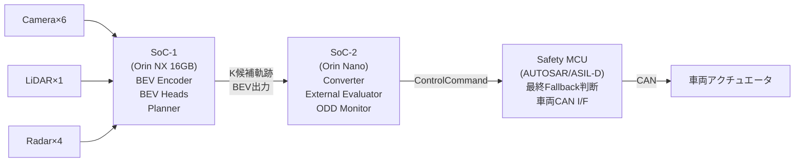
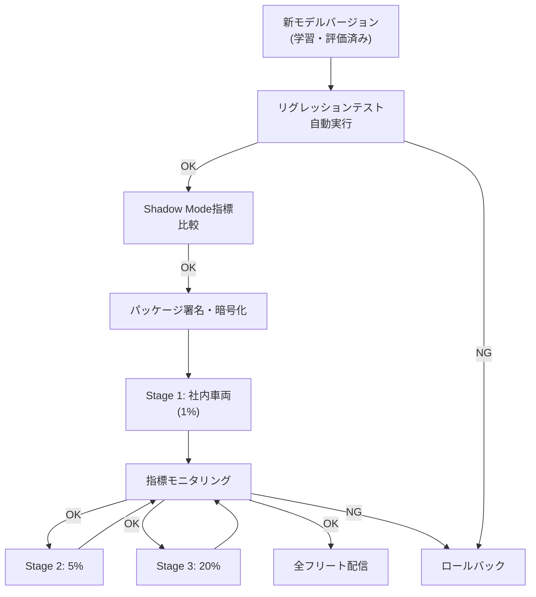

# 第14章 ハードウェアプラットフォーム・量子化・OTAデプロイ

---

## 14.1 車載コンピュートの制約

自動運転システムは、データセンターではなく車内に搭載するコンピュータで動かす必要がある。

```text
制約の種類:
  電力: 車内の電力は限られている
    - ガソリン車（ICE）: 補機用バッテリ（12V/48V）から供給
    - 電気自動車（EV）: メインバッテリからのDC-DC変換で供給
    - 消費電力: 30〜100W（ICE）, 50〜300W（EV）程度が現実的
    - 高性能な推論チップは30〜60W程度

  発熱: 密閉された車内は放熱が難しい
    - 動作温度: -40〜+85°C (AEC-Q100 Grade 1相当)
    - 長時間使用でのサーマルスロットリング対策
    - 水冷やヒートパイプなどの放熱設計も重要

  物理サイズ: 搭載スペースが限定される
    - 開発車両: ラゲッジルームや後部座席の下
    - 量産車: ECU相当のフォームファクタ

  信頼性: 走行中の振動・衝撃
    - 車載グレードの認証が必要
    - SIL/ASIL対応

  コスト: 量産時の部品コスト
    - 開発期: 高コストOKだが量産時はターゲットコスト
```

---

## 14.2 推奨ハードウェアプラットフォーム

### NVIDIA Orin / Thorシリーズ（主力推奨）

| モデル | AI TOPS | 電力 | 適用例 |
|---|---|---|---|
| DRIVE Orin 64GB | 275 TOPS | 60W | 高性能ADS |
| DRIVE Thor 64GB | 500 TOPS | 120W | フルスタックADS |

```text
特徴:
  - TensorRT でのハードウェア最適化が可能
  - INT8/FP16 推論のサポート
  - CUDA, cuDNN, cuSPARSE のフル活用
  - DriveOSベースのBSP
  - 開発車両ではUbuntuベースのOSも利用可能
  - 量産車両ではQNXベースのDriveOSで動作
  - ASIL-B / ASIL-D Safety Island オプション（DRIVE Orin / Thor）
  
本設計との対応:
  - 初期検討: DRIVE Orin 64GB 推奨
  - 量産を目指す段階: DRIVE Thor 64GB で動作確認
  - 目標: DRIVE Thor 64GB で 30fps以上動作
```

### Qualcomm Snapdragon Ride Platform

```text
主要モデル: Snapdragon Ride Elite (SA8775P)
特徴:
  - 自動車向けSoCでAISC-B認定
  - Hexagon NPU (50+ TOPS)
  - エンコーダ・デコーダの車載グレード統合
  - 複数カメラの直結サポート
  
適用例:
  - コスト最適化が必要な量産向け
  - TensorRTではなくQNN (Qualcomm Neural Network SDK) を使う
  - 本書の実装はONNX経由でQNNに変換可能
```

---

## 14.3 モデル量子化

学習精度（FP32）のモデルをFP16またはINT8に変換し、推論速度と消費電力を改善する。

### FP16（半精度浮動小数点）

```text
特徴:
  - FP32から精度低下が少ない（ほぼ同等）
  - NVIDIA GPU での FP16 Tensor Core 活用で大幅高速化
  - メモリ使用量が半分

推奨場面:
  - まず試すべき手順
  - BEV Encoder, Transformer等の大規模モジュール

TensorRT でのFP16変換:
  import tensorrt as trt
  
  builder.fp16_mode = True  # TRT 7以前
  # または
  config.set_flag(trt.BuilderFlag.FP16)  # TRT 8以降
```

### INT8（整数量子化）

```text
特徴:
  - FP16よりさらに2倍高速化の可能性
  - メモリ使用量がFP32の1/4
  - 精度低下がある（キャリブレーションで緩和）
  - キャリブレーションデータが必要

手順:
  Step 1: キャリブレーションデータセットの準備
    - 代表的な走行シーンの入力データ（500〜1000サンプル）
    
  Step 2: TensorRT INT8 キャリブレーション
    class Calibrator(trt.IInt8EntropyCalibrator2):
        def __init__(self, calib_data):
            ...
        def get_batch(self, names):
            ...
        def get_batch_size(self):
            return self.batch_size
    
  Step 3: 精度確認
    - INT8変換後にメトリクス確認
    - 許容劣化: mAP -1〜3pt程度
    - 重要なヘッド（Evaluator入力）は精度を優先してFP16に
    
推奨場面:
  - BEV Encoder, Detection Head
  - メモリ制約が強い場合
  - 精度を検証した上で採用
```

### Quantization-Aware Training (QAT)

```text
INT8 Post-Training Quantization（PTQ）より精度が高い
特徴:
  - 学習時から量子化シミュレーションを含む
  - PTQより精度低下が少ない
  - ただし再学習が必要

実装:
  - PyTorch: torch.quantization or pytorch-quantization（NVIDIA）
  - QAT後にTensorRTでINT8変換
  
使い分け:
  - PTQで精度が落ちすぎる場合に QAT を試す
  - まずはPTQから試す（工数が少ない）
```

---

## 14.4 ONNXによるモデル可搬性

ONNX (Open Neural Network Exchange) を経由することで、複数のランタイムへの展開が可能になる。

```text
エクスポートの流れ:
  PyTorch Model
    → ONNX export (torch.onnx.export)
    → TensorRT engine (trtexec or trt.Builder)
    または
    → QNN (Qualcomm Neural Network SDK)
    または
    → ONNXRuntime (開発・デバッグ用)

注意点:
  - Dynamic shape (可変バッチサイズ等) は設定が必要
  - カスタムオペレータ（custom attention等）はONNX化が難しい場合がある
  - BEVFormerのDeformable Attentionは要確認
  - torch.onnx.export で警告が出る箇所は事前に対処する

TensorRT 変換コマンド:
  trtexec \
    --onnx=model.onnx \
    --saveEngine=model.trt \
    --fp16 \
    --workspace=4096

バリデーション:
  - ONNX出力とPyTorch出力の数値一致確認
  - TRT出力とONNX出力の数値一致確認
  - 許容誤差: FP16で 1e-3程度以内
```

---

## 14.5 マルチチップ展開アーキテクチャ

単一チップで全処理をこなすのが理想だが、コストや電力の制約から複数チップ構成も考える。



```text
設計の考え方:
  - メイン推論 (SoC-1): 高TOPS、高コスト、高消費電力
  - セーフティ評価 (SoC-2): 低コスト、低消費電力、シンプルなロジック
  - Safety MCU: ASIL-D認定、最終的な安全ゲート

利点:
  - 故障時の独立性（SoC-1が落ちてもMCUはFallback継続）
  - コスト最適化（メイン推論に集中投資）
  - セーフティ証明の分離

欠点:
  - チップ間通信のレイテンシ
  - 設計の複雑さ
  - 複数チップのOTA管理
```

---

## 14.6 TensorRTパイプラインの実装

```python
import tensorrt as trt
import numpy as np
import pycuda.driver as cuda
import pycuda.autoinit

class TRTInference:
    def __init__(self, engine_path: str):
        with open(engine_path, "rb") as f:
            runtime = trt.Runtime(trt.Logger(trt.Logger.WARNING))
            self.engine = runtime.deserialize_cuda_engine(f.read())
        self.context = self.engine.create_execution_context()
        self._allocate_buffers()
    
    def _allocate_buffers(self):
        self.inputs = []
        self.outputs = []
        self.bindings = []
        
        for binding in self.engine:
            shape = self.engine.get_binding_shape(binding)
            size = trt.volume(shape)
            dtype = trt.nptype(self.engine.get_binding_dtype(binding))
            
            host_mem = cuda.pagelocked_empty(size, dtype)
            device_mem = cuda.mem_alloc(host_mem.nbytes)
            self.bindings.append(int(device_mem))
            
            if self.engine.binding_is_input(binding):
                self.inputs.append({"host": host_mem, "device": device_mem})
            else:
                self.outputs.append({"host": host_mem, "device": device_mem})
    
    def infer(self, *input_arrays):
        for i, arr in enumerate(input_arrays):
            np.copyto(self.inputs[i]["host"], arr.ravel())
            cuda.memcpy_htod(self.inputs[i]["device"], self.inputs[i]["host"])
        
        self.context.execute_v2(bindings=self.bindings)
        
        results = []
        for out in self.outputs:
            cuda.memcpy_dtoh(out["host"], out["device"])
            results.append(out["host"].copy())
        return results
```

---

## 14.7 OTA（Over-the-Air）更新パイプライン

モデルを安全に遠隔更新するための仕組み。

### OTA更新の設計原則

```text
原則1: 更新は段階的に（Gradual Rollout）
  - 全フリートに一度に配信しない
  - 1% → 5% → 20% → 100% のように段階的に拡大
  - 各段階でShadow Mode指標を確認

原則2: ロールバック機能の必須化
  - 問題が発生したら前のバージョンに戻せる
  - ロールバック手順を事前に検証

原則3: 更新前後の検証
  - リグレッションテストの自動実行
  - Shadow Mode指標の比較
  - 問題があれば配信を自動停止

原則4: 署名・暗号化
  - 更新パッケージの署名確認（改ざん検出）
  - 通信の暗号化（TLS）
  - 車両IDの認証

原則5: 更新タイミングの安全性
  - 走行中の更新は基本的に禁止
  - 駐車中・エンジンOFF時に更新
  - 更新中は起動しない
```

### OTA更新フロー



---

## 14.8 モデルのパフォーマンスプロファイリング

```text
計測すべき指標:
  - Latency（遅延）: 1フレームあたりの処理時間 [ms]
  - Throughput（スループット）: 1秒あたり処理フレーム数 [fps]
  - Memory Usage: GPU VRAM 消費量 [MB]
  - Power: 実際の消費電力 [W]
  - Thermal: 動作温度 [°C]

ツール:
  NVIDIA Nsight Systems:
    nsys profile -o profile.qdrep python inference.py
    → Kernelレベルのタイムライン可視化

  NVIDIA Nsight Compute:
    ncu --metrics ... python inference.py
    → GPU Kernel の詳細分析

  TensorRT Profiler:
    context.profiler = trt.Profiler()
    → 各レイヤーの処理時間確認

  tegrastats (Orin/Jetson):
    tegrastats --interval 1000
    → CPU, GPU, メモリ, 電力, 温度のリアルタイム確認

目標値:
  - Full pipeline latency: < 100ms (10Hz)
  - BEV Encoder + Planner: < 50ms
  - Converter + Evaluator: < 5ms
  - GPU VRAM: < 8GB (Orin NX 16GB の半分目標)
  - 消費電力: < 40W (Orin NX で安定動作)
```

---

## 14.9 本番環境でのモニタリング

```text
モニタリング対象:
  技術指標:
    - 処理時間（フレームごと）
    - GPU使用率・温度
    - センサ欠損率
    - Fallback発動率
    - bev_uncertainty の分布変化
    - ODD外検出回数
    
  ドリフト検出:
    - BEV特徴量の分布が学習時と離れていないか
    - 入力の分布シフト（新しい地域・季節）
    - 予測の分布変化（システムが急に違うことを出す）
    
  アラート条件:
    - Fallback率が急増（1時間の平均が2倍以上）
    - 処理時間が100msを超えるフレームが増加
    - センサ欠損が増加
    - bev_uncertainty が急増

モニタリングの仕組み:
  - テレメトリ送信（定期的に集計データを送信）
  - ダッシュボード（Grafana等で可視化）
  - アラート通知（Slack, PagerDuty等）
```

---

## 14.10 ハードウェア選定のチェックリスト

```text
開発初期:
  □ NVIDIA AGX Orin 64GB または 32GB
  □ Drive OS on Ubuntu
  □ TensorRT 10.x (最新)
  □ Docker によるソフトウェア環境の管理
  □ デバッグ・プロファイリングツールの準備

量産評価フェーズ:
  □ ターゲットSoC（Thor等）でのモデル動作確認
  □ FP16変換と精度確認
  □ INT8変換と精度確認（許容劣化以内か）
  □ 消費電力・温度の長時間計測
  □ 車載グレードの認証状況確認

OTA準備:
  □ 更新パッケージの署名・暗号化の実装
  □ ロールバック機能の実装と検証
  □ 段階的配信の仕組みの実装
  □ モニタリングダッシュボードの準備
  □ リグレッションテストの自動化
```

---

## 14.11 章のまとめ

```text
本章で設計した要素:
  1. 車載コンピュートの制約（電力・発熱・サイズ・信頼性・コスト）
  2. ハードウェアプラットフォーム比較（Orin/Thor/Snapdragon Ride）
  3. モデル量子化（FP16/INT8/QAT）
  4. ONNXによるモデル可搬性
  5. マルチチップ展開アーキテクチャ
  6. TensorRT推論パイプライン実装
  7. OTA更新パイプライン設計（5原則・段階的配信フロー）
  8. パフォーマンスプロファイリング（ツール・目標値）
  9. 本番環境モニタリング
  10. ハードウェア選定チェックリスト
```

付録では、実装疑似コード・出力フォーマット・参考文献・学習戦略を詳述する。
