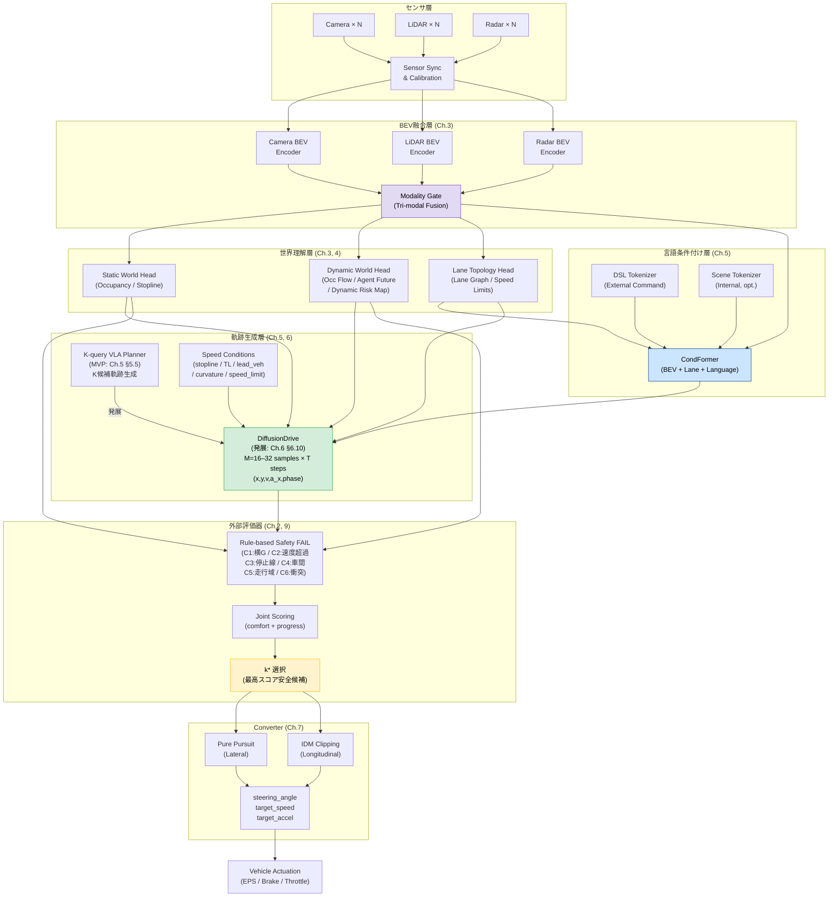

# 第16章 システム統合サマリーとアーキテクチャ全体像

---

## 16.1 統合サマリー

第1章から第15章・各付録にわたって設計してきたすべてのコンポーネントは、
一つの一貫したアーキテクチャとして統合される。
本章はその全体像を可視化し、採用した設計判断・モジュール間インターフェース・
学習戦略・安全要件・評価指標を一箇所に集約した**最終統合リファレンス**である。

```text
センサ入力
  → Tri-modal BEV 融合（Ch.3）
  → 静的・動的世界理解（Ch.3, 4）
  → 言語条件付け CondFormer（Ch.5）
  → 軌跡生成 K-query Planner → DiffusionDrive（Ch.5, 6）
  → External Evaluator 安全選択（Ch.2, 9）
  → Converter 舵角・速度変換（Ch.7）
  → 実車制御
```

---

## 16.2 採用アーキテクチャ決定マップ

```text
決定項目                  採用内容                               参照章
─────────────────────────────────────────────────────────────────
BEV統合                   Tri-modal BEV Fusion                   Ch.3
                          (Camera + LiDAR + Radar)
動的世界理解              Occupancy Flow + Agent Future           Ch.4
                          + Dynamic Risk Map
言語条件付け              DSL + CondFormer                        Ch.5
軌跡生成バックボーン      K-query VLA Planner（MVP）              Ch.5, 6
                          → DiffusionDrive（拡散モデル、発展）    Ch.6 §6.10
縦横一体最適化            (x,y,v,a_x,phase) 同時denoising        Ch.6 §6.11
速度プロファイル          S字停止 / IDM / 先読みカーブ速度        Ch.6 §6.12
軌跡→制御変換             Pure Pursuit + IDM クリッピング         Ch.7
安全選択                  External Evaluator（rule-based）        Ch.2,9
リアルタイム              BEV Sparsification + Static Cache       Ch.8
製品安全                  ISO 26262 / SOTIF / UNECE R157          Ch.9
ミドルウェア              ROS 2 + Autoware.Universe               Ch.15
学習戦略                  Stage-wise 7段階                        App.D
```

---

## 16.3 AD ECU 搭載アーキテクチャ全体図

### システムデータフロー（テキスト表現）

```text
╔══════════════════════════════════════════════════════════════════════╗
║                       SENSOR LAYER                                   ║
║  Camera×N  ──┐                                                        ║
║  LiDAR×N   ──┼──→ [Sensor Sync & Calibration] ──→ SensorPacket      ║
║  Radar×N   ──┘                                                        ║
╚══════════════════════════════════════════════════════════════════════╝
                                │
                                ▼
╔══════════════════════════════════════════════════════════════════════╗
║                    BEV FUSION LAYER (Ch.3)                            ║
║  SensorPacket                                                         ║
║    ├─ Camera BEV Encoder (LSS / BEVFormer)                           ║
║    ├─ LiDAR BEV Encoder  (VoxelNet / CenterPoint)                    ║
║    └─ Radar BEV Encoder  (RadarNet)                                   ║
║                    ↓ Modality Gate                                    ║
║              [Tri-modal BEV Tensor]  (H×W×C)                         ║
╚══════════════════════════════════════════════════════════════════════╝
                                │
              ┌─────────────────┼──────────────────┐
              ▼                 ▼                   ▼
╔════════════════════╗ ╔══════════════════╗ ╔═══════════════════╗
║  STATIC WORLD HEAD ║ ║ DYNAMIC WORLD    ║ ║ LANE TOPOLOGY     ║
║  (Ch.3)            ║ ║ HEAD (Ch.4)      ║ ║ HEAD (Ch.3)       ║
║  - Drivable Area   ║ ║  - Occ Flow      ║ ║  - Lane Graph     ║
║  - Occupancy       ║ ║  - Agent Det.    ║ ║  - Stoplines      ║
║  - Stoplines       ║ ║  - Agent Future  ║ ║  - Crosswalks     ║
║  - Crosswalk       ║ ║  - Dynamic Risk  ║ ║  - Speed Limits   ║
║  - Speed Limit     ║ ║    Map           ║ ╚═══════════════════╝
╚════════════════════╝ ╚══════════════════╝
              │                 │                   │
              └─────────────────┼───────────────────┘
                                ▼
╔══════════════════════════════════════════════════════════════════════╗
║              LANGUAGE CONDITIONING LAYER (Ch.5)                       ║
║                                                                       ║
║  External Command ──→ DSL Tokenizer ──→ T_ext                        ║
║  Internal Scene  ──→ Scene Tokenizer──→ T_scene (opt.)               ║
║                                                                       ║
║  [CondFormer]                                                         ║
║    BEV tokens + Lane tokens + T_ext + T_scene                        ║
║    → conditioned_tokens  (言語・空間の統合特徴量)                     ║
╚══════════════════════════════════════════════════════════════════════╝
                                │
                                ▼
╔══════════════════════════════════════════════════════════════════════╗
║       TRAJECTORY GENERATION LAYER (Ch.5, 6)                          ║
║                                                                       ║
║  Phase 1 MVP: K-query VLA Planner (Ch.5 §5.5)                        ║
║    K=8〜24 learnable queries → Transformer Decoder                   ║
║    → K候補軌跡 [(x_t, y_t, v_target_t, a_x_t, phase_t)]            ║
║    損失: MHP Loss  min_k L2(traj_k, traj_human)                      ║
║                                                                       ║
║  Phase 2 発展: DiffusionDrive (Ch.6 §6.10)                           ║
║    Conditioning: conditioned_tokens / stopline / TL /                ║
║                  lead_vehicle / curvature / desired_speed            ║
║    Denoising: noise → [eps_theta × N_steps] → M trajectories        ║
║    M = 16〜32 samples, 100ms以内 (10 Hz compatible)                   ║
║    Output: [(x_t, y_t, v_target_t, a_x_t, phase_t)]  T=10 steps    ║
║    phase_t ∈ {ACCEL, CRUISE, DECEL}                                  ║
╚══════════════════════════════════════════════════════════════════════╝
                                │
                                ▼
╔══════════════════════════════════════════════════════════════════════╗
║              EXTERNAL EVALUATOR (Ch.2, Ch.9)                         ║
║                                                                       ║
║  Input: M trajectories + Static World + Dynamic Risk + Agent Futures ║
║                                                                       ║
║  Safety FAIL checks (rule-based):                                    ║
║    C1: v_t² × |κ_t| > A_Y_MAX         (横G超過)                     ║
║    C2: v_t > speed_limit               (速度制限超過)                 ║
║    C3: stopline_overshoot              (停止線超過)                   ║
║    C4: headway < min_gap               (車間不足)                    ║
║    C5: drivable_area_violation         (走行可能域逸脱)               ║
║    C6: dynamic_collision_risk          (動的衝突リスク)               ║
║                                                                       ║
║  Scoring (PASS candidates):                                          ║
║    joint_score = w_c × comfort + w_p × progress                     ║
║                                                                       ║
║  Output: k* = argmax score  (or hold-previous if all FAIL)           ║
╚══════════════════════════════════════════════════════════════════════╝
                                │
                                ▼
╔══════════════════════════════════════════════════════════════════════╗
║           TRAJECTORY-TO-STEERING CONVERTER (Ch.7)                    ║
║                                                                       ║
║  Input: selected trajectory k* + Ego State                           ║
║                                                                       ║
║  Lateral:                                                             ║
║    Lookahead point → Pure Pursuit → target_curvature                 ║
║    target_curvature → steering_angle_deg  (kinematic model)          ║
║                                                                       ║
║  Longitudinal:                                                        ║
║    v_target / a_x_target from Planner output (K-query / DiffusionDrive)║
║    IDM clipping: min(planner_accel, acc_idm)                         ║
║    Stopline precision check: final override if d_stop < threshold    ║
║                                                                       ║
║  Output:                                                              ║
║    steering_angle_deg / target_speed_mps / target_accel_mps2        ║
╚══════════════════════════════════════════════════════════════════════╝
                                │
                                ▼
╔══════════════════════════════════════════════════════════════════════╗
║                   VEHICLE ACTUATION                                   ║
║   EPS (Electric Power Steering) / Brake / Throttle / Gear            ║
╚══════════════════════════════════════════════════════════════════════╝
```

---

## 16.4 Mermaid アーキテクチャ図



---

## 16.5 モジュール間インターフェース一覧

```text
インターフェース名            送信元                   受信先               データ型
─────────────────────────────────────────────────────────────────────────────────────
SensorPacket                  各センサ                  BEV Encoders         時刻同期済みrawデータ
BEVTensor (H×W×C)             Modality Gate             各 World Head / COND  float16, stride=0.2m
StaticWorldOutput             Static World Head         Evaluator / DiffDrive  Occ,Stopline,Crosswalk
DynamicWorldOutput            Dynamic World Head        Evaluator / DiffDrive  AgentFuture,DynRisk
LaneGraphOutput               Lane Topology Head        CondFormer / DiffDrive LaneNode,EdgeWeight
ConditionedTokens             CondFormer                DiffusionDrive         [N_token, C_bev]
SpeedConditions               Ego State / Perception    DiffusionDrive         6スカラー (§6.10)
TrajectorySet                 DiffusionDrive            External Evaluator     [M, T, 5] float32
SelectedTrajectory k*         External Evaluator        Converter              [T, 5] + safety_flags
ControlCommand                Converter                 Vehicle Bus            steer/speed/accel
```

---

## 16.6 学習パイプライン統合図（7ステージ）

```text
Stage 1: BEV Backbone 事前学習
  データ: nuScenes Detection
  更新:   Camera/LiDAR/Radar Encoder + Modality Gate

Stage 2: BEV Information Heads 学習
  データ: nuScenes + 自社データ
  固定:   Stage 1（BEV Backbone）
  更新:   Static/Dynamic/Lane Topology Heads

Stage 3: K-query VLA Planner — 軌跡生成 MVP 学習 (Ch.5 §5.5, Ch.6)
  データ: 大規模人間走行ログ
  固定:   Stage 1+2
  更新:   CondFormer（言語なし版）+ K-query Transformer Decoder
  損失:   MHP Loss  L = min_k L2(traj_k, traj_human)
  習得:   §6.12 の停止・IDM・カーブ速度を条件入力で学習

Stage 4: CondFormer — 外部言語条件付け (Ch.5)
  データ: 走行ログ + DSL アノテーション
  固定:   Stage 1+2
  更新:   Text Encoder + CondFormer（言語条件付き部分）

Stage 5: Scene Tokenizer 学習（オプション）
  データ: カメラ画像 + VLM 生成テキスト (Ch.12)
  固定:   Stage 1+2+3
  更新:   Scene Tokenizer（VLM 知識蒸留）

Stage 6: Closed-loop / Offline RL — 速度方策 Fine-tuning (App.D §D.8)
  データ: Waymax / CARLA + 厳選実車ログ
  固定:   World Heads / Perception
  更新:   K-query Planner 速度分岐（v/a_x/phase head）
  目的:   人間模倣だけでは獲得しづらい「予見的減速→旋回→加速」を閉ループで獲得
  ※ DiffusionDrive への移行はオプション（§6.10 Phase A/B/C 参照）

Stage 7: Joint Fine-tuning
  データ: 全データ混合
  更新:   全モジュール（低 LR）
```

---

## 16.7 製品安全・法規対応マトリクス

```text
法規・基準              対応設計                          参照章
─────────────────────────────────────────────────────────────────────
ISO 26262 (機能安全)    ASIL D 電気系統 + ASIL B NN出力   Ch.9
                        External Evaluator は rule-based
SOTIF (ISO 21448)       ODD 定義 + Shadow Mode 評価       Ch.9, 11
UNECE R157 ALKS         L3 サイン認識・レーン維持・         Ch.9
                        システム限界認識
UNECE WP.29 R155        CSMS / TARA / セキュア OTA          Ch.9
  (サイバーセキュリティ) → 参考 (設計で R155 対応を推奨)
GB/T 34590 (中国)       R157 と同等要求での対応            Ch.9
GDPR / 個人情報         走行ログ匿名化 (フェイス/LP 除去)  Ch.12
```

---

## 16.8 評価指標ダッシュボード（主要 KPI）

```text
レイヤー          主要指標                         合格基準（参考）
────────────────────────────────────────────────────────────────────
BEV知覚           nuScenes NDS                     > 0.60
                  mAP (3D detection)               > 0.45
動的世界          VPQ (Video Panoptic Quality)      > 0.55
                  ADE/FDE (Agent Future 1s/3s)      < 0.5m / 1.5m
DiffusionDrive    Open-loop ADE (best of M)        < 0.8m
                  Closed-loop progress (Waymax)     > 85%
                  Collision rate (sim)              < 0.1%
Converter         停止誤差 (±停止線)                < ±0.3m
                  車間誤差                          ±0.5m以内
実時間性          エンドツーエンド遅延              < 100ms (10 Hz)
                  GPU 使用率                        < 80% (熱余裕)
```

---

## 16.9 ADコンポーネント完全網羅チェックリスト

```text
必須コンポーネント                      本書での対応
────────────────────────────────────────────────────────────────────
[知覚]
  ✅ Camera BEV Encoder                Ch.3
  ✅ LiDAR BEV Encoder                 Ch.3
  ✅ Radar BEV Encoder                 Ch.3
  ✅ Tri-modal Fusion (Modality Gate)  Ch.3
  ✅ Static World / Occupancy          Ch.3
  ✅ Dynamic Object Detection          Ch.4
  ✅ Agent Future Prediction           Ch.4
  ✅ Occupancy Flow                    Ch.4
  ✅ Lane Topology                     Ch.3
  ✅ Traffic Light Recognition         Ch.3, 6

[計画]
  ✅ Language Conditioning (CondFormer) Ch.5
  ✅ K-query VLA Planner（MVP）        Ch.5, 6
  ✅ DiffusionDrive（発展）             Ch.6 §6.10
  ✅ 縦横一体最適化                   Ch.6 §6.11
  ✅ 速度プロファイル設計              Ch.6 §6.12
    ✅ S字停止プロファイル             Ch.6 §6.12
    ✅ IDM 前走車追従                  Ch.6 §6.12
    ✅ 予見的カーブ速度制御            Ch.6 §6.12
  ✅ External Evaluator（安全選択）    Ch.2, 9
  ✅ Trajectory-to-Steering Converter  Ch.7

[学習・データ]
  ✅ 人間軌跡教師の構築               Ch.6
  ✅ データ収集・品質管理             Ch.12
  ✅ 学習戦略（7ステージ）            App.D
  ✅ 閉ループ評価                     Ch.6, App.D

[システム]
  ✅ リアルタイム設計（100ms）         Ch.8
  ✅ BEV Sparsification                Ch.8
  ✅ Static World Cache                Ch.8
  ✅ マルチチップ展開                 Ch.14

[製品・運用]
  ✅ 製品安全 (ISO 26262 / SOTIF)      Ch.9
  ✅ 法規対応 (R157 / R155)            Ch.9
  ✅ Shadow Mode / ロードマップ        Ch.11
  ✅ ハードウェアプラットフォーム      Ch.14
  ✅ ミドルウェア (ROS 2 / Autoware)  Ch.15
  ✅ 評価指標                         Ch.13

[参考実装]
  ✅ 疑似コード                        App.A
  ✅ 出力フォーマット定義              App.B
  ✅ 参考文献                          App.C
  ✅ 用語集                            App.E
```

---

## 16.10 未解決課題と今後の展望

```text
領域                      現状の課題                   将来対応の方向性
─────────────────────────────────────────────────────────────────────
DMS                       本書スコープ外               UNECE R157 L3 義務化に伴い
(Driver Monitoring)       (L2は基本設計のみ)           専用 DMS SoC との統合が必要

V2X 統合                  Ch.15 ハードウェアに記載     V2I/V2V データをBEV
                          するのみ                     conditioning input として
                                                        組み込む余地あり

ワールドモデル            本書はフレーム単位認識        UniSim / GAIA-1 のような
(World Model)             + DiffusionDrive で対応       生成的世界モデルへの発展

Occupancy 3D              現在は BEV 2.5D              NeRF / 3D GS ベースの
                                                        フル 3D 占有予測

プライバシー技術          マスキングによる匿名化        連合学習 / 差分プライバシー
                          (Ch.12)                       による分散学習

オープンセット検知         既知クラスのみ対応           OWL-ViT 等の open-vocabulary
                                                        検出器の統合
```

---

## 16.11 章のまとめ

```text
本書で設計したシステムのコアは以下の等式で表せる:

  AD出力 = Converter(
    ExternalEvaluator(
      VLAPlanner(  -- Phase1: K-query / Phase2: DiffusionDrive
        CondFormer(BEV(Camera, LiDAR, Radar),
                   LaneTopology,
                   DSL(NL_command)),
        SpeedConditions),
      StaticWorld,
      DynamicWorld))

重要な設計判断:
  1. BEV 統合     → センサ冗長性とスケールの両立
  2. 言語条件付け → 人間意図の明示的入力
  3. K-query Planner → MVP として実装容易・低計算コスト。安定後に
                       DiffusionDrive へ段階的に移行可能（§6.10）
  4. External Evaluator → 確率論的な NN 出力に rule-based 安全弁を重ねる
  5. Converter 分離 → 車種依存コードを NN から完全に分離

このアーキテクチャは、単一モデルが「認識から制御まで」を通じて
人間の暗黙知（軌跡パターン）を直接学習しながら、
製品として必要な安全性・検証性・法規対応を構造的に保証する
Structured End-to-End 設計の実現形である。
```
