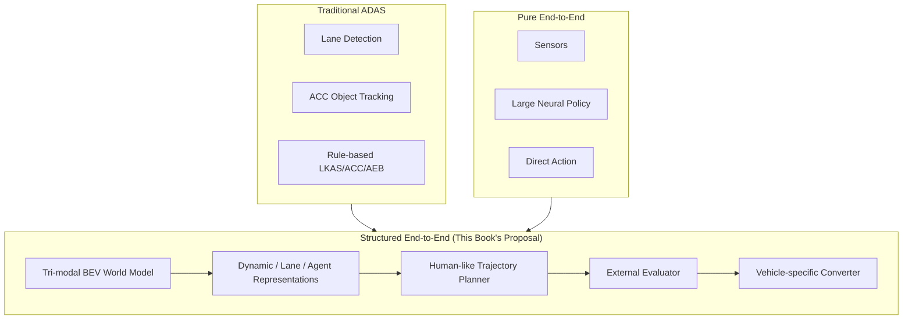
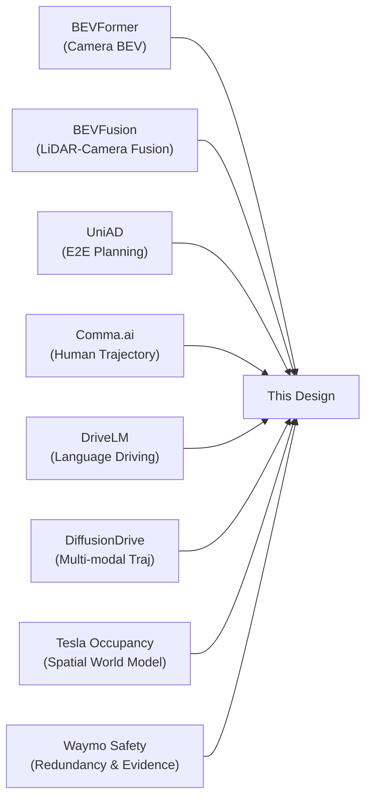

# Chapter 1 Design Philosophy of the Autonomous Driving Architecture

---

### Architecture View: Structured E2E Between ADAS and Pure E2E



---

## 1.1 BEV as a Common Spatial Representation

In autonomous driving, sensor observations each exist in different coordinate systems and projections.

- Camera produces perspective images
- LiDAR produces 3D point clouds
- Radar produces sparse points or range-azimuth measurements
- Route is expressed in map or body coordinates
- The Planner typically wants to reason in an ego-centric 2D/3D space

When these are fused directly, the correspondence between modalities becomes ambiguous.  
Therefore, **BEV is used as the common spatial representation**.

### Advantages of BEV

1. **Easy for the Planner to work with**
   - Target trajectories are normally expressed in the XY plane of ego coordinates
   - BEV can be directly overlaid with trajectories

2. **Easy to pass to an external evaluator**
   - Rule evaluation is straightforward to write when occupancy, drivable region, lanes, and dynamic object positions can be viewed in BEV

3. **Robust to adding new sensors**
   - Any new sensor that can be projected into BEV can be added to the same fusion pipeline

4. **Easy to integrate over time**
   - Ego motion warping is relatively simple in BEV

### BEV Coordinate System

The BEV coordinate system is unified throughout this book as follows:

```text
ego coordinate:
- x: forward (vehicle forward direction)
- y: left (vehicle left direction)
- z: up
- yaw: counter-clockwise positive
- unit: meter, radian
```

Sharing this definition across all modules is a prerequisite for implementation.

---

## 1.2 Why Fuse Vision, LiDAR, and Radar

Vision, LiDAR, and Radar each have different strengths and weaknesses.

| Sensor | Strong Information | Weaknesses |
|---|---|---|
| Camera | Lanes, traffic lights, signs, color, texture, semantics | Depth uncertainty, bad weather, nighttime |
| LiDAR | Shape, distance, obstacle boundaries, 3D geometry | Sparse at long range, rain/fog, cost |
| Radar | Velocity, Doppler, weather robustness, moving object detection | Coarse shape, ghost returns, multipath |

For this reason, **BEV fusion that does not depend on a single sensor** is the safety-oriented design choice.

### Typical Sensor Layout

Sensor placement in actual vehicles varies by vehicle size, class, and cost, but a typical configuration is as follows:

```text
Front cameras:
- 1 to 3 units
- Covers long range (telephoto), medium range, wide angle
- Traffic lights, signs, pedestrians, lanes

Side/rear cameras:
- 4 to 8 units
- Full surround coverage
- Lane changes, reversing, blind spots

Front LiDAR:
- 1 unit (primary)
- 200m coverage
- Obstacle shape, leading vehicle, pedestrians

Corner radars:
- 4 units (four corners)
- Merging, blind spots, reversing
- Velocity information

Front radar:
- 1 unit
- ACC, long-range velocity
- Weather robustness
```

This design assumes at minimum "multiple front cameras + 1 LiDAR + multiple radars."  
To accommodate diversity in sensor placement, modules are separated by sensor type.

---

## 1.3 Passing Intent and Constraints to the Planner via Language Conditioning

External language instructions express "intent" and "constraints" that cannot be obtained from ordinary perception alone.

Examples:

```text
Turn right at the next intersection.
Do not change lanes.
Follow the left lane after the bridge.
Drive cautiously because there is construction ahead.
Prioritize the passenger's comfort.
```

These cannot be read directly from images or LiDAR.

On the other hand, it is dangerous for the Planner to look only at external language.  
Scene-specific awareness (such as "I want to turn right but there are pedestrians") must come from BEV/vision.

Therefore, this design separates language into two types:

```text
External language:
- User or navigation command
- Explicit instruction
- High level constraint

Internal scene language:
- Generated from BEV or vision
- Latent scene summary
- Risk and intent cues
```

Both are integrated by CondFormer and passed to the Planner.

### Notes on Language-Based Action Conditioning

Language instructions are not for "making the system converse" but for "conditioning the action distribution."

```text
Language conditioning:
- not for explanation
- not for conversation
- for action conditioning
```

In a product, treating natural language directly as a safety constraint is dangerous.  
A design that inserts a conversion from natural language to structured commands is preferable (see Chapter 5 for details).

---

## 1.4 Conventional ADAS: Operating Conditions and Limits

Conventional ADAS has evolved with a function-by-function structure.

```text
ACC:
- Maintain distance from the leading vehicle

LKAS:
- Stay near the lane center

AEB:
- Brake if a collision threat is detected

BSM:
- Warn of vehicles in blind spots

TSR:
- Recognize traffic signs

HBA:
- Automatic high-beam control
```

This structure is very product-friendly.  
It is easy to define inputs, outputs, safety requirements, and test conditions for each function.

However, real driving cannot be decomposed this neatly.  
When a vehicle moves slightly to the right within the lane to avoid a parked vehicle — is that lane keeping, obstacle avoidance, comfort control, or interaction with surrounding traffic?  
When waiting to turn right at an intersection by judging the speed of oncoming traffic — is that object recognition, prediction, rule-based judgment, or planning?

In conventional ADAS, the boundaries between modules become harder to define as these interactions grow stronger.

### Realistic Operating Domains of ADAS

| Function | Easy-to-operate ODD | Difficult scenarios |
|---|---|---|
| LKAS | Highway, clear lane markings | Intersections, faded lines, construction |
| ACC | Single leading vehicle, highway | Cut-ins, stationary objects, intersections |
| AEB | Head-on collision | Crossing vehicles, pedestrians (low speed) |
| BSM | Straight road, adjacent lane | Merging, curves |

These functions are individually effective, but gaps in design tend to arise for integrated behavior in urban areas and complex intersections.

---

## 1.5 The Appeal of Pure End-to-End and the Challenges of Productization

End-to-End is compelling. From large volumes of sensor logs and human driving outcomes, complex decisions can be learned directly. Like Comma.ai's E2E lateral planning, learning toward the future trajectory that humans actually drove opens the possibility of acquiring natural driving behavior that lane-center following cannot express.

However, pure E2E has product-level challenges.

```text
Product-level challenges of Pure E2E:
- Hard to explain why a particular output was produced
- Unclear what a safety monitor should inspect
- Difficult to add regulations or regional differences after the fact
- Hard to separately handle out-of-ODD scenarios or sensor failures
- Difficult to isolate whether a fault was perception or planning
- Hard to produce evidence for safety standards (ISO 26262, SOTIF)
- Low portability when the vehicle changes
```

When shipping autonomous driving as a product, "the neural net produced this output" is not sufficient.  
Logs at failure, incident analysis, safety cases, audits, OTA updates, regression tests, and regulatory change handling are all required.

---

## 1.6 Structured End-to-End as a Design Philosophy

This design targets the middle ground between conventional ADAS and pure E2E.

```text
Conventional ADAS:
- Understandable
- Easy to verify
- But weak on interactions
- Difficult to extend ODD

Pure E2E:
- Easy to learn complex decisions
- Can learn human trajectories directly
- But product verification is hard
- Out-of-ODD handling is opaque

Structured E2E (this design):
- Learns human trajectories
- Has intermediate representations such as BEV and dynamic world
- Outputs information that can be passed to an external evaluator
- Physical vehicle control is separated into a deterministic converter
- Intermediate observation points required for a product are built into the design
```

### Responsibility Boundary of Structured E2E

The fundamental question of Structured E2E is: "What does the neural network handle, and what does it not?"

Conventional modular ADAS tried to express almost all decisions in rules. This has high transparency but carries the essential difficulty of "writing rules for every situation in the world." On the other hand, pure End-to-End delegates "sensors to steering" entirely to a neural network, but it is hard to trace what is happening inside and difficult to build safety evidence.

The responsibility boundary of Structured E2E is drawn as follows:

**Domain handled by the neural network**: World perception and generation of planning candidates. This involves complex decisions where combinatorial explosion occurs, and learning from data is indispensable. The network perceives the world as BEV, predicts the future of dynamic objects, and generates K candidate trajectories.

**Domain handled by external modules**: Reviewing generated candidates and the final stage of actually moving the vehicle. This is the part that can be described explicitly in rules and is required to be "explainable" under safety standards such as ISO 26262. It rejects unsafe candidates, detects out-of-ODD conditions, converts trajectories to physically correct steering angles, and activates Fallback in the event that all candidates fail.

By drawing this boundary:
- Failures on the neural network side (misperception, misplanning) can be caught by external modules
- External modules can be implemented with lightweight rules, making ASIL-B/D certification realistic
- Information that should be logged is naturally designed into the system (what was selected and why)


This boundary separates the part that the neural network learns from the part that is explicitly controlled by rules.

---

## 1.7 Learning Redundancy and Evidence Structure from Safety-Case Systems

Systems like Waymo's robotaxi approach emphasize sensor redundancy and safety cases. Combining LiDAR, Camera, and Radar, they stack maps, simulation, real-world driving, incident rate comparisons, and safety cases.

What this direction teaches us is not simply "add expensive sensors."  
The key point is that shipping a product that carries people requires **a structured body of evidence to assert safety**.

The reason this design includes BEV information heads, candidate trajectories, an external evaluator, a Dynamic Risk Map, and logs is precisely this.  
When a model outputs steering angles directly, it becomes difficult to produce the evidence needed for a safety case.

### Elements Required for a Safety Case

```text
Claim: This system operates safely within the defined ODD

Argument:
- Sensor redundancy allows continued operation when a single sensor fails
- Intermediate representations (BEV) allow validity of Perception to be verified
- K candidates and the external evaluator allow unsafe trajectories to be excluded
- ODD monitoring detects out-of-scope operation and triggers fallback
- Logs allow failure cases to be analyzed

Evidence:
- Label accuracy evaluation of per-sensor BEV outputs
- Analysis of rejection rate and rejection reasons by the external evaluator
- Comparison of candidate trajectories vs. human trajectories in Shadow Mode
- Scenario test of out-of-ODD detection rate
```

---

## 1.8 Learning Spatial Representations from Occupancy and Fleet Learning

A major insight available from Tesla's public disclosures is the emphasis on occupancy and occupancy flow of the surrounding space, not just bounding boxes.  
In the real world, many things are difficult to detect as clean boxes: construction fences, fallen objects, curbs, oddly shaped obstacles, partial vehicles, gate-like structures, and so on.

Relying only on box detection makes it easy to miss "things that cannot be classified."  
Occupancy, rather than classification names, first asks "is that space physically occupied?" This is a representation closer to safety.

This design extends that concept to include the following:

```text
- static occupancy (static occupation)
- dynamic occupancy (dynamic occupation)
- occupancy flow (movement of occupation)
- future dynamic occupancy (future dynamic occupation)
- dynamic risk map (dynamic risk map)
```

This is to pass the Planner not just "what the object is" but "where it is occupying, how it moves, and when it will intersect with the ego trajectory."

### The Importance of Fleet Learning

Large-scale fleets (data collection from many vehicles) are indispensable for learning tail cases (rare scenarios).

```text
Value of Fleet Learning:
- Even rare scenarios that appear only once per million km of driving can be accumulated
- Road structures and traffic culture differences by region can be learned
- Differences by sensor layout and vehicle type can be learned
- Reward signals for reinforcement learning can be designed offline
```

This design's emphasis on log design and making intermediate representations explicit is also intended to make a fleet learning pipeline easier to design in the future.

---

## 1.9 End-to-End Lateral Planning Using Human Trajectories as Teachers

The most important lesson to take from Comma.ai/openpilot's E2E lateral planning is the idea of using not lane centerlines but the future trajectories from actual human driving logs as teacher signals.

This idea is very powerful.  
This is because lane center is an artificial centerline of road geometry, not the human driving decision itself.

Humans naturally shift their position within the lane by looking at parked vehicles on the roadside, cyclists, pedestrians, adjacent large vehicles, road edges, construction, road surface conditions, comfort in curves, and so on.  
Learning the resulting trajectory is closer to driving behavior than learning the lane center.

The reason this design has the structure of "outputting an ego-based target trajectory each cycle" is consistent with this philosophy.

---

## 1.10 The Role of Longitudinal Control (Speed Planning)

This book primarily describes lateral control (steering), but longitudinal control (speed planning/acceleration and deceleration) is equally important.

```text
Lateral:
- Which lane, and at what lateral position
- x, y components of candidate trajectories
- Steering commands

Longitudinal:
- At what speed to drive
- Timing of acceleration and deceleration
- Following the leading vehicle, responding to signals, curve speed
```

Including a speed profile (v) in candidate trajectories allows lateral and longitudinal directions to be handled in an integrated manner.

```text
trajectory point:
- t: timestamp
- x: forward position
- y: lateral position
- yaw: heading angle
- v: target speed at this point
- a: target acceleration (optional)
```

Scenarios that should be treated as an independent problem of speed planning:

```text
- Signal response (stop on red, go on green)
- Temporary stop at stop lines
- Intersection entry speed
- Comfortable speed in curves
- Deceleration in school zones or construction areas
- Following the leading vehicle
```

These are handled as speed/comfort checks in the External Evaluator or as speed profiles in Planner output.

---

## 1.11 Design Evolution and Role of This Book

The architecture proposed in this book is not a translation of a single paper.  
It is an integration of knowledge from multiple directions — BEVFormer, BEVFusion, UniAD, DiffusionDrive, DriveLM, Comma.ai E2E, Tesla Occupancy, Waymo Safety Case — into "one system that can run on a real vehicle."



Starting from Chapter 2, the specific structure of this architecture is explained in order.

---

### Coffee Break: Why Is "Design Philosophy" Chapter 1?

In research papers, it is common to first cover related work and then propose a method. However, in actual product development, if "what this design is for" is not shared first, judgments will diverge at implementation details. The reason this book places design philosophy in Chapter 1 is so that team members can proceed to implementation with an understanding of "why this structure."
