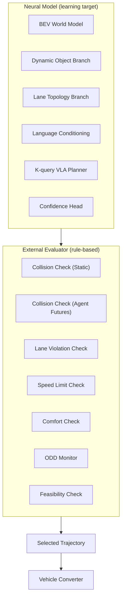
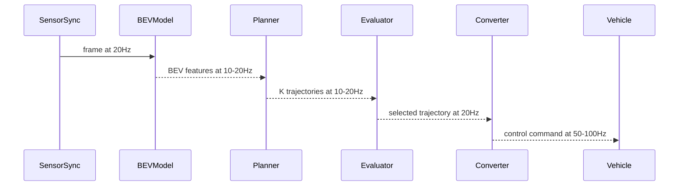

# Chapter 2 System Requirements and Overall Architecture

---

## 2.1 Design Principles

The design principles of this system are as follows.

```text
1. Perform sensor fusion in a shared BEV space
2. Separate the world representation into static, dynamic, lane, and agent components
3. The Planner outputs multiple candidates, and an external evaluator selects one
4. Separate the connection to control into a deterministic converter
5. Make all intermediate representations loggable
6. Design fallback from the beginning for sensor failure, out-of-ODD conditions, and excessive risk
```

---

## 2.2 Input Interface

### Sensor Inputs

```text
images:
  shape: [B, N_cam, C, H, W]
  type: float32
  unit: normalized [0, 1]
  note: undistorted, synchronized

lidar_points:
  shape: [B, N_sweeps, N_points, D]  (D = x, y, z, intensity, ring, ...)
  type: float32
  unit: meter
  note: ego frame, N_sweeps = 1 or stacked

radar_points:
  shape: [B, N_radar_sweeps, N_rpoints, D_r]  (D_r = x, y, vr, rcs, ...)
  type: float32
  unit: meter, m/s
  note: corrected to ego velocity, ego frame
```

### Ego State

```text
ego_state:
  speed:       float32, m/s
  yaw_rate:    float32, rad/s
  accel_x:     float32, m/s^2
  accel_y:     float32, m/s^2
  steer_angle: float32, rad
  timestamp:   int64, ns
```

### Route and Language Instructions

```text
route_info:
  type: structured or lane sequence
  example: [lane_id_1, lane_id_2, lane_id_3]
  note: route information for the next 300-500 m

language_command:
  type: str (UTF-8)
  example: "Please turn right at the next intersection"
  note: navigation or user instruction
```

### Calibration

```text
calibration:
  camera_intrinsics: [N_cam, 3, 3]
  camera_extrinsics: [N_cam, 4, 4] (ego <- camera)
  lidar_to_ego:      [4, 4]
  radar_to_ego:      [N_radar, 4, 4]
```

---

## 2.3 Output Interface

### Planner Outputs

```text
trajectories:     [B, K, T, D]   K candidate trajectories
confidence:       [B, K]          confidence score for each candidate
selected_traj:    [B, T, D]       trajectory selected by the external evaluator (optional)
```

### World Model Outputs

```text
bev_drivable:     [B, H, W]       drivable area (3 classes: 0=NOT_DRIVABLE, 1=DRIVABLE, 2=MARGINAL)
bev_occupancy:    [B, H, W]       static occupancy
bev_lane:         [B, H, W, C]    lane information
bev_agent_occ:    [B, H, W]       dynamic object occupancy
bev_agent_vel:    [B, H, W, 2]    dynamic object velocity field
bev_uncertainty:  [B, H, W]       uncertainty map
dynamic_risk_map: [B, T_fut, H, W] future risk map
lane_topology:    dict            lane graph (list of LaneNode)
agent_futures:    [B, N_ag, M, T_fut, D_a] agent future trajectories
```

### Control Outputs

```text
control_command:
  target_curvature:  float32, 1/m
  target_speed:      float32, m/s
  limit_steer:       bool
  limit_accel:       bool
  feasibility_ok:    bool
  fallback_active:   bool
  timestamp:         int64, ns
```

### Debug Outputs

```text
debug:
  T_scene_text:      str   (debug decode of internal scene tokens)
  selected_reason:   str   (reason for selection)
  ood_flags:         dict  (out-of-ODD flags)
  sensor_health:     dict  (health of each sensor)
  processing_ms:     float (processing time in ms)
```

---

## 2.4 Responsibility Split Between Neural Model and External Evaluator



**Handled by the neural model:**  
- Conversion from sensors to intermediate representations
- Estimation and prediction of world state
- Generation of K candidate trajectories and confidence estimation

**Handled by the external evaluator:**  
- Rule-compliance checks for the K candidates
- Removal of invalid candidates
- Detection of ODD exceedance
- Decision to activate fallback

This separation makes the basis for safe behavior explicit as external evaluator rules, which makes auditing and testing easier.

---

## 2.5 Overall View of the Unified Architecture (10 Steps)

```mermaid
flowchart LR
  S1["1. SensorPacket\n(images, lidar, radar,\nego_state, calib)"]
  S2["2. Sensor Sync\n& Calib"]
  S3["3. Tri-modal BEV Encoder\n(Camera/LiDAR/Radar)"]
  S4["4. BEV Fusion &\nTemporal Memory"]
  S5["5. BEV Information Heads\n(Static/Lane/Dynamic/Risk)"]
  S6["6. Language & Scene\nConditioning"]
  S7["7. VLA Planner\n(K Candidate Trajectories)"]
  S8["8. External Evaluator\n(Rule-based Safety Check)"]
  S9["9. Trajectory-to-Steering\nConverter"]
  S10["10. ControlCommand\n(curvature, speed)"]

  S1 --> S2 --> S3 --> S4 --> S5 --> S6 --> S7 --> S8 --> S9 --> S10
```



---

## 2.6 Correspondence with Existing Research

| Module in This Design | Representative OSS or Design |
|---|---|
| Camera BEV Encoder | BEVFormer (multi-view camera BEV) |
| Tri-modal BEV Fusion | BEVFusion (MIT Han Lab) |
| LiDAR BEV Encoder | PointPillars + MMDetection3D |
| Temporal BEV Memory | BEVFormer temporal attention |
| BEV Information Heads | UniAD, FusionOcc, SurroundOcc |
| Lane Topology Branch | MapTR, TopoNet, LaneSegNet |
| Dynamic Object Branch | UniAD (motion prediction) |
| Agent Future Predictor | UniAD, Wayformer, MotionDiffuser |
| VLA Planner | UniAD planner, DiffusionDrive |
| Language Conditioning | DriveLM, VLM-AD, CLIP, LLaVA |
| External Evaluator | PDM-Closed (nuPlan) style |
| Trajectory Converter | Reference: openpilot/sunnypilot pure-pursuit control |

---

## 2.7 Runtime Pipeline (Details of the 10 Steps)

| Step | Process | Input | Output |
|---|---|---|---|
| 1 | Receive SensorPacket | raw sensor + ego | SensorPacket |
| 2 | Synchronization and calibration | SensorPacket | synchronized frames |
| 3 | Camera BEV Encoder | images, calib | camera BEV features |
| 4 | LiDAR BEV Encoder | lidar_points | lidar BEV features |
| 5 | Radar BEV Encoder | radar_points | radar BEV features |
| 6 | Tri-modal Fusion + Temporal | modality BEVs, history | fused BEV |
| 7 | BEV Information Heads | fused BEV | world outputs |
| 8 | Language + Scene Conditioning | language, BEV | T_inst + T_scene |
| 9 | VLA Planner | BEV + conditioning | K trajectories + conf |
| 10 | External Evaluator | K trajs, world, ODD | selected trajectory |
| 11 | Vehicle Converter | selected trajectory | control command |

---

## 2.8 Multi-Rate Processing Design

In a system such as autonomous driving, where physical time constants matter, it is not realistic to run all processing at the same rate.

```text
Fast Layer (20-100 Hz):
  - Vehicle Converter (Trajectory-to-Steering)
  - Fallback condition monitor
  - Sensor health check
  - EPS/throttle command output

Medium Layer (10-20 Hz):
  - VLA Planner
  - External Evaluator
  - Language instruction decode
  - BEV feature update (Dynamic priority)

Slow Layer (1-5 Hz):
  - Static World Cache update
  - Lane Topology update
  - Map-assisted lane topology alignment
  - ODD status update
  - Scene Tokenizer (T_scene) update
```

This design reduces computation cost while minimizing control delay.



---

## 2.9 List of 21 Modules

The main modules in this design are the following 21 components.

| # | Module Name | Role |
|---|---|---|
| 1 | SensorSyncCalib | Sensor synchronization and calibration |
| 2 | CameraBEVEncoder | Camera-to-BEV conversion |
| 3 | LiDARBEVEncoder | LiDAR-to-BEV conversion |
| 4 | RadarBEVEncoder | Radar-to-BEV conversion |
| 5 | ModalityGateFuser | Modality-gated BEV fusion |
| 6 | TemporalBEVMemory | Temporal BEV integration |
| 7 | PlannerfacingBEVBuilder | BEV token construction for the Planner |
| 8 | StaticWorldHead | Drivable area, occupancy, uncertainty |
| 9 | LaneTopologyHead | Lane graph estimation |
| 10 | DynamicObjectHead | Dynamic object occupancy and velocity field |
| 11 | OccupancyFlowHead | Occupancy flow |
| 12 | FutureDynamicOccHead | Future dynamic occupancy |
| 13 | AgentFuturePredictor | Agent future trajectories |
| 14 | MotionSalienceGate | Agent importance |
| 15 | DynamicRiskMap | Dynamic risk map |
| 16 | ExternalLanguageEncoder | External language encoder |
| 17 | InternalSceneTokenizer | Internal scene tokenizer |
| 18 | CondFormer | Conditioning attention integration |
| 19 | VLAPlanner | K candidate trajectory generation |
| 20 | ExternalEvaluator | Rule-based safety selection |
| 21 | TrajectoryToSteeringConverter | Trajectory-to-steering conversion |

---

## 2.10 Data Contract Between Modules

```text
SensorPacket
  -> SensorSyncCalib
    -> [Camera|LiDAR|Radar]BEVEncoder (parallel)
      -> ModalityGateFuser + TemporalBEVMemory
        -> PlannerfacingBEVBuilder
          -> [StaticWorldHead, LaneTopologyHead, Dynamic Heads] (parallel)
        -> CondFormer <- ExternalLanguageEncoder <- language_command
                     <- InternalSceneTokenizer <- BEV features
          -> VLAPlanner -> [K trajectories, confidence]
            -> ExternalEvaluator <- [world outputs, ODD status]
              -> selected trajectory
                -> TrajectoryToSteeringConverter
                  -> ControlCommand
```

---

## 2.11 Main Tensor Shapes

| Tensor | Shape | Description |
|---|---|---|
| camera images | [B, N_cam, 3, H_img, W_img] | Example: [1, 6, 3, 900, 1600] |
| BEV feature | [B, C, H, W] | Example: [1, 256, 200, 200] |
| BEV tokens | [B, H×W, C] | Example: [1, 40000, 256] |
| trajectory candidates | [B, K, T, D] | Example: [1, 16, 10, 4] (x,y,yaw,v) |
| confidence | [B, K] | Example: [1, 16] |
| agent futures | [B, N, M, T_f, D_a] | Example: [1, 32, 6, 12, 5] |
| dynamic risk map | [B, T_f, H, W] | Example: [1, 8, 200, 200] |

---

## 2.12 Sensor Redundancy Design

This design considers behavior under single-sensor failures from the design stage.

```text
Camera failure (one camera):
  - Continue if the view can be covered by other cameras
  - Notify the external evaluator of regions where BEV uncertainty increases
  - Lower the speed limit

LiDAR failure:
  - Degrade to Camera-only BEV
  - Automatically close the LiDAR-dependent modality gate
  - Log that long-range and shape accuracy have degraded
  - Limit ODD (if highway operation requires LiDAR -> stop)

Radar failure:
  - Continue with Camera + LiDAR only
  - Uncertainty in dynamic object velocity estimation increases
  - Confidence in lead-vehicle velocity decreases

GPS/localization failure:
  - Continue using relative motion (dead reckoning)
  - Route information confidence decreases
  - Treat as out-of-ODD and reduce speed
```

---

## 2.13 Fallback Hierarchy

```text
Level 0 (Normal): Normal operation
Level 1 (Degraded): Partial sensor failure, speed limitation, ODD restriction
Level 2 (Caution): External evaluator rejects all K candidates and selects a minimum-risk trajectory (MRM)
Level 3 (Safe Stop): Planner cannot output a trajectory, or control is impossible -> safe stop
Level 4 (Emergency): System failure -> driver intervention request, emergency braking
```

This fallback hierarchy corresponds to Minimum Risk Maneuver requirements in ISO 26262 / UNECE R157 (details in Chapter 9).

---

## 2.14 Role of Localization and Map Management

Map information and localization information are among the external inputs used in this design.
However, this design does not require the method of "cutting out a prebuilt HD Map using high-precision absolute localization and using it directly as the premise of the BEV world model."
Maps are mainly auxiliary inputs to the Lane Topology Branch. At inference time, lane structures observed from sensors are matched against map-derived lane candidates to generate a local lane topology around the vehicle online.

```text
Information provided by maps:
  - Lane candidates or road centerline candidates
  - Lane connectivity graph candidates (successor, predecessor)
  - Structural candidates for intersections, splits, and merges
  - Speed limits
  - Static element candidates such as stop lines, crosswalks, and traffic lights
  - Road segment candidates related to the route

Information provided by localization:
  - Coarse absolute position for map search (latitude, longitude, heading)
  - Relative motion amount for temporal consistency (ego motion)
  - Ego pose relative to the local lane topology coordinate system
```

### Requirements for Localization Accuracy and Map Consistency

This design does not make either an HD Map or an SD Map a mandatory input.
When map information is available, it is treated not as a prior that determines lane estimation, but as auxiliary information for candidate generation and ambiguity resolution.
Therefore, the main requirement for external localization accuracy is that appropriate nearby candidates can be retrieved from the map. RTK-GNSS-level absolute position accuracy is not required at all times.

On the other hand, ego position and pose relative to the online-generated local lane topology must be accurate.
The Planner and external evaluator refer not to an HD Map in global coordinates, but to ego position, current lane, lateral offset, and heading error on the local lane graph that is consistent with current observations.

```text
Minimum requirements for external localization:
  - Coarse absolute position accuracy sufficient to retrieve nearby map candidates
  - Heading and road-link estimation that does not confuse route segments badly
  - IMU/wheel-speed integration to maintain short-term ego motion when GNSS is unstable

Requirements for local lane topology:
  - Estimate the lane ID or lane candidate set that the ego vehicle belongs to with high confidence
  - Estimate lateral offset from the lane centerline with accuracy sufficient for control
  - Estimate ego yaw-angle difference relative to the lane tangent direction with accuracy sufficient for control
  - Check consistency between the generated lane graph and BEV occupancy, dynamic objects, and traffic light/sign recognition
```

This separation prevents map and absolute localization errors from being passed directly into the Planner, and allows the currently visible road structure to be used as the main representation through a consistent local map.

### Handling Unreliable Localization

```text
When GNSS confidence is low (tunnels, urban canyons):
  - Short-term Dead Reckoning by IMU
  - Visual Odometry
  - Matching between BEV features and map candidates
  - Track ego pose on the already generated local lane topology

When map information and the actual road differ:
  - Prioritize online estimation by the Lane Topology Head
  - Raise a map mismatch flag and increase uncertainty
  - Degrade to map-less operation mode
```

### Map-less Operation Mode

When map information cannot be used or is unreliable, the vehicle operates only with online Lane Topology estimation.

```text
Map-less degradation:
  - Online estimation by the Lane Topology Head is primary
  - Route information is only GPS + road number
  - Speed limits and stop lines rely only on camera recognition
  - Operating range: restrict ODD and drive only at low speed
```

---

## 2.15 Clock and Timestamp Design

Timestamp design is directly connected to multi-sensor fusion accuracy.

```text
Sensor clocks:
  - Cameras usually run at fixed frame rates of 10Hz or 30Hz
  - LiDAR uses rotating scans at 10Hz or 20Hz
  - Radar runs at 10Hz-20Hz
  - IMU/EgoState is generally 100Hz

Requirements:
  - Synchronize all sensors using GPS time or PTP (IEEE 1588)
  - Timestamp accuracy target: 1ms or less
  - Processing latency: record the processing time of each frame and compensate for control delay
```

### Delay Compensation

```text
Use the timestamp of EgoState to compensate ego position and pose at the time the control command is generated.
Apply delay compensation also to the ego motion warp of BEV memory.
```
