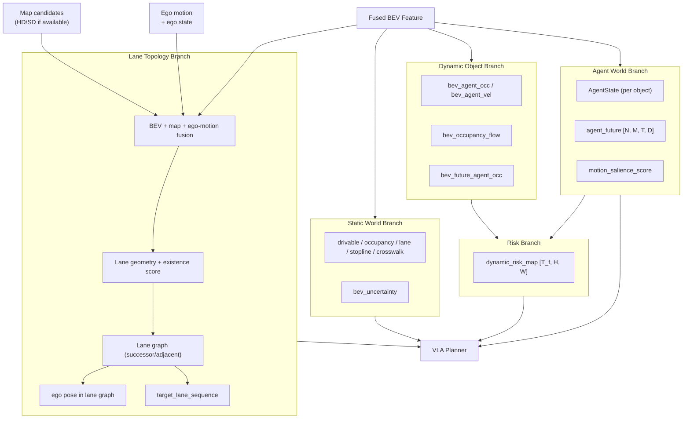

# Chapter 4 Dynamic Object World Model and Future Risk Estimation

---

## 4.1 Why Static Occupancy Is Not Enough

The static occupancy of the BEV (bev_occupancy) represents "what is physically occupied right now."  
This alone cannot support the following decisions:

```text
Decisions that cannot be made with static occupancy alone:
  - Is the vehicle ahead moving or parked?
  - At what speed and when will a vehicle coming from the side enter the intersection?
  - Is the pedestrian about to cross the road?
  - Could the vehicle ahead suddenly brake?
  - Will the stopped vehicle start moving?
```

For the Planner to plan safe and natural driving, prediction of "how dynamic objects will move" is necessary.

---

## 4.2 Occupancy Flow and Dynamic Space Representation

### Occupancy Flow

Occupancy Flow represents in which direction and how much the occupancy of each BEV cell moves.

```text
bev_occupancy_flow: [B, H, W, 2]
  - channel 0: flow_x (displacement in the front-back direction)
  - channel 1: flow_y (displacement in the left-right direction)
  - meaning: where the occupancy will move from this time point to the next
  - unit: meters/frame or meters/second
```

Similar to optical flow, but represents the movement of dynamic objects on the BEV.

### Separation of Static World and Dynamic World

```text
Static World Branch:
  - Road structure (drivable area, lanes, stop lines, crosswalks)
  - Stationary obstacles (buildings, walls, construction barriers)
  - Update frequency: low (1-5 Hz, cacheable)

Dynamic Object Branch:
  - Moving vehicles, pedestrians, cyclists
  - Dynamic states (velocity, acceleration, intent)
  - Update frequency: high (10-20 Hz)
```

This separation allows static information to be cached to reduce computational cost, while only dynamic information is updated at high frequency.

---

## 4.3 Dynamic Object Detection & State Head

This head detects each dynamic object from BEV features and estimates its state.  
This section covers only "current-frame detection and state estimation"; multi-modal future trajectories several seconds ahead are handled in Section 4.6.  
Detection results are passed to the downstream Future Predictor and Planner as Agent Tokens and AgentState.

### Interface

```text
Input:
  bev_temporal:  (B, T_in, C_bev, H, W)   <- Temporal BEV features (multiple frames)

Output:
  agent_tokens:  (N_agent, C_agent)        <- Embedding vectors for detected agents
  agent_states:  List[AgentState]          <- Interpretable state (also used for Planner rules)
    - bbox_bev:          (cx, cy, w, l, yaw)    Bounding box on BEV
    - velocity:          (vx, vy) m/s
    - heading:           float, rad
    - category:          "vehicle" / "pedestrian" / "cyclist" / "animal" / "unknown"
    - vehicle_subtype:   "car" / "truck" / "bus" / "motorcycle" / "special"  (vehicle only, for display)
    - motion_state:      "parked" / "stationary" / "moving" / "accelerating" / "decelerating" / "turning"
    - existence_score:   float [0, 1]
    - track_id:          str   <- ID to continuously identify the same agent across frames
    - occlusion_level:   "none" / "partial" / "full"
    - unknown_dynamic:   bool  <- Detected as a moving object via bev_agent_occ diff + vel threshold, but unclassifiable
```

### Model Architecture

```text
BEV Detection Head (CenterPoint / DETR-BEV style):

Step 1: Feature Extraction
  - Concatenate bev_temporal (T_in frames) along the Channel dimension and process with 2D CNN / Transformer
  - Output: spatial_features (B, C_spatial, H, W)

Step 2: Object Query Generation (DETR style)
  - Initialize N_query learned queries
  - Cross-attention against spatial_features -> query_features (N_query, C_agent)
  - Only queries whose existence probability exceeds a threshold are passed as agent_tokens to the next stage

Step 3: Decoding Each Attribute (Multi-task Head)
  - bbox_bev:      Regress (cx, cy, w, l, sin(yaw), cos(yaw)) with MLP
  - velocity:      Regress (vx, vy) with MLP
  - category:      5-class Softmax (vehicle/pedestrian/cyclist/animal/unknown)
  - vehicle_subtype: 5-class Softmax (valid only for category=vehicle, CE loss)
  - existence_score: Sigmoid
  - occlusion_level: 3-class classification

Losses:
  - bbox regression: Smooth L1 loss (CenterPoint style: heatmap + offset regression)
  - velocity:        L1 loss
  - category:        CE loss (5-class)
  - subtype:         CE loss (5-class, vehicle samples only)
  - existence:       BCE loss
```

### Motion State Classification

```text
parked:       speed < 0.5 m/s AND no position change for an extended period
              (uses context such as roadside / parking space / hazard lights)
stationary:   speed < 0.5 m/s AND short-term stop
              (waiting at traffic light, traffic jam, temporary stop -- capable of moving)
moving:       speed >= 0.5 m/s AND near-constant velocity (small yaw_rate)
accelerating: speed increasing (speed difference from previous frame > threshold)
decelerating: speed decreasing
turning:      yaw_rate > threshold (e.g., 0.1 rad/s)

-> This classification is assigned to agent_states by rule-based logic (not a learning target)
-> Used for Planner rule-based safety checks and Dynamic Risk Map weighting
```

### Distinguishing Parked Vehicles from Temporarily Stopped Vehicles

This distinction is important for the Planner. The uncertainty in future prediction differs significantly.

```text
Parked vehicle (parked):
  - High probability of not moving in the near future -> main modes of agent_future are near-stationary
  - Door opening risk is added separately by rule
  - Identification basis: duration of stop, consistency with roadside/parking space,
    inconsistency with surrounding traffic flow

Temporarily stopped vehicle (stationary):
  - May start moving after signal change or clearance of obstruction ahead
  - "Start and accelerate" mode appears with high probability in agent_future
  - Identification basis: nearby signal state, presence of crosswalk, traffic ahead

-> Misidentification risk (parked misidentified as stationary):
     Unnecessary waiting and excessive follow-up expectations lead to unnatural driving
-> Misidentification risk (stationary misidentified as parked):
     Collision risk with the vehicle when it starts moving is underestimated
-> Countermeasure: Suppress misclassification by adding hysteresis based on number of stationary frames
```

### Assigning the unknown_dynamic Flag

A mechanism to safely handle objects that are moving but cannot be classified
(rolling debris, special vehicles, animals, etc.).

```text
Condition:
  - A cell is newly occupied in the diff of bev_agent_occ (diff_occ)
  - AND a significant velocity vector exists at that cell in bev_agent_vel
  - AND category = unknown (could not be classified into a known category)

Processing:
  - Set unknown_dynamic = true
  - Agent Future Predictor outputs "stop," "slow forward," and "maintain current speed"
    as conservative candidates
  - Set a higher risk floor than normal agents in the Dynamic Risk Map
```

---

## 4.4 Occupancy Flow and Velocity Field

Estimates the cell-level motion field on the BEV. Operates independently of the Agent Detection Head  
and captures movements of small objects, distant objects, and dense areas that could not be detected,
serving as a complementary representation.

### Output Tensors

```text
Input:
  bev_temporal: (B, T_in, C_bev, H, W)   <- Temporal BEV features

Output:
  bev_agent_occ:      (B, H, W)         Cells currently occupied by dynamic objects (probability [0,1])
  bev_agent_vel:      (B, H, W, 2)      Velocity field at each cell (vx, vy) [m/s]
  bev_occupancy_flow: (B, H, W, 2)      Displacement field to the next frame (delta_x, delta_y) [m]
  bev_motion_prob:    (B, H, W)         Probability of being a dynamic object (distinguishing static from dynamic)
```

### Model Architecture

```text
Occupancy Flow Head (lightweight CNN decoder):

Step 1: Shared Encoder from BEV Features
  - Convolve bev_temporal T_in frames temporally (Temporal Conv / attention)
  - Output: flow_features (B, C_flow, H, W)

Step 2: Decode Each Output (Multi-task, branched from shared encoder)
  - bev_agent_occ:      Conv -> Sigmoid
  - bev_agent_vel:      Conv -> velocity vector (unrestricted float)
  - bev_occupancy_flow: Conv -> displacement vector (same method as PixelFlow)
  - bev_motion_prob:    Conv -> Sigmoid

Losses:
  - bev_agent_occ:      BCE loss (Focal Weight applied to dynamic cells)
  - bev_agent_vel:      L1 loss (only for cells where bev_agent_occ > 0.5)
  - bev_occupancy_flow: Charbonnier loss + flow consistency loss
      flow consistency: bev_agent_occ_t+1 ~= warp(bev_agent_occ_t, flow_t)
  - bev_motion_prob:    BCE loss

Handling Imbalance:
  - Dynamic cells are approximately 5-10% of all cells -> Focal Loss + positive-weight sampling
  - bev_agent_vel loss is computed only on dynamic cells

References: PredRNN (NeurIPS 2017), FlowNet3D (CVPR 2019),
            Waymo Open Dataset occupancy flow challenge
```

### Why Both Agent Detection and Occupancy Flow Are Needed

```text
Agent Detection Head:
  - Can track "who" is moving by assigning track_id to individual objects
  - Provides high-precision bbox information for future prediction and collision judgment
  - Prone to detection misses in dense or occluded situations

Occupancy Flow Head:
  - Can capture small objects, dense areas that are difficult to detect at the cell level
  - Velocity field can be used directly by Planner for risk calculation
  - However, cannot identify "who" is moving (no ID)

-> Combining both allows occupancy flow to compensate for missed detections,
  while major agents are tracked with IDs.
```

---

## 4.5 Future Dynamic Occupancy Head

Predicts the dynamic occupancy distribution at each future time step from the current state.  
While the Agent Future Predictor (Section 4.6) predicts trajectories for individual agents,  
this head predicts the overall future dynamic distribution at the cell level -- a coarse-grained representation.

### Interface

```text
Input:
  bev_temporal:   (B, T_in, C_bev, H, W)   <- Temporal BEV features
  bev_agent_occ:  (B, H, W)                <- Current dynamic object occupancy (output of Section 4.4)
  bev_agent_vel:  (B, H, W, 2)             <- Current velocity field (output of Section 4.4)

Output:
  bev_future_agent_occ: (B, T_future, H, W)
    - T_future = 4 to 12 steps
    - Occupancy probability [0, 1] at each step
    - Example: T_future=12, 0.5s interval -> up to 6 seconds ahead
```

### Model Architecture

```text
Convolutional Future Occupancy Predictor:

Step 1: Feature Integration of Current State
  - Concatenate bev_temporal (past frames) + bev_agent_occ + bev_agent_vel
  - Compress spatial features with 2D CNN Encoder -> context_features (B, C, H/4, W/4)

Step 2: Temporal Unrolling (AutoRegressive or Parallel Decode)
  Parallel decode method (speed-first):
    - Have T_future decoder heads in parallel
    - Directly predict occupancy at each time step from context_features
    - Output: (B, T_future, H, W)

  AutoRegressive method (accuracy-first):
    - Predict occupancy for the next step one at a time with ConvLSTM / PredRNN
    - Use the previous step's prediction as input to the next
    - Higher output accuracy but increased inference latency

Step 3: Warp-based Consistency Reinforcement
  - Weighted average of predicted bev_future_agent_occ and warp-based prediction
    from bev_occupancy_flow as the final output
  - Reinforces physical consistency so objects do not disappear or appear suddenly

Losses:
  - per-step BCE loss (comparison with ground truth for each future frame)
  - flow consistency loss: warp(occ_t, flow_t) ~= occ_t+1
  - Ground truth: bev_agent_occ of future frames in logs,
                  or use Agent Future Predictor output as soft target

References: Occupancy Flow (ICCV 2021, Waymo),
            PowerBEV (ICCV 2023), Tesla Occupancy Networks
```

### Division of Roles with Agent Detection

```text
bev_future_agent_occ (this section):
  - Cell level, coarse granularity
  - Basis for Dynamic Risk Map computation (Section 4.8)
  - Captures "overall risk" including objects that could not be detected

agent_futures (Section 4.6, per-agent):
  - Precise multi-modal trajectories per agent
  - Cross-attention input for Planner
  - Necessary for Planner to judge "who moves in which mode"

-> Both are computed in parallel and used for different purposes.
```

---

## 4.6 Agent Future Trajectory Prediction

Predicts future trajectories for each object in multi-modal form (multiple scenarios).

```text
External Interface (agent input is centered on the current frame;
history is handled via internal state and temporal BEV):
  Input:
    agent_tokens:  (N_agent, C_agent)        <- Current-frame output of Section 4.3
    agent_states:  List[AgentState]          <- Current state including bbox, velocity, heading, track_id
    bev_temporal:  (B, T_in, C_bev, H, W)    <- Temporal BEV (context: intersection geometry, signals, etc.)
    lane_graph:    Local Lane Graph tokens   <- Used as constraints for driving direction

  Output:
    agent_futures: (N_agent, M_modes, T_future, D_agent)
    mode_scores:   (N_agent, M_modes)         <- Probability of each mode
      - N_agent:   Maximum number of agents (e.g., 32)
      - M_modes:   Number of trajectory modes (e.g., 6)
      - T_future:  Future time steps (e.g., 12 at 0.5s intervals -> up to 6 seconds ahead)
      - D_agent:   State dimension (x, y, vx, vy, heading) = 5

  Internal State (maintained and updated by the module):
    hidden_states: Dict[track_id -> h (C_hidden,)]
      <- GRU hidden state per agent
      <- States of undetected agents are retained for a fixed number of frames, then deleted
```

### Why Historical Information Is Needed and Why It Is Held as Internal State

```text
From a single current frame, the following cannot be determined:
  - Is it accelerating or decelerating? (velocity change)
  - Is it approaching a curve? (yaw rate change)
  - Did it stop and is now about to start? (stop -> speed increase)
  - Has it started a lane change? (lateral drift)
  - Did the pedestrian stop and turn?

-> Passing past information as a buffer from outside each time:
  - Makes the interface complex
  - Shifts buffer management responsibility to the caller
  - Makes compensation for frame gaps (occlusion) difficult

-> Holding it as GRU hidden state inside the module is the appropriate design:
  - From the outside, the interface is simple: just pass the current frame
  - Handling of occlusion and new agents is completed within the module

References: Trajectron++ (Ivanovic & Pavone, ECCV 2020)
            Social-LSTM (Alahi et al., CVPR 2016)
            MOTR (Zeng et al., ECCV 2022) -- continuous retention of track queries across frames
            StreamPETR (Wang et al., ICCV 2023) -- streaming propagation of object queries
```

### Model Architecture (Recurrent + Multi-mode Decoder)

```text
Recurrent Encoder (GRU-based, per-agent hidden state):

Step 1: Current Frame Input Transformation
  - Combine agent_tokens and agent_states (position, velocity, heading, motion_state)
    and linearly transform to GRU input dimension
  - Retrieve corresponding hidden_state h_prev from the track_id of each agent
    (new agents use h_prev = zeros)

Step 2: GRU Update (Accumulating Temporal Information)
  h_new = GRU(x_t=agent_input_projected, h=h_prev)
  - h_new: (N_agent, C_hidden)  <- Past trajectory patterns are compressed
  - Update hidden_states for each track_id with h_new (stored inside the module)

Step 3: BEV Cross-Attention (Incorporating Scene Context)
  - h_new cross-attends to BEV tokens around its own position
  - Integrates intersection geometry, signal positions, and lane directions into agent features
  - Output: context_aware_features (N_agent, C_hidden)

Step 4: Agent-to-Agent Cross-Attention (Modeling Interactions)
  - Execute self-attention among all agents
  - Nearby agents can make predictions that account for each other's movements
  - Example: Lead vehicle is decelerating (hidden state accumulates deceleration pattern)
             -> Reflected in following vehicle's hidden -> Probability of "stop mode" increases

Step 5: Multi-mode Decoder
  - Decode using M learned mode queries (fixed)
  - Each query is learned as a latent mode representing a behavioral mode
    such as "straight," "right turn," "stop"
  - Output: (N_agent, M_modes, T_future, D_agent) + mode_scores

Occlusion Handling:
  - hidden_state of agents with interrupted detection is retained for N frames (e.g., 10 frames)
  - Upon re-detection: continue GRU update from the retained hidden_state
  - Deleted after exceeding N frames (re-detected after that is treated as a new agent)

Training:
  - During training, learn T_hist sequences with BPTT (Backpropagation Through Time)
  - During inference, update hidden_state sequentially frame by frame
  - Winner-takes-all / best-of-M: target the mode closest to the actual trajectory
  - minADE/minFDE loss, NLL loss for mode_scores,
    physical consistency penalty for velocity and acceleration

Reference Architectures:
  - Trajectron++ (ECCV 2020): Conditional VAE + GRU per-agent hidden state
  - Social-LSTM (CVPR 2016): Pool LSTM hidden states of each pedestrian
  - MOTR (ECCV 2022): Continuous retention of track queries across frames
  - StreamPETR (ICCV 2023): Streaming propagation of object queries
```

### Importance of Multi-modal Prediction

```text
Examples of multiple possible futures from the same state:
  - Vehicle ahead: straight ahead, right turn, or sudden stop
  - Pedestrian: waiting or starting to cross
  - Cyclist in front of crosswalk: stop or dash out

Outputting M=6 modes allows the Planner to select a safe trajectory
regardless of which scenario occurs.
In the final decision, mode_scores and the Dynamic Risk Map are used together.
```

### Interaction-aware Prediction

Predictions that account for interactions among multiple agents improve accuracy
compared to individual prediction.

```text
Interaction-aware methods:
  - Transformer-based joint prediction (Wayformer, etc.)
  - Graph Neural Network over agent proximity
  - Social Force model inspired

This design: Transformer-based multi-agent self-attention / cross-attention
  - Each agent references other agents' states via MHA
  - Also references BEV features (intersection geometry, etc.)
```

---

## 4.7 Motion Salience Gate

Not all agents are equally important. This mechanism allocates computational resources  
preferentially to high-importance agents while maintaining safety and reducing the Planner's computational load.

### Interface

```text
Input:
  agent_states:   List[AgentState]     <- Output of Detection Head in Section 4.3
  agent_futures:  (N_agent, M, T, D)  <- Output of Future Predictor in Section 4.6
  ego_state:      (x, y, vx, vy, heading, route)

Output:
  motion_salience_score: (N_agent,)   <- [0, 1]; higher means greater impact on ego Planner
```

### Score Calculation Method

```text
Compute the following scores for each agent and take a weighted sum:

1. Distance score (w=0.30):
   s_dist = exp(-d / sigma_dist)
   - d: Euclidean distance between ego and agent
   - sigma_dist = 20m (emphasizes agents within 20m)

2. Velocity score (w=0.20):
   s_vel = min(|v_agent| / v_max, 1.0)
   - Normalized with v_max = 20 m/s as upper limit
   - Stationary agents receive a low score

3. Route intersection score (w=0.25):
   s_route = max over modes and route_points(mode_score[m] * exp(-d_to_route[m] / sigma_route))
   - d_to_route[m]: Closest distance between each mode trajectory of agent_future and ego route
   - sigma_route = 5m

4. Relative angle score (w=0.15):
   s_angle = |sin(theta_relative)|
   - theta_relative: Relative angle between ego heading and agent heading
   - Agents that cross or merge receive higher scores

5. Vulnerability bonus (w=0.10):
   s_vuln = 1.0 if category in (pedestrian, cyclist) else 0.0

motion_salience_score[i] = sum_k(w_k * s_k[i])  (normalized to [0, 1])
A safety floor value is set for unknown_dynamic or pedestrian/cyclist
```

### Usage in Planner and Risk Map

```text
Planner Decoder:
  - Sort by motion_salience_score and use only the top N_top agents (e.g., 16)
    as input to cross-attention
  - Agents below N_top influence indirectly through dynamic_risk_map

Dynamic Risk Map (Section 4.8):
  - Weight each agent's contribution by motion_salience_score
  - Suppress risk contribution of low-score agents (distant stationary vehicles, etc.)
  - However, nearby obstacles and unknown_dynamic objects are not zeroed out by salience

Contribution to Real-Time Performance:
  - Always processing up to 32 agents increases Planner computational cost
  - Reducing to N_top = 16 halves the computation for cross-attention (reduction of O(N^2))
  - At intersections and merging points, high-score agents naturally rise to the top
```

---

## 4.8 Dynamic Risk Map

Computes a temporal risk map on the BEV from future predictions of dynamic objects.  
Quantifies collision risk along both spatial and temporal axes for trajectory evaluation in the Planner.

### Interface

```text
Input:
  agent_futures:          (N_agent, M, T_future, D)   <- Section 4.6
  mode_scores:            (N_agent, M)                <- Probability of each mode
  motion_salience_score:  (N_agent,)                  <- Section 4.7
  bev_future_agent_occ:   (B, T_future, H, W)         <- Section 4.5 (for complementing)

Output:
  dynamic_risk_map: (B, T_future, H, W)
    - Risk value for each BEV cell at each future time step
    - Value: [0, 1] (1 is the highest risk)
```

### Risk Calculation Method

```text
Step 1: Generate Occupancy Probability Map per Agent
  For each agent i, mode m, time step t:
    - Project a 2D Gaussian centered at trajectory point (x_t, y_t) onto the BEV grid
    - sigma is proportional to the agent's bbox size and the uncertainty of mode_score
    occ_prob[i, m, t](x, y) = mode_scores[i, m] * Gaussian(x-x_t, y-y_t; sigma_bbox)

Step 2: Mode Integration and Salience Weighting
  agent_risk[i, t](x, y) = 1 - product_m(1 - occ_prob[i, m, t](x, y))
  risk_weight[i] = max(salience[i], category_floor[i])
  dynamic_risk_map[t](x, y) = max_i(agent_risk[i, t](x, y) * risk_weight[i])
  - category_floor is set higher for pedestrian/cyclist/unknown_dynamic
    so they are not removed by low salience

Step 3: Fusion with bev_future_agent_occ (Complementing Undetected Objects)
  final_risk[t](x, y) = max(dynamic_risk_map[t](x, y),
                             alpha * bev_future_agent_occ[t](x, y))
  alpha = 0.5 to 1.0 (prioritizes precise prediction of detected agents
                       while complementing undetected objects)

Loss (during training):
  - Supervised loss using occupancy distribution computed from agent_futures
    and bev_future_agent_occ as ground truth
  - For collision/emergency braking logs, add calibration loss to prevent risk from
    dropping low near collision points
  - An indirect improvement design via agent_futures losses (without end-to-end
    backprop through the risk map) is also possible
```

### Usage in Planner

```text
Trajectory Candidate Evaluation (inside External Evaluator):
  - Reference dynamic_risk_map[t](x, y) at each time step and point of K candidate trajectories
  - candidate_risk[k] = sum_t sum_point dynamic_risk_map[t](ego_xy[k,t])
  - Exclude candidates where candidate_risk exceeds threshold
  - Select the trajectory with the highest comfort score from remaining candidates

Integration into Planner Loss:
  - For scenes where the logged trajectory enters a high-risk region of dynamic_risk_map,
    add a safety loss (to promote learning of avoidance behavior)
```

---

## 4.9 Interaction-aware Planner Connection

Defines the design for efficiently passing outputs from each Dynamic World module to the Planner Decoder.  
The way information is passed (concat / cross-attention / additive) and the order directly affect Planner performance.

### How Information Is Passed

```text
The Planner Decoder has a Transformer Decoder structure (detailed in Chapter 5).
Dynamic world information is injected in the following ways:

1. agent_futures (per-agent cross-attention):
   - Use future tokens of top N_top Motion Salience agents as keys
   - Planner queries reference them via cross-attention
   - Explicitly conditions on "who is where"

2. dynamic_risk_map (Spatial attention bias):
   - Add risk-derived negative bias to attention logits between BEV grid and Planner queries
   - Functions as a Negative Attention Bias that suppresses attention to high-risk cells

3. bev_future_agent_occ (optional):
   - May be passed to the Planner as a complement to dynamic_risk_map
   - Omitted if redundant to reduce computational cost
```

### Attention Order in Planner Decoder

```text
Order of information reference in each Decoder layer:
  1. Static World (drivable area, current occupancy, stop lines)
       -> Hard constraints of "where can we drive at all"
  2. Lane Topology (target lane, connection graph)
       -> Structural constraints of "which route to take"
  3. Dynamic Agent Futures (multi-modal trajectories of top agents)
       -> Trajectory formation conditioned on "how surroundings will move"
  4. Dynamic Risk Map (BEV-level risk)
       -> Continuous penalty of "where is dangerous"
  5. Language Conditioning (external instructions, scene description)
       -> Semantic conditioning of "what should be done"
  6. Ego Route & Context (ego route, speed, remaining distance)
       -> Goal condition of "heading to destination"

This order corresponds to the logic of autonomous driving decision-making:
"Safety constraints -> Structural constraints -> Dynamic constraints -> Language instructions -> Goal"

Usage of each agent's information:
  - Top N_top agents: Explicitly consider scenarios via cross-attention
  - Lower-ranked agents: Influence indirectly through dynamic_risk_map

Design Notes:
  - agent_futures and dynamic_risk_map share some overlapping information
  - In implementation, it is preferable to apply dynamic_risk_map attention first,
    then add agent_futures cross-attention as a residual
  - Injecting information progressively rather than all at once tends to stabilize training
```

---

## 4.10 Extended BEV Output Package

```json
{
  "static_world": {
    "bev_drivable": "tensor [B, H, W]  (0=NOT_DRIVABLE, 1=DRIVABLE, 2=MARGINAL)",
    "bev_occupancy": "tensor [B, H, W]",
    "bev_lane": "tensor [B, H, W, C]",
    "bev_stopline": "tensor [B, H, W]",
    "bev_crosswalk": "tensor [B, H, W]",
    "bev_uncertainty": "tensor [B, H, W]"
  },
  "lane_topology": {
    "lane_nodes": "[LaneNode]",
    "lane_edges": "[LaneEdge]",
    "target_lane_sequence": "[lane_id]"
  },
  "dynamic_world": {
    "bev_agent_occ": "tensor [B, H, W]",
    "bev_agent_vel": "tensor [B, H, W, 2]",
    "bev_occupancy_flow": "tensor [B, H, W, 2]",
    "bev_motion_prob": "tensor [B, H, W]",
    "bev_future_agent_occ": "tensor [B, T_future, H, W]"
  },
  "agent_world": {
    "agent_states": "List[AgentState]",
    "agent_tokens": "tensor [N_agent, C_agent]",
    "agent_futures": "tensor [B, N, M, T, D]",
    "mode_scores": "tensor [B, N, M]",
    "motion_salience": "tensor [B, N]"
  },
  "risk_outputs": {
    "dynamic_risk_map": "tensor [B, T_future, H, W]"
  }
}
```

---

## 4.11 Scenario-Based Processing Examples

### Passing the Side of a Parked Vehicle

```text
Observation:
  - bev_agent_occ: Occupied at the front right
  - bev_motion_prob: Low (0.1 or below)
  - motion_state: "parked"
  - Time series: Stationary at the same position for multiple frames

Reflection in Dynamic Risk Map:
  - Always treated as an obstacle in current occupancy and static collision check
  - Dynamic future risk is low, but the parked vehicle's footprint is retained at future time steps
  - Door opening or pedestrian dash-out is added as additional nearby risk

Impact on Planner:
  - Candidate trajectories are generated with a left offset to avoid the parked vehicle
  - External evaluator selects the avoidance trajectory
  - Candidates are evaluated by computing the lateral margin
```

### Waiting for an Oncoming Left-Turning Vehicle at an Intersection

```text
Observation:
  - bev_agent_occ: Oncoming vehicle decelerating as it approaches the intersection
  - motion_state: "decelerating" -> "stationary"
  - agent_future: Mode has "go straight" and "turn left toward us"

Reflection in Dynamic Risk Map:
  - Left-turn mode trajectory is reflected in the risk map
  - Risk near the center of the intersection is high

Impact on Planner:
  - Risk of candidate trajectories inside the intersection increases
  - External evaluator: Selects trajectory to proceed after oncoming vehicle completes left turn
  - It is desirable for "stop then go" judgment to appear in candidate trajectories
```

### Vehicle Suddenly Pulling Out

```text
Observation:
  - Radar: Target approaching at high speed from the side
  - Camera: Vehicle emerging from a side road on the right
  - bev_motion_prob: Rapid increase
  - agent_future: High-probability mode that crosses ego trajectory

Reflection in Dynamic Risk Map:
  - Risk on ego trajectory surges a few seconds out

Impact on Planner:
  - External evaluator eliminates high-risk trajectories
  - Remaining candidates: Slow down and wait, or make a large avoidance move
  - External Evaluator selects the minimum-risk trajectory
```

### Lead Vehicle Starting After a Temporary Stop

```text
Observation:
  - motion_state: "stationary" -> "moving"
  - agent_future: High-probability mode of accelerating and going straight

Reflection in Dynamic Risk Map:
  - Risk near the lead vehicle's current position shifts forward over time
  - Candidate trajectories that fall below the space-time gap to follow are excluded

Impact on Planner:
  - A following trajectory predicting the lead vehicle's start appears as a candidate
  - Natural acceleration avoiding excessive braking is generated
```

---

## 4.12 Overall Architecture Diagram (5-Branch Structure)



---

## 4.13 Challenges in Training

### Constructing Ground Truth

```text
Ground truth for bev_agent_occ:
  - 3D bbox from LiDAR -> BEV projection
  - Or distill from UniAD occupancy head output

Ground truth for agent_futures:
  - Actual future trajectories in logs (nuScenes annotations)
  - Minimize prediction error (minADE, minFDE, MR, etc.)

Ground truth for dynamic_risk_map:
  - Computed from probability distribution of agent_futures
  - Or back-calculated from logs where collisions actually occurred
```

### Imbalance Problem

```text
Problem: Overwhelming majority of cells have no dynamic objects
Countermeasures:
  - Focal Loss
  - Weighted sampling (sample around dynamic object regions at higher frequency)
  - Presence-guided loss masking
```

---

## 4.14 Chapter Summary

```text
Elements designed in this chapter:
  1. Why the dynamic world is needed (limitations of static Occupancy)
  2. Separation of static world and dynamic world -- design philosophy
  3. Dynamic Object Detection & State Head
       - CenterPoint / DETR-BEV style architecture
       - Two-level classification (5 classes + vehicle subtype)
       - Motion state classification (parked/stationary/moving, etc.)
       - Distinguishing parked vehicles from temporarily stopped vehicles
       - Assigning the unknown_dynamic flag
  4. Occupancy Flow / Velocity Field
       - Cell-level velocity field and displacement field
       - Division of roles with Agent Detection
  5. Future Dynamic Occupancy Head
       - Parallel decode / AutoRegressive methods
       - Flow consistency loss
       - Difference in granularity from Agent Future Predictor
  6. Agent Future Trajectory Prediction (multi-modal)
       - GRU per-agent hidden state (history held as internal state)
       - BEV cross-attention + agent-to-agent cross-attention
       - Winner-takes-all training
  7. Motion Salience Gate
       - Weighted score of distance, velocity, route intersection, relative angle, vulnerability
       - Reduction of Planner computational cost (N_top filtering)
  8. Dynamic Risk Map
       - Gaussian projection per agent + mode integration + salience/category floor weighting
       - Fusion with bev_future_agent_occ (complementing)
       - Integration into Planner trajectory evaluation
  9. Interaction-aware Planner connection
       - How to pass information (per-agent cross-attn / risk spatial bias)
       - Design philosophy of attention ordering
 10. Scenario-based operation examples (4 scenarios)
```

In the next chapter, the design of Language Conditioning and the VLA Planner will be detailed.
