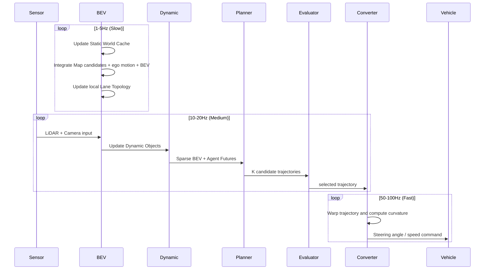

# Chapter 8 Lightweight Design and Real-Time Architecture for Vehicle Deployment

---

## 8.1 Constraints of the In-Vehicle Environment

In research environments, models can be run on large GPU servers.  
However, deployment on an actual vehicle imposes the following constraints.

```text
Power constraints:
  - Passenger cars: 100–200W Thermal Design Power (TDP)
  - Automotive-grade SoCs: DRIVE Orin / Thor (NVIDIA): 60W–300W
  - Research GPUs (A100, etc.): 400W or more

Memory bandwidth:
  - HBM2 (A100): 2 TB/s
  - Orin AGX DRAM: 136 GB/s (LPDDR5)
  - Large gap -> memory bandwidth easily becomes the bottleneck

Storage:
  - Model load speed for inference
  - Model size limit for OTA updates

Temperature:
  - Interior vehicle temperature can reach 70–80°C in summer
  - Automotive-grade (AEC-Q100, etc.) requirements

Vibration and shock:
  - In-vehicle vibration characteristics differ from those in a lab
```

---

## 8.2 Core Principles of Lightweight Design

```text
Principle 1: Do not over-slim the Planner
  - Planning accuracy directly affects safety
  - Better to slim Perception than to reduce Planner accuracy for compute savings

Principle 2: Concentrate computation on "spaces relevant to planning"
  - High-resolution processing around the Route Corridor
  - Coarse sampling for distant or irrelevant regions

Principle 3: Cache static information
  - Road structure (drivable area, lanes) does not need per-frame updates
  - Only Dynamic Objects and Risk Maps need high-frequency updates

Principle 4: Convert Dense BEV to Sparse BEV
  - Instead of processing all BEV cells, process only the important tokens
```

---

## 8.3 From Dense BEV to Sparse BEV for the Planner

```text
Passing all BEV tokens (200x200 = 40,000) to the Planner is too costly.

Sparsification strategy:
  1. Score tokens by Motion Salience
  2. Retain high-density tokens inside the Route Corridor
  3. Reduce low-importance tokens via pooling
  4. Target: 2,000–4,000 tokens as Planner input

Inspired by SparseDrive:
  - Use sparse features related to moving objects and routes, not all of BEV
  - Object-centric representation
```

### Sparse BEV Token Selection

```python
# Sparse BEV token selection (overview)
salience_scores = compute_salience(bev_features, route_tokens, agent_tokens)
# salience: motion_prob + route_proximity + bev_uncertainty

keep_mask = salience_scores > SALIENCE_THRESHOLD
# keep_mask: retain top 2,000–4,000 tokens
pooled_rest = mean_pool(bev_features[~keep_mask])  # pool the rest

sparse_bev = concat([bev_features[keep_mask], pooled_rest])
```

---

## 8.4 Range-Adaptive Perception (Distance-Adaptive Resolution)

BEV resolution varies according to distance.

```text
Zone 1 (0–30m): High resolution
  - BEV grid: 0.2m/pixel
  - Attention budget: high
  - Close obstacles, pedestrians, stopped at signals

Zone 2 (30–80m): Medium resolution
  - BEV grid: 0.5m/pixel
  - Attention budget: medium
  - Lead vehicle, cut-in vehicles

Zone 3 (80m–200m): Low resolution
  - BEV grid: 1.0–2.0m/pixel
  - Attention budget: low
  - Distant reference information only
```

Implementation:

```text
Method A: Multi-scale BEV Grid
  - Maintain separate BEV grids for each zone
  - Merge at Planner input

Method B: Rectilinear Projection
  - Non-linear resolution along the x-axis
  - High density at close range, low density at far range

Recommended: Simplified version of Method A (2 scales: near/far)
```

---

## 8.5 Static World Cache

```text
Static information (drivable area, lanes, stop lines, crosswalks)
does not need per-frame updates as long as road structure stays unchanged.

Cache design:
  update_interval: 1–5 Hz (slow layer)
  cache_duration:  ~1 second

  Ego motion warp:
    - Warp the cached BEV each frame by ego motion before use
    - Also update the local Lane Graph to the current coordinate frame via ego motion
    - Warp computation cost is far lower than full BEV inference

Cache invalidation conditions:
  - Mismatch score between Map candidates and BEV observations exceeds threshold
  - Significant drop in sensor quality
  - Sudden ego speed change (hard braking, etc.)
  - ODD-out detection
```

---

## 8.6 Dynamic-First Perception

Dynamic information is processed before static information.

```text
Reasons for dynamic-first:
  - Dynamic objects change every frame
  - Pedestrian motion can change significantly within 100ms
  - Supplement static information from the cache while spending budget on dynamic processing

Implementation:
  1. Radar Doppler + temporal difference -> fast detection of moving regions
  2. Prioritize updates of BEV features around moving objects
  3. Fill in static background from cache

Early moving-object detection using Radar Doppler:
  - Radar has low latency
  - Use Doppler velocity to quickly obtain direction and speed of moving objects
  - Use this as a "hint" for BEV processing
```

---

## 8.7 Route Corridor Perception (Two-Stage Processing)

```text
Stage 1: Coarse Global BEV
  - Process the entire range at low resolution
  - Confirm route direction
  - Coarse risk detection

Stage 2: High-Resolution Corridor BEV
  - High-resolution processing around the route (approximately ±5m)
  - Detailed obstacle detection
  - Lane refinement
  - Pedestrian details

Computation allocation:
  Stage 1: 30% of total computation cost
  Stage 2: 70% concentrated on the route corridor
```

---

## 8.8 Token Compression and Query Pruning

```text
Keep tokens (retained at high density):
  - BEV cells with motion_prob > 0.3 (moving objects)
  - BEV cells with route_proximity < 3m (near route)
  - BEV cells with bev_uncertainty > 0.5 (uncertain regions)
  - Cells where stop lines or crosswalks are detected

Pool tokens (aggregated):
  - Distant static background not in the above categories
  - 2x2 or 4x4 average pooling

Remove tokens (discarded):
  - Cells where bev_drivable = NOT_DRIVABLE(0) AND Dynamic Risk = 0
    * Do NOT remove MARGINAL(2) cells (retain as emergency avoidance paths)
  - Clearly irrelevant distant regions
```

---

## 8.9 Cascaded Perception (Progressive Refinement)

```text
Pass 1: Coarse (fast, low accuracy)
  - Process everything with a lightweight backbone
  - Obtain masks for moving regions and important regions
  - Target: 10–20ms

Pass 2: Refinement (important regions only)
  - Apply high-accuracy backbone to ROIs identified by Pass 1
  - Additional 30–50ms

Total target: 50–70ms (below 50ms for 20Hz target)
```

---

## 8.10 Multi-Rate Cycle Design (Detail)



---

## 8.11 Anytime Planning (Staged Fallback)

Staged response for when computation cannot complete in time.

```text
Level 0 (Normal): Full inference
  - All modules active
  - K=16 candidates
  - T=10 steps

Level 1 (Lite): Lightweight inference
  - Reduce BEV resolution to 128x128
  - K=8 candidates
  - T=8 steps
  - Trigger: inference exceeds 30ms

Level 2 (Minimal): Minimal inference
  - Only Static cache updated
  - K=4 candidates
  - T=6 steps
  - Radar + warp of previous BEV only
  - Trigger: inference exceeds 50ms

Level 3 (Emergency): Emergency mode
  - Stop Planner
  - Activate External Evaluator MRM
  - Continue at safe speed or stop
  - Trigger: inference exceeds 100ms or sensor failure

Level 4 (Safe Stop): Safe stop
  - Full system stop, safe standstill
  - Trigger: Level 3 continues for 5 seconds or more
```

---

## 8.12 Knowledge Distillation (Teacher–Student Models)

Transfer knowledge from a large model to a smaller one.

```text
Teacher: large model (offline training environment)
  - ResNet101 + BEVFormer-Base
  - nuScenes full-resolution training
  - High accuracy but long inference time

Student: lightweight model (vehicle-deployed)
  - EfficientNet-B2 + simplified BEV Encoder
  - Low-resolution BEV
  - TensorRT INT8 quantized

Distillation loss:
  L_distill = MSE(student_bev, teacher_bev.detach())
             + KLDiv(student_conf, teacher_conf.detach())
```

---

## 8.13 Importance Supervision

Train the lightweight model to concentrate computation on important locations using supervised importance maps.

```text
Importance Map teacher:
  - Occupancy of Dynamic Objects
  - Route corridor
  - High uncertainty regions

Loss:
  L_importance = BCE(pred_importance_map, gt_importance_map)

This teaches the lightweight model "where to look."
```

---

## 8.14 OSS References: SparseDrive and Fast-BEV

```text
SparseDrive:
  https://github.com/swc-17/SparseDrive
  - Sparse representation for E2E autonomous driving
  - Object-centric, route-aware sparse BEV
  - Reference for the Sparse BEV design in this work

Fast-BEV:
  Paper: https://arxiv.org/abs/2301.12511
  - Fast BEV inference without deformable attention
  - Pre-computed camera frustum sampling
  - Reference for fast BEV inference for vehicle deployment
```

---

## 8.15 Chapter Summary

```text
Elements designed in this chapter:
  1. In-vehicle environment constraints (power, bandwidth, temperature)
  2. Core principles of lightweight design (4 principles)
  3. Dense BEV -> Sparse BEV conversion
  4. Range-Adaptive Perception (distance-adaptive resolution)
  5. Static World Cache
  6. Dynamic-First Perception
  7. Route Corridor Perception (two-stage processing)
  8. Token Compression and Query Pruning
  9. Cascaded Perception
  10. Multi-rate cycle design
  11. Anytime Planning (4-level fallback)
  12. Knowledge Distillation
  13. References: SparseDrive / Fast-BEV
```

The next chapter details the design of productization, safety, regulations, ODD, and logging.
