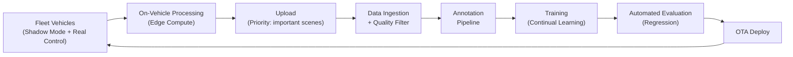

# Chapter 12 Data Collection, Fleet Learning, and Annotation Pipeline

---

## 12.1 The Unique Nature of Autonomous Driving Training Data

Training data for autonomous driving has a fundamentally different character from ordinary image recognition data.

```text
Ordinary image recognition data:
  - Still images + labels
  - Independent samples
  - Manual labeling is standard

Autonomous driving training data:
  - Synchronized time-series sensor data (Camera, LiDAR, Radar)
  - Ego vehicle state (speed, steering, acceleration)
  - Precise timestamps, ego motion, coarse positioning
  - Future trajectories of other vehicles and pedestrians
  - Road structure, signal, and sign information
  - These are highly coupled into a complex structure
```

---

## 12.2 Design Principles for Data Collection

```text
Principle 1: Ensure sensor synchronization (do this reliably at collection time)
  - Calibration/synchronization flaws cannot be corrected after the fact
  - Verify calibration before every drive

Principle 2: Record ego state
  - Record speed, steering, and acceleration for every frame
  - This is the foundation for the human trajectory teacher

Principle 3: Record ego motion and coarse positioning
  - GPS alone is insufficient for temporal BEV integration
  - Estimate high-frequency ego motion from IMU + wheel speed + steering angle
  - Record GNSS for nearby Map candidate search and route alignment

Principle 4: Store raw data
  - Store raw data, not preprocessed data
  - Enables reprocessing even when preprocessing algorithms change

Principle 5: Enrich metadata
  - Record weather, time of day, region, and scenario tags
  - Used for filtering and balancing during training
```

---

## 12.3 Sensor Configuration of Collection Vehicles

```text
Collection Vehicle A (full configuration, early development / complex scenes):
  - Camera: 8 (front long-range x1, mid-range x2, side x4, rear x1)
  - LiDAR: 2 (front long-range + 360-degree)
  - Radar: 6 (corner x4 + front x2)
  - Ego motion: IMU + wheel speed + steering angle (100Hz+)
  - GNSS: for nearby Map candidate search (RTK used as supplemental teacher when available)
  - Additional: microphone, temperature sensor
  - Use: tail case collection, BEV/Lane Topology teacher generation

Collection Vehicle B (production sensor configuration, fleet):
  - Camera: 6 (equivalent to production model)
  - LiDAR: 1
  - Radar: 5 (corner x4 + front x1)
  - Ego motion: IMU + wheel speed + steering angle
  - GNSS: coarse positioning and route alignment
  - Use: large-scale driving data collection
```

---

## 12.4 Human Trajectory Data Quality Filtering Pipeline

```text
Pipeline:
  Step 1: Sensor health check
    - Confirm each sensor's recording is uninterrupted
    - Verify timestamp continuity
    -> NG: exclude entire session

  Step 2: Ego motion / positioning quality check
    - Ego motion continuity and physical consistency
    - GNSS accuracy flag (DOP value)
    - IMU output anomaly (clipping)
    -> NG: exclude relevant segment

  Step 3: Sudden-maneuver filter
    - |steer_rate| > threshold
    - |a_x| > 8 m/s^2 (hard braking)
    - |a_y| > 5 m/s^2 (hard steering)
    -> NG: exclude ±10-second window around the event

  Step 4: Violation filter
    - Speed violation (exceeds 120% of posted limit)
    - Possible stop-line ignoring (behavioral pattern)
    -> NG: down-weight or exclude relevant segment

  Step 5: Driver intervention detection
    - Steering grip sensor (if available)
    - Sudden divergence between system and actual steering
    -> NG: exclude area before and after intervention

  Step 6: Scenario tagging
    - Automatically determine road type, weather, traffic volume
    - Flag special scenarios (intersections, parking avoidance, etc.)
    -> OK: save as metadata

  Step 7: Trajectory quality score
    - Assign a quality score to each sample
    - Used for weighting during training
```

---

## 12.5 Fleet Learning Design

Fleet learning is a system that continuously improves the model by leveraging large amounts of data from real-world driving.

### Fleet Learning Architecture



The role of each component and references to details are shown below.

| Component | Main Role | See Section |
|---|---|---|
| Fleet Vehicles | Concurrent Shadow Mode and Real Control operation. Scenario tagging and trigger detection | — |
| On-Vehicle Processing (Edge Compute) | Sensor data compression, important scene clipping, priority-based upload queue management | 12.6 |
| Data Ingestion & Quality Filter | Timestamp synchronization check, blur/duplicate removal. DB registration, annotation queue submission | — |
| Annotation | Automatic driving log/BEV generation, semi-automatic Lane Topology, VLM-based T_scene generation | 12.7 |
| Continual Learning | Replay buffer + knowledge distillation to prevent catastrophic forgetting. Daily/weekly/monthly schedule | 12.9 |
| Automated Evaluation & Regression | Pass/fail criteria check for Shadow ADE, Fallback rate, Hard Fail rate | — |
| OTA Deploy | Canary Release with 3 phases. 1 Hard Fail -> immediate rollback of all vehicles | — |

### Data Ingestion Quality Filter Criteria

```text
- Sensor timestamp sync deviation > 50ms -> exclude
- Camera image blur / abnormal exposure -> exclude
- LiDAR echo loss rate > 30% -> exclude
- GPS accuracy too coarse (region where Map candidates cannot be retrieved) -> assign low-confidence flag
- Duplicate scene (cosine similarity > 0.98) -> keep only 1 representative
```

### Automated Evaluation Pass Criteria

| Metric | Pass Criterion | Action on Failure |
|---|---|---|
| Shadow ADE (overall) | <= current model + 0.05 m | Continue training; hold deployment |
| Shadow ADE (tail cases) | <= current model + 0.10 m | Hold deployment |
| bev_drivable IoU (3-class average) | >= current model - 0.01 | Continue training; hold deployment |
| Fallback activation rate (simulation) | <= current model x 1.10 | Immediate rollback |
| Hard Fail rate (simulation) | = 0 cases | Immediate rollback |
| Lane Topology F1 (centerline match) | >= current model - 0.02 | Hold deployment |

Training complete -> evaluation set inference -> metric calculation -> all items pass -> enter OTA queue. One or more items fail -> alert, hold deployment, enter root cause analysis queue.

### OTA Deployment Safety Gates

```text
Staged deployment (Canary Release):
  Phase 1: Internal test vehicles (Shadow Mode only, 1-2 weeks of real driving)
  Phase 2: Limited fleet (5%) deployed as Real Control
  Phase 3: Full fleet deployment

Safety gates:
  - Phase 1 -> 2: Confirm Shadow ADE is below design target
  - Phase 2 -> 3: Confirm Fallback activation rate in real driving is no worse than current model
  - Any 1 Hard Fail across full fleet -> immediate rollback of all vehicles
  - OTA receive & verify: switch only after hash verification + digital signature confirmation
```

---

## 12.6 Important Scene Detection and Upload Priority Control

Continuous uploading of all data is not practical from a bandwidth, cost, and storage perspective. On-vehicle processing (Edge Compute) compresses and prioritizes data, selectively uploading important scenes.

### On-Vehicle Processing (Edge Compute)

```text
A. Sensor data compression
  - Camera: H.265 encoding (high quality for important scenes, medium quality for routine driving)
  - LiDAR: point cloud decimation (retain all points for important scenes, spatial subsampling for routine driving)
  - Radar: raw sensor output as-is (already compact)

B. Trigger recording and clipping
  - Clip and buffer ±T_buffer seconds around the trigger event
  - T_buffer: High priority = ±10s, Medium = ±5s, Low = ±2s

C. Metadata attachment
  - Timestamp, GPS (coarse location), scenario tags
  - Shadow Mode delta score, bev_uncertainty statistics
  - Sensor health log
```

### Upload Priority

```text
High (immediate transmission via LTE/5G):
  - Fallback activation scenes
  - Out-of-ODD detection scenes
  - Scenes with Critical delta in Shadow Mode
  - Sensor failure scenes
  - Collision or near-miss scenes

Medium (send at next stop):
  - Scenes with Suspicious delta in Shadow Mode
  - Uncommon scenario tags (new intersection, construction zone, etc.)
  - Adverse weather scenes
  - Scenes with high bev_uncertainty

Low (send when Wi-Fi connected):
  - Sampling of steady-state driving (highway straight, etc.)
  - Scenes with Benign delta

On queue overflow: drop Low, protect High. Sample Medium based on capacity.
```

### Data Included in Uploads

```text
- Sensor data (compressed)
- Ego state (speed, steering, acceleration)
- System logs
- Shadow Mode delta information
- Scenario tags, trigger type
```

---

## 12.7 Annotation Design

Multiple types of teacher signals are required for training this design.

### Teacher Signal Types and Automation Feasibility

| Teacher Signal | Collection Method | Automation Feasibility |
|---|---|---|
| Human driving trajectory | Auto-extracted from driving logs | Fully automatic |
| Speed profile | Auto-calculated from driving logs | Fully automatic |
| bev_drivable (3-class) | HD Map (DRIVABLE/NOT_DRIVABLE) + LiDAR step detection (MARGINAL boundary) | Nearly automatic (MARGINAL boundary needs review) |
| bev_lane | Camera/LiDAR BEV + Map candidate matching | Nearly automatic |
| bev_occupancy (static) | LiDAR point cloud -> automatic | Automatic (accuracy limited) |
| bev_agent_occ (dynamic) | LiDAR 3D bbox -> automatic | Automatic |
| agent_futures | Auto from trajectory logs | Automatic |
| bev_stopline | Camera recognition + Map candidates + manual review | Semi-automatic |
| Lane Topology | BEV time series + ego motion + Map candidate matching | Semi-automatic to nearly automatic |
| T_scene text labels | VLM teacher (DriveLM, etc.) | Automatic (VLM-generated) |
| Tail case scenarios | Manual review required | Semi-automatic |

### Lane Topology Teacher Generation Using Map Candidates

```text
Basic policy:
  - Do not directly project HD Map as ground truth
  - Match Map candidates retrieved by coarse positioning against BEV lane evidence estimated from sensors
  - Warp multiple frames to the current coordinate via ego motion to compensate for occlusion and temporary detection drops
  - Save teacher as "local Lane Graph consistent with current observation" and "ego position on that Graph"

Inputs:
  - Camera/LiDAR/Radar integrated BEV
  - Temporal BEV memory
  - Ego motion
  - HD/SD Map candidates (when available)
  - Route candidates or road segment candidates

Limitations:
  - Temporary restrictions in construction zones are difficult
  - Correspondence of traffic signals
  - Recognizing posted speed limits

Countermeasures:
  - Assign high bev_uncertainty to low-accuracy regions
  - Record mismatch between Map candidates and observations as map_mismatch_score
  - Send mismatched segments to manual review or retraining queue
  - Generate local Lane Graph teacher from BEV time series and ego motion even without Map candidates
```

### Automatic Annotation via VLM Teacher (T_scene)

Large language models (LLaVA, GPT-4V, DriveLM, etc.) are used to auto-generate scene description labels.

```text
Target: teacher signal for T_scene (internal scene tokens)

Generation process:
  Step 1: Input camera image to VLM
  Step 2: Example prompt:
    "This is a forward camera view of a car.
     Describe the key risks and scene context in 3 sentences."
  Step 3: Use VLM output text as teacher for T_scene
  Step 4: Train T_scene with text decoder loss

Prompt design points:
  - Guide the VLM to include risk information ("pedestrian about to cross")
  - Elicit agent intent ("the vehicle appears to be slowing down")
  - Guide inclusion of implications for ego action ("caution required")

Quality control:
  - Generate from the same scene with multiple prompts and check consistency
  - Auto-detect cases where VLM output is clearly wrong (score threshold)
  - Perform manual review on a fixed fraction (5-10%)
```

---

## 12.8 Tail Case Collection Strategy

Everyday scenes automatically collected from the fleet alone cannot cover rare dangerous situations.

```text
Tail case collection methods:

A. Automatic detection via Novelty Score
  - Scenes where model bev_uncertainty is high
  - Scenes with feature patterns that have appeared rarely in the past
  - Automatically flagged -> upload priority raised

B. Manual scenario design and collection
  - Construction zones
  - Roads with faded lane markings
  - Non-standard intersections
  - Multiple parked vehicles
  - Groups of pedestrians crossing
  - Scenes blocked by large vehicles
  - Smoke or fog visibility impairment
  - Dirt from sand / insects on sensors

C. Augmentation from external datasets
  - nuScenes (1,000 scenes)
  - Waymo Open (1,950 segments)
  - Argoverse 2
  - KITTI (older but useful for reference)
  - Pay attention to domain gaps with own collected data

D. Simulation generation
  - Scenario generation in CARLA etc.
  - Sim-to-Real gap management required
```

---

## 12.9 Continual Learning Design

When continuously updating the model, the following techniques are combined to prevent degradation of past performance (preventing catastrophic forgetting).

### Countermeasures Against Catastrophic Forgetting

```text
A. Replay Buffer
  - Retain representative past scenes sampled uniformly by scenario tag
  - Construct mini-batches with new data : replay data = 7:3 ratio
  - Buffer size: guideline of 500k samples (20-30% of all data)

B. Knowledge Distillation
  - Distill soft logits from the currently deployed model (Teacher) into the new model (Student) via KL divergence
  - Distillation coefficient lambda_kd = 0.3-0.5 (balance with new task loss)

C. Weight Regularization
  - EWC (Elastic Weight Consolidation): penalizes changes to important parameters
  - SI (Synaptic Intelligence): dynamically tracks parameter importance during training

D. Per-Task Learning Rate Schedule
  - BEV Encoder (shared backbone): lr x 0.1 (protect existing representations)
  - New task heads: lr x 1.0 (update aggressively)
  - Lane Topology Head: lr x 0.3 (update carefully, map-dependent component)

Recommended: Use A (Replay) + B (Distillation) as baseline; add C for large-scale domain additions.
```

### Version Management

```text
- Version number in YYYYMMDD-NNN format
- Save checkpoints to object storage (S3, etc.)
- Always retain the latest 5 versions for rollback
- Every update must pass the full automated evaluation (see 12.5)
```

### Training Schedule

```text
Daily batch training:
  - Continual learning on High and Medium data from the last 24h

Weekly full training:
  - 1 epoch over all data including replay buffer
  - Full automated evaluation on all evaluation set items

Monthly large-scale training:
  - Performed for architecture changes or large additional data batches

Off-schedule triggers:
  - When tail case data accumulates above threshold (guideline: 1,000 scenes)
  - When Suspicious delta rate in Shadow Mode exceeds threshold
  - When adding a new region or new ODD
```

---

## 12.10 Privacy and Regulatory Compliance

```text
Privacy:
  - Vehicle license plates: automatic blur (detection + masking)
  - Pedestrian faces: automatic blur
  - Removal of driver identification information

Regional regulations:
  - EU GDPR: requirements for collection, retention, and deletion of personal data
  - China Personal Information Protection Law: restrictions on cross-border data transfer
  - Confirm legal requirements for driving data collection in each country

Sensor data licensing:
  - Collected driving data is proprietary asset
  - Confirm licensing when using external data such as HD/SD Map as Map candidates
  - Confirm licenses of OSS datasets used for training
```

---

## 12.11 Chapter Summary

```text
Elements designed in this chapter:
  1. The unique nature of autonomous driving training data
  2. 5 principles for data collection
  3. Sensor configuration of collection vehicles (full configuration / production sensor configuration)
  4. Human trajectory data quality filtering pipeline (7 steps)
  5. Fleet learning pipeline (architecture, evaluation criteria, OTA deployment)
  6. Important scene detection and upload priority control (Edge Compute compression, priority control)
  7. Annotation design (teacher signal types, Lane Topology GT generation, VLM Teacher)
  8. Tail case collection strategy (Novelty Score, manual collection, external datasets, simulation)
  9. Continual learning design (Replay Buffer, knowledge distillation, EWC/SI, training schedule)
  10. Privacy and regulatory compliance
```

The next chapter covers evaluation metrics, benchmarks, and scenario design.
