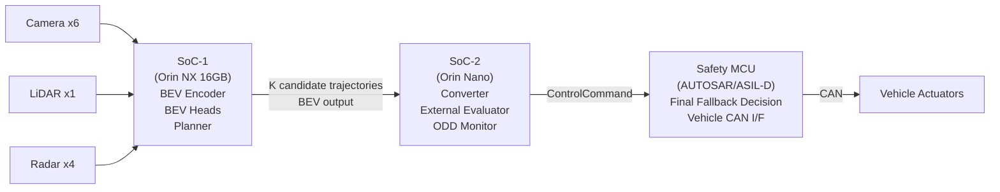
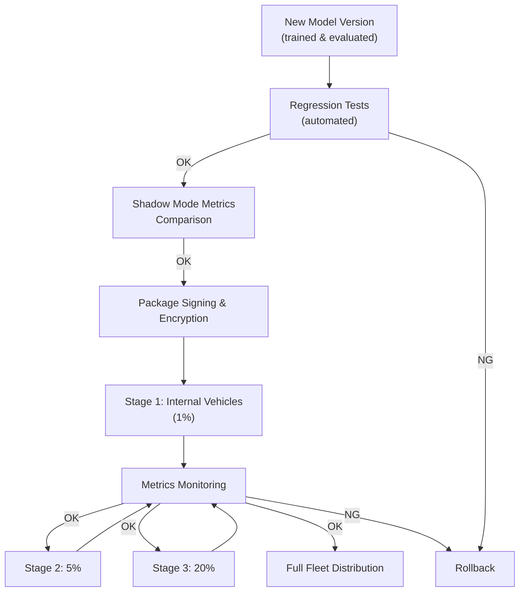

# Chapter 14 Hardware Platform, Quantization, and OTA Deployment

---

## 14.1 Constraints of In-Vehicle Computing

An autonomous driving system must run on a computer installed inside the vehicle, not in a data center.

```text
Types of constraints:
  Power: power inside the vehicle is limited
    - Gasoline vehicles (ICE): supplied from auxiliary battery (12V/48V)
    - Electric vehicles (EV): supplied via DC-DC conversion from main battery
    - Power consumption: 30-100W (ICE), 50-300W (EV) is realistic
    - High-performance inference chips consume roughly 30-60W

  Heat: heat dissipation is difficult in an enclosed vehicle
    - Operating temperature: -40 to +85°C (equivalent to AEC-Q100 Grade 1)
    - Measures against thermal throttling during extended use
    - Thermal design with liquid cooling or heat pipes is also important

  Physical size: installation space is limited
    - Development vehicles: trunk or under rear seats
    - Production vehicles: ECU-equivalent form factor

  Reliability: vibration and shock during driving
    - Automotive-grade certification required
    - SIL/ASIL compliance

  Cost: component cost in mass production
    - Development phase: high cost acceptable, but target cost for mass production
```

---

## 14.2 Recommended Hardware Platforms

### NVIDIA Orin / Thor Series (Primary Recommendation)

| Model | AI TOPS | Power | Application |
|---|---|---|---|
| DRIVE Orin 64GB | 275 TOPS | 60W | High-performance ADS |
| DRIVE Thor 64GB | 500 TOPS | 120W | Full-stack ADS |

```text
Features:
  - Hardware optimization available with TensorRT
  - Support for INT8/FP16 inference
  - Full utilization of CUDA, cuDNN, cuSPARSE
  - DriveOS-based BSP
  - Ubuntu-based OS also usable in development vehicles
  - Production vehicles operate on QNX-based DriveOS
  - ASIL-B / ASIL-D Safety Island option (DRIVE Orin / Thor)
  
Correspondence with this design:
  - Initial evaluation: DRIVE Orin 64GB recommended
  - Moving toward productization: verify operation on DRIVE Thor 64GB
  - Target: operate at 30fps+ on DRIVE Thor 64GB
```

### Qualcomm Snapdragon Ride Platform

```text
Main model: Snapdragon Ride Elite (SA8775P)
Features:
  - Automotive SoC with AISC-B certification
  - Hexagon NPU (50+ TOPS)
  - Automotive-grade integrated encoder/decoder
  - Direct connection support for multiple cameras
  
Application:
  - Cost-optimized production
  - Uses QNN (Qualcomm Neural Network SDK) instead of TensorRT
  - This book's implementation can be converted to QNN via ONNX
```

---

## 14.3 Model Quantization

Convert a training-precision (FP32) model to FP16 or INT8 to improve inference speed and power consumption.

### FP16 (Half-Precision Floating Point)

```text
Features:
  - Little accuracy loss compared to FP32 (nearly equivalent)
  - Significant speedup by leveraging FP16 Tensor Cores on NVIDIA GPUs
  - Half the memory usage

Recommended for:
  - The first step to try
  - Large-scale modules such as BEV Encoder, Transformer

FP16 conversion with TensorRT:
  import tensorrt as trt
  
  builder.fp16_mode = True  # TRT 7 and earlier
  # or
  config.set_flag(trt.BuilderFlag.FP16)  # TRT 8 and later
```

### INT8 (Integer Quantization)

```text
Features:
  - Potentially 2x faster than FP16
  - Memory usage 1/4 of FP32
  - Accuracy degradation exists (mitigated by calibration)
  - Calibration data is required

Steps:
  Step 1: Prepare calibration dataset
    - Representative driving scene input data (500-1000 samples)
    
  Step 2: TensorRT INT8 calibration
    class Calibrator(trt.IInt8EntropyCalibrator2):
        def __init__(self, calib_data):
            ...
        def get_batch(self, names):
            ...
        def get_batch_size(self):
            return self.batch_size
    
  Step 3: Verify accuracy
    - Check metrics after INT8 conversion
    - Acceptable degradation: roughly mAP -1 to -3pt
    - Prioritize FP16 for important heads (Evaluator inputs)
    
Recommended for:
  - BEV Encoder, Detection Head
  - When memory constraints are severe
  - Adopt after verifying accuracy
```

### Quantization-Aware Training (QAT)

```text
Higher accuracy than INT8 Post-Training Quantization (PTQ)
Features:
  - Includes quantization simulation from training time
  - Less accuracy degradation than PTQ
  - Requires retraining

Implementation:
  - PyTorch: torch.quantization or pytorch-quantization (NVIDIA)
  - INT8 conversion with TensorRT after QAT
  
When to use:
  - Try QAT when PTQ causes too much accuracy loss
  - Start with PTQ first (requires less effort)
```

---

## 14.4 Model Portability via ONNX

By routing through ONNX (Open Neural Network Exchange), deployment to multiple runtimes becomes possible.

```text
Export flow:
  PyTorch Model
    -> ONNX export (torch.onnx.export)
    -> TensorRT engine (trtexec or trt.Builder)
    or
    -> QNN (Qualcomm Neural Network SDK)
    or
    -> ONNXRuntime (for development / debugging)

Caveats:
  - Dynamic shapes (variable batch size, etc.) require explicit configuration
  - Custom operators (custom attention, etc.) may be difficult to export to ONNX
  - Deformable Attention in BEVFormer needs to be confirmed
  - Address warnings from torch.onnx.export in advance

TensorRT conversion command:
  trtexec \
    --onnx=model.onnx \
    --saveEngine=model.trt \
    --fp16 \
    --workspace=4096

Validation:
  - Confirm numerical agreement between ONNX output and PyTorch output
  - Confirm numerical agreement between TRT output and ONNX output
  - Tolerance: within ~1e-3 for FP16
```

---

## 14.5 Multi-Chip Deployment Architecture

While a single chip handling all processing is ideal, multi-chip configurations are also considered due to cost and power constraints.



```text
Design rationale:
  - Main inference (SoC-1): high TOPS, high cost, high power
  - Safety evaluation (SoC-2): low cost, low power, simple logic
  - Safety MCU: ASIL-D certified, final safety gate

Advantages:
  - Independence on failure (even if SoC-1 crashes, MCU continues Fallback)
  - Cost optimization (concentrated investment in main inference)
  - Separation of safety proof

Disadvantages:
  - Latency of inter-chip communication
  - Design complexity
  - OTA management across multiple chips
```

---

## 14.6 TensorRT Inference Pipeline Implementation

```python
import tensorrt as trt
import numpy as np
import pycuda.driver as cuda
import pycuda.autoinit

class TRTInference:
    def __init__(self, engine_path: str):
        with open(engine_path, "rb") as f:
            runtime = trt.Runtime(trt.Logger(trt.Logger.WARNING))
            self.engine = runtime.deserialize_cuda_engine(f.read())
        self.context = self.engine.create_execution_context()
        self._allocate_buffers()
    
    def _allocate_buffers(self):
        self.inputs = []
        self.outputs = []
        self.bindings = []
        
        for binding in self.engine:
            shape = self.engine.get_binding_shape(binding)
            size = trt.volume(shape)
            dtype = trt.nptype(self.engine.get_binding_dtype(binding))
            
            host_mem = cuda.pagelocked_empty(size, dtype)
            device_mem = cuda.mem_alloc(host_mem.nbytes)
            self.bindings.append(int(device_mem))
            
            if self.engine.binding_is_input(binding):
                self.inputs.append({"host": host_mem, "device": device_mem})
            else:
                self.outputs.append({"host": host_mem, "device": device_mem})
    
    def infer(self, *input_arrays):
        for i, arr in enumerate(input_arrays):
            np.copyto(self.inputs[i]["host"], arr.ravel())
            cuda.memcpy_htod(self.inputs[i]["device"], self.inputs[i]["host"])
        
        self.context.execute_v2(bindings=self.bindings)
        
        results = []
        for out in self.outputs:
            cuda.memcpy_dtoh(out["host"], out["device"])
            results.append(out["host"].copy())
        return results
```

---

## 14.7 OTA (Over-the-Air) Update Pipeline

A mechanism for safely updating models remotely.

### OTA Update Design Principles

```text
Principle 1: Stage the update (Gradual Rollout)
  - Do not distribute to the entire fleet at once
  - Expand incrementally: 1% -> 5% -> 20% -> 100%
  - Check Shadow Mode metrics at each stage

Principle 2: Rollback capability is mandatory
  - Be able to revert to the previous version if a problem occurs
  - Validate rollback procedure in advance

Principle 3: Verification before and after update
  - Automatic execution of regression tests
  - Comparison of Shadow Mode metrics
  - Automatically halt distribution if a problem is detected

Principle 4: Signing and encryption
  - Verify update package signature (tamper detection)
  - Encrypt communications (TLS)
  - Authenticate vehicle ID

Principle 5: Update timing safety
  - Updates during driving are basically prohibited
  - Update while parked / engine off
  - Do not start up during update
```

### OTA Update Flow



---

## 14.8 Model Performance Profiling

```text
Metrics to measure:
  - Latency: processing time per frame [ms]
  - Throughput: number of frames processed per second [fps]
  - Memory Usage: GPU VRAM consumption [MB]
  - Power: actual power consumption [W]
  - Thermal: operating temperature [°C]

Tools:
  NVIDIA Nsight Systems:
    nsys profile -o profile.qdrep python inference.py
    -> Kernel-level timeline visualization

  NVIDIA Nsight Compute:
    ncu --metrics ... python inference.py
    -> Detailed analysis of GPU kernels

  TensorRT Profiler:
    context.profiler = trt.Profiler()
    -> Check processing time per layer

  tegrastats (Orin/Jetson):
    tegrastats --interval 1000
    -> Real-time monitoring of CPU, GPU, memory, power, and temperature

Target values:
  - Full pipeline latency: < 100ms (10Hz)
  - BEV Encoder + Planner: < 50ms
  - Converter + Evaluator: < 5ms
  - GPU VRAM: < 8GB (targeting half of Orin NX 16GB)
  - Power consumption: < 40W (stable operation on Orin NX)
```

---

## 14.9 Monitoring in Production

```text
Monitoring targets:
  Technical metrics:
    - Processing time (per frame)
    - GPU utilization and temperature
    - Sensor loss rate
    - Fallback activation rate
    - Distribution changes in bev_uncertainty
    - Number of out-of-ODD detections
    
  Drift detection:
    - Is the BEV feature distribution drifting from training?
    - Input distribution shift (new region / season)
    - Changes in prediction distribution (system suddenly outputting different results)
    
  Alert conditions:
    - Sudden spike in Fallback rate (1-hour average doubles)
    - Increasing frames where processing time exceeds 100ms
    - Increasing sensor loss
    - Sudden spike in bev_uncertainty

Monitoring infrastructure:
  - Telemetry transmission (periodically send aggregated data)
  - Dashboard (visualization with Grafana, etc.)
  - Alert notification (Slack, PagerDuty, etc.)
```

---

## 14.10 Hardware Selection Checklist

```text
Early development:
  □ NVIDIA AGX Orin 64GB or 32GB
  □ Drive OS on Ubuntu
  □ TensorRT 10.x (latest)
  □ Software environment management via Docker
  □ Debugging and profiling tools ready

Production evaluation phase:
  □ Verify model operation on target SoC (Thor, etc.)
  □ FP16 conversion and accuracy verification
  □ INT8 conversion and accuracy verification (within acceptable degradation?)
  □ Long-term measurement of power consumption and temperature
  □ Confirm automotive-grade certification status

OTA preparation:
  □ Implement signing and encryption of update packages
  □ Implement and validate rollback functionality
  □ Implement staged distribution mechanism
  □ Monitoring dashboard ready
  □ Regression tests automated
```

---

## 14.11 Chapter Summary

```text
Elements designed in this chapter:
  1. Constraints of in-vehicle computing (power, heat, size, reliability, cost)
  2. Hardware platform comparison (Orin/Thor/Snapdragon Ride)
  3. Model quantization (FP16/INT8/QAT)
  4. Model portability via ONNX
  5. Multi-chip deployment architecture
  6. TensorRT inference pipeline implementation
  7. OTA update pipeline design (5 principles, staged deployment flow)
  8. Performance profiling (tools, target values)
  9. Production environment monitoring
  10. Hardware selection checklist
```

The appendices detail implementation pseudocode, output formats, references, and training strategy.
