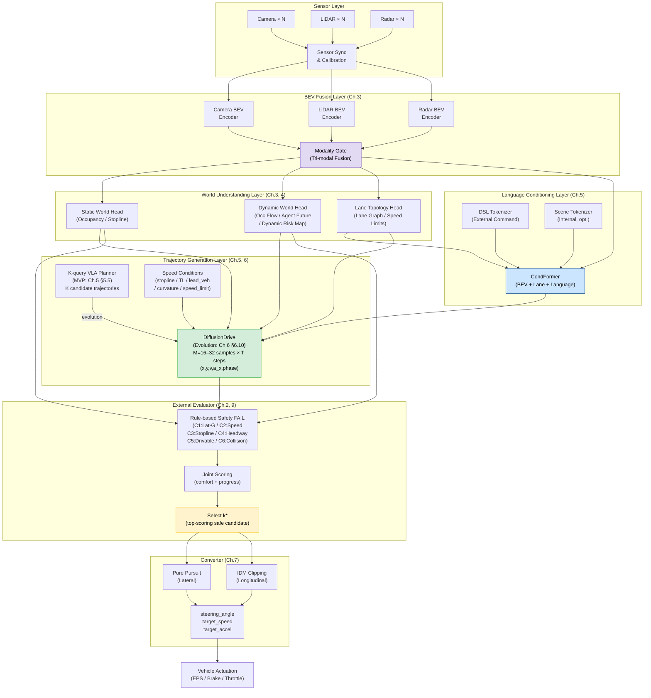

# Chapter 16 System Integration Summary and Full Architecture Overview

---

## 16.1 Integration Summary

All components designed across Chapters 1–15 and the appendices converge into
a single coherent architecture.
This chapter serves as the **final integration reference** — visualizing the complete
system, and consolidating in one place the design decisions, inter-module interfaces,
training strategy, safety requirements, and evaluation metrics.

```text
Sensor input
  → Tri-modal BEV Fusion (Ch.3)
  → Static & Dynamic World Understanding (Ch.3, 4)
  → Language Conditioning CondFormer (Ch.5)
  → Trajectory Generation: K-query Planner → DiffusionDrive (Ch.5, 6)
  → External Evaluator safety selection (Ch.2, 9)
  → Converter: steering & speed conversion (Ch.7)
  → Vehicle actuation
```

---

## 16.2 Architecture Decision Map

```text
Decision Item             Adopted Design                           Reference
────────────────────────────────────────────────────────────────────────────
BEV fusion                Tri-modal BEV Fusion                     Ch.3
                          (Camera + LiDAR + Radar)
Dynamic world             Occupancy Flow + Agent Future            Ch.4
                          + Dynamic Risk Map
Language conditioning     DSL + CondFormer                         Ch.5
Trajectory backbone       K-query VLA Planner (MVP)                Ch.5, 6
                          → DiffusionDrive (diffusion model, evolution) Ch.6 §6.10
Joint lat-lon opt.        (x,y,v,a_x,phase) joint denoising        Ch.6 §6.11
Speed profiles            S-curve stop / IDM / anticipatory curve  Ch.6 §6.12
Trajectory→control conv.  Pure Pursuit + IDM clipping              Ch.7
Safety selection          External Evaluator (rule-based)          Ch.2, 9
Real-time                 BEV Sparsification + Static Cache        Ch.8
Product safety            ISO 26262 / SOTIF / UNECE R157           Ch.9
Middleware                ROS 2 + Autoware.Universe                Ch.15
Training strategy         Stage-wise 7-stage pipeline              App.D
```

---

## 16.3 AD ECU Architecture Diagram

### System Data Flow (Text Representation)

```text
╔══════════════════════════════════════════════════════════════════════╗
║                       SENSOR LAYER                                   ║
║  Camera×N  ──┐                                                        ║
║  LiDAR×N   ──┼──→ [Sensor Sync & Calibration] ──→ SensorPacket      ║
║  Radar×N   ──┘                                                        ║
╚══════════════════════════════════════════════════════════════════════╝
                                │
                                ▼
╔══════════════════════════════════════════════════════════════════════╗
║                    BEV FUSION LAYER (Ch.3)                            ║
║  SensorPacket                                                         ║
║    ├─ Camera BEV Encoder (LSS / BEVFormer)                           ║
║    ├─ LiDAR BEV Encoder  (VoxelNet / CenterPoint)                    ║
║    └─ Radar BEV Encoder  (RadarNet)                                   ║
║                    ↓ Modality Gate                                    ║
║              [Tri-modal BEV Tensor]  (H×W×C)                         ║
╚══════════════════════════════════════════════════════════════════════╝
                                │
              ┌─────────────────┼──────────────────┐
              ▼                 ▼                   ▼
╔════════════════════╗ ╔══════════════════╗ ╔═══════════════════╗
║  STATIC WORLD HEAD ║ ║ DYNAMIC WORLD    ║ ║ LANE TOPOLOGY     ║
║  (Ch.3)            ║ ║ HEAD (Ch.4)      ║ ║ HEAD (Ch.3)       ║
║  - Drivable Area   ║ ║  - Occ Flow      ║ ║  - Lane Graph     ║
║  - Occupancy       ║ ║  - Agent Det.    ║ ║  - Stoplines      ║
║  - Stoplines       ║ ║  - Agent Future  ║ ║  - Crosswalks     ║
║  - Crosswalk       ║ ║  - Dynamic Risk  ║ ║  - Speed Limits   ║
║  - Speed Limit     ║ ║    Map           ║ ╚═══════════════════╝
╚════════════════════╝ ╚══════════════════╝
              │                 │                   │
              └─────────────────┼───────────────────┘
                                ▼
╔══════════════════════════════════════════════════════════════════════╗
║              LANGUAGE CONDITIONING LAYER (Ch.5)                       ║
║                                                                       ║
║  External Command ──→ DSL Tokenizer ──→ T_ext                        ║
║  Internal Scene  ──→ Scene Tokenizer──→ T_scene (optional)           ║
║                                                                       ║
║  [CondFormer]                                                         ║
║    BEV tokens + Lane tokens + T_ext + T_scene                        ║
║    → conditioned_tokens  (fused spatial-language features)           ║
╚══════════════════════════════════════════════════════════════════════╝
                                │
                                ▼
╔══════════════════════════════════════════════════════════════════════╗
║       TRAJECTORY GENERATION LAYER (Ch.5, 6)                          ║
║                                                                       ║
║  Phase 1 MVP: K-query VLA Planner (Ch.5 §5.5)                        ║
║    K=8–24 learnable queries → Transformer Decoder                   ║
║    → K candidate trajectories [(x_t, y_t, v_target_t, a_x_t, phase)]║
║    Loss: MHP Loss  min_k L2(traj_k, traj_human)                      ║
║                                                                       ║
║  Phase 2 Evolution: DiffusionDrive (Ch.6 §6.10)                      ║
║    Conditioning: conditioned_tokens / stopline / TL /                ║
║                  lead_vehicle / curvature / desired_speed            ║
║    Denoising: noise → [eps_theta × N_steps] → M trajectories        ║
║    M = 16–32 samples, within 100ms (10 Hz compatible)                ║
║    Output: [(x_t, y_t, v_target_t, a_x_t, phase_t)]  T=10 steps    ║
║    phase_t ∈ {ACCEL, CRUISE, DECEL}                                  ║
╚══════════════════════════════════════════════════════════════════════╝
                                │
                                ▼
╔══════════════════════════════════════════════════════════════════════╗
║                 EXTERNAL EVALUATOR (Ch.2, Ch.9)                      ║
║                                                                       ║
║  Input: M trajectories + Static World + Dynamic Risk + Agent Futures ║
║                                                                       ║
║  Safety FAIL checks (rule-based):                                    ║
║    C1: v_t² × |κ_t| > A_Y_MAX         (lateral G exceeded)          ║
║    C2: v_t > speed_limit               (speed limit exceeded)        ║
║    C3: stopline_overshoot              (stopline overshoot)          ║
║    C4: headway < min_gap               (insufficient headway)        ║
║    C5: drivable_area_violation         (drivable area violation)     ║
║    C6: dynamic_collision_risk          (dynamic collision risk)      ║
║                                                                       ║
║  Scoring (PASS candidates):                                          ║
║    joint_score = w_c × comfort + w_p × progress                     ║
║                                                                       ║
║  Output: k* = argmax score  (or hold-previous if all FAIL)           ║
╚══════════════════════════════════════════════════════════════════════╝
                                │
                                ▼
╔══════════════════════════════════════════════════════════════════════╗
║           TRAJECTORY-TO-STEERING CONVERTER (Ch.7)                    ║
║                                                                       ║
║  Input: selected trajectory k* + Ego State                           ║
║                                                                       ║
║  Lateral:                                                             ║
║    Lookahead point → Pure Pursuit → target_curvature                 ║
║    target_curvature → steering_angle_deg  (kinematic model)          ║
║                                                                       ║
║  Longitudinal:                                                        ║
║    v_target / a_x_target from Planner output (K-query / DiffusionDrive)║
║    IDM clipping: min(planner_accel, acc_idm)                         ║
║    Stopline precision check: final override if d_stop < threshold    ║
║                                                                       ║
║  Output:                                                              ║
║    steering_angle_deg / target_speed_mps / target_accel_mps2        ║
╚══════════════════════════════════════════════════════════════════════╝
                                │
                                ▼
╔══════════════════════════════════════════════════════════════════════╗
║                   VEHICLE ACTUATION                                   ║
║   EPS (Electric Power Steering) / Brake / Throttle / Gear            ║
╚══════════════════════════════════════════════════════════════════════╝
```

---

## 16.4 Mermaid Architecture Diagram



---

## 16.5 Inter-Module Interface Reference

```text
Interface Name                 From                      To                    Data Type
──────────────────────────────────────────────────────────────────────────────────────────
SensorPacket                   Sensors                   BEV Encoders          Time-synced raw data
BEVTensor (H×W×C)              Modality Gate             World Heads / COND    float16, stride=0.2m
StaticWorldOutput              Static World Head         Evaluator / DiffDrive  Occ, Stopline, Crosswalk
DynamicWorldOutput             Dynamic World Head        Evaluator / DiffDrive  AgentFuture, DynRisk
LaneGraphOutput                Lane Topology Head        CondFormer / DiffDrive LaneNode, EdgeWeight
ConditionedTokens              CondFormer                DiffusionDrive         [N_token, C_bev]
SpeedConditions                Ego State / Perception    DiffusionDrive         6 scalars (§6.10)
TrajectorySet                  DiffusionDrive            External Evaluator     [M, T, 5] float32
SelectedTrajectory k*          External Evaluator        Converter              [T, 5] + safety_flags
ControlCommand                 Converter                 Vehicle Bus            steer/speed/accel
```

---

## 16.6 Integrated Training Pipeline (7 Stages)

```text
Stage 1: BEV Backbone Pretraining
  Data:    nuScenes Detection
  Update:  Camera/LiDAR/Radar Encoder + Modality Gate

Stage 2: BEV Information Heads Training
  Data:    nuScenes + proprietary data
  Frozen:  Stage 1 (BEV Backbone)
  Update:  Static / Dynamic / Lane Topology Heads

Stage 3: K-query VLA Planner — Trajectory Generation MVP Training (Ch.5 §5.5, Ch.6)
  Data:    Large-scale human driving logs
  Frozen:  Stage 1+2
  Update:  CondFormer (no-language version) + K-query Transformer Decoder
  Loss:    MHP Loss  L = min_k L2(traj_k, traj_human)
  Learns:  §6.12 stop / IDM / curve speed via conditioning inputs

Stage 4: CondFormer — External Language Conditioning (Ch.5)
  Data:    Driving logs + DSL annotations
  Frozen:  Stage 1+2
  Update:  Text Encoder + CondFormer (language-conditioned parts)

Stage 5: Scene Tokenizer Training (optional)
  Data:    Camera images + VLM-generated text (Ch.12)
  Frozen:  Stage 1+2+3
  Update:  Scene Tokenizer (VLM knowledge distillation)

Stage 6: Closed-loop / Offline RL — Speed Policy Fine-tuning (App.D §D.8)
  Data:    Waymax / CARLA + curated real-world logs
  Frozen:  World Heads / Perception
  Update:  K-query Planner speed branch (v/a_x/phase head)
  Goal:    Acquire anticipatory decel→curve→accel patterns via closed-loop training
  Note:    DiffusionDrive migration is optional — see §6.10 Phase A/B/C

Stage 7: Joint Fine-tuning
  Data:    All data mixed
  Update:  All modules (low LR)
```

---

## 16.7 Product Safety and Regulation Compliance Matrix

```text
Standard                    Design Response                       Reference
──────────────────────────────────────────────────────────────────────────
ISO 26262 (Functional       ASIL D electrical + ASIL B NN output  Ch.9
  Safety)                   External Evaluator is rule-based
SOTIF (ISO 21448)           ODD definition + Shadow Mode eval.    Ch.9, 11
UNECE R157 ALKS             L3 sign recognition / lane keeping /  Ch.9
                            system limit recognition
UNECE WP.29 R155            CSMS / TARA / Secure OTA              Ch.9
  (Cybersecurity)           → recommended to comply with R155
GB/T 34590 (China)          Equivalent to R157 requirements       Ch.9
GDPR / Personal Data        Log anonymization (face/LP removal)   Ch.12
```

---

## 16.8 Evaluation Metrics Dashboard (Key KPIs)

```text
Layer              Key Metric                          Pass Criterion (reference)
────────────────────────────────────────────────────────────────────────────────
BEV Perception     nuScenes NDS                        > 0.60
                   mAP (3D detection)                  > 0.45
Dynamic World      VPQ (Video Panoptic Quality)         > 0.55
                   ADE/FDE (Agent Future 1s/3s)         < 0.5m / 1.5m
DiffusionDrive     Open-loop ADE (best of M)           < 0.8m
                   Closed-loop progress (Waymax)        > 85%
                   Collision rate (sim)                 < 0.1%
Converter          Stop position error (±stopline)      < ±0.3m
                   Headway error                        within ±0.5m
Real-time          End-to-end latency                  < 100ms (10 Hz)
                   GPU utilization                      < 80% (thermal margin)
```

---

## 16.9 AD Component Completeness Checklist

```text
Required Component                         Coverage in This Book
────────────────────────────────────────────────────────────────────
[Perception]
  ✅ Camera BEV Encoder                    Ch.3
  ✅ LiDAR BEV Encoder                     Ch.3
  ✅ Radar BEV Encoder                     Ch.3
  ✅ Tri-modal Fusion (Modality Gate)       Ch.3
  ✅ Static World / Occupancy              Ch.3
  ✅ Dynamic Object Detection              Ch.4
  ✅ Agent Future Prediction               Ch.4
  ✅ Occupancy Flow                        Ch.4
  ✅ Lane Topology                         Ch.3
  ✅ Traffic Light Recognition             Ch.3, 6

[Planning]
  ✅ Language Conditioning (CondFormer)    Ch.5
  ✅ K-query VLA Planner (MVP)              Ch.5, 6
  ✅ DiffusionDrive (evolution)              Ch.6 §6.10
  ✅ Joint lat-lon optimization            Ch.6 §6.11
  ✅ Speed profile design                  Ch.6 §6.12
    ✅ S-curve stop profile                Ch.6 §6.12
    ✅ IDM car-following                   Ch.6 §6.12
    ✅ Anticipatory curve speed control    Ch.6 §6.12
  ✅ External Evaluator (safety selection) Ch.2, 9
  ✅ Trajectory-to-Steering Converter      Ch.7

[Training & Data]
  ✅ Human trajectory teacher construction Ch.6
  ✅ Data collection & quality management  Ch.12
  ✅ Training strategy (7 stages)          App.D
  ✅ Closed-loop evaluation               Ch.6, App.D

[System]
  ✅ Real-time design (100ms)              Ch.8
  ✅ BEV Sparsification                   Ch.8
  ✅ Static World Cache                   Ch.8
  ✅ Multi-chip deployment                Ch.14

[Product & Operations]
  ✅ Product safety (ISO 26262 / SOTIF)   Ch.9
  ✅ Regulatory compliance (R157 / R155)  Ch.9
  ✅ Shadow Mode / Roadmap               Ch.11
  ✅ Hardware platform                    Ch.14
  ✅ Middleware (ROS 2 / Autoware)        Ch.15
  ✅ Evaluation metrics                   Ch.13

[Reference Implementation]
  ✅ Pseudocode                           App.A
  ✅ Output format definitions            App.B
  ✅ References                           App.C
  ✅ Glossary                             App.E
```

---

## 16.10 Open Problems and Future Directions

```text
Area                      Current Limitation              Future Direction
──────────────────────────────────────────────────────────────────────────
DMS                       Out of scope (L2 basic only)    Required with UNECE R157
(Driver Monitoring)                                        L3 mandate; dedicated DMS
                                                           SoC integration needed

V2X Integration           Hardware-level mention in       Incorporate V2I/V2V data
                          Ch.15 only                      as BEV conditioning input

World Models              Frame-level perception          Generative world models
                          + DiffusionDrive                (UniSim / GAIA-1 direction)

3D Occupancy              BEV 2.5D only                   Full 3D occupancy via
                                                           NeRF / 3D Gaussian Splatting

Privacy Technology        Masking anonymization (Ch.12)   Federated learning /
                                                           differential privacy

Open-set Detection        Known classes only              Open-vocabulary detectors
                                                           (OWL-ViT integration)
```

---

## 16.11 Chapter Summary

```text
The core of the system designed in this book can be expressed as:

  AD_output = Converter(
    ExternalEvaluator(
      VLAPlanner(  -- Phase 1: K-query / Phase 2: DiffusionDrive
        CondFormer(BEV(Camera, LiDAR, Radar),
                   LaneTopology,
                   DSL(NL_command)),
        SpeedConditions),
      StaticWorld,
      DynamicWorld))

Key design decisions:
  1. BEV fusion      → Sensor redundancy and scalability
  2. Language cond.  → Explicit injection of human intent
  3. K-query Planner → Easy to implement as MVP with low compute cost.
                       Incremental migration to DiffusionDrive is available (§6.10)
  4. External Eval.  → Rule-based safety backstop layered over probabilistic NN
  5. Converter sep.  → Vehicle-dependent code fully decoupled from the NN

This architecture achieves Structured End-to-End design: a single pipeline
that learns human implicit knowledge (trajectory patterns) from sensor to
actuation, while structurally guaranteeing the safety, verifiability, and
regulatory compliance required for a production autonomous driving product.
```
